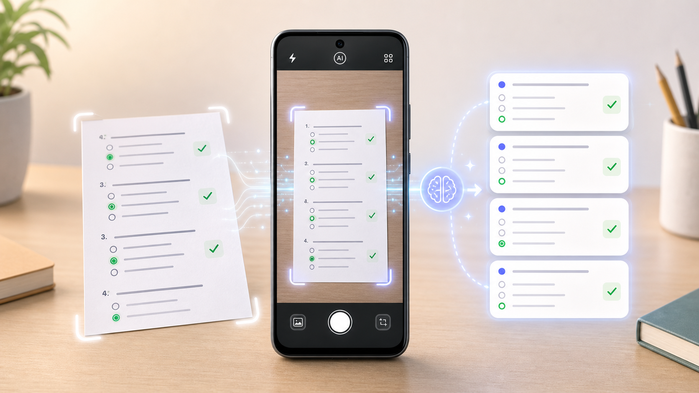

# AI-Assisted Question Import

Qmaker now makes it easier to turn existing exam papers, worksheets, notes, and other question-answer documents into interactive quizzes.

With the new AI-assisted import feature, available in QcmCreator through `ImportQcmInviteDialog`, users can import questions from almost any existing document format. They can also use their device camera as a digital document scanner, directly from the app.

## What It Does

- Scans or imports a document containing questions and answers.
- Uses AI to detect the questions, answer choices, and correct answers.
- Converts the content into a real interactive quiz.
- Keeps automatic correction ready inside the generated quiz.

This means a paper exam or printed exercise sheet can quickly become a digital QCM activity, without manually recreating every question.

## Demo

The video below shows the feature launching the digital scanner from the app, scanning an exam document, and turning it into an interactive quiz.

<iframe
  width="100%"
  height="480"
  src="https://www.youtube.com/embed/So5f53zYR3w"
  title="Qmaker AI-assisted question import demo"
  frameborder="0"
  allow="accelerometer; autoplay; clipboard-write; encrypted-media; gyroscope; picture-in-picture; web-share"
  allowfullscreen>
</iframe>

[Watch the demo on YouTube](https://www.youtube.com/shorts/So5f53zYR3w)
