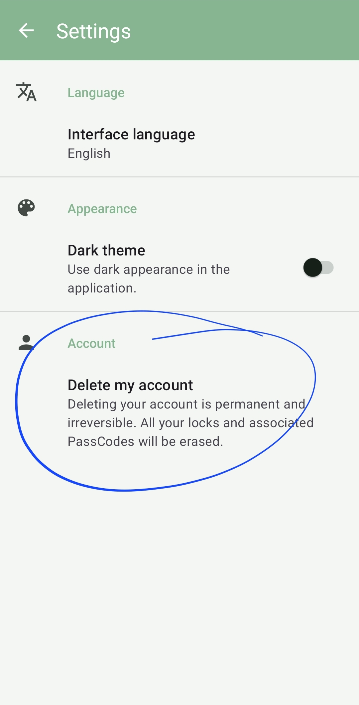
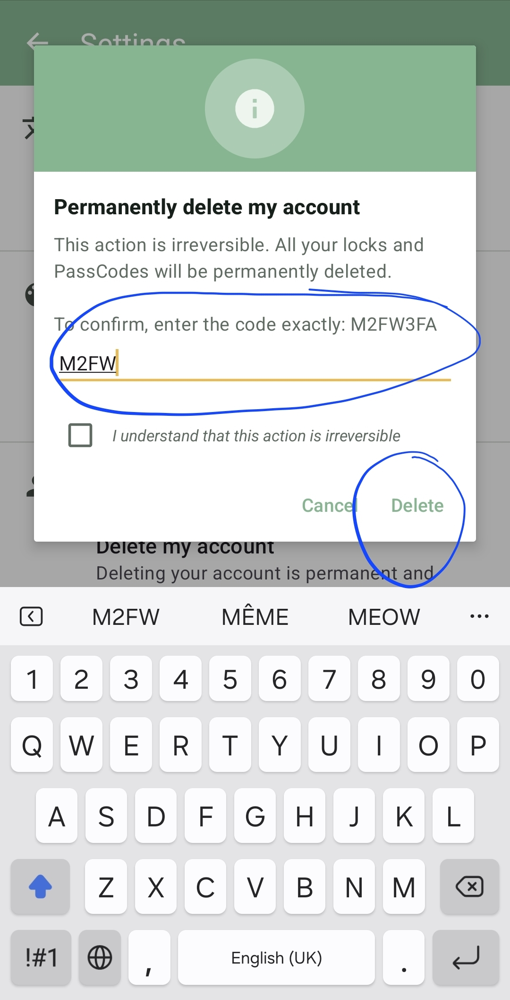

# How to Delete Your Qcm Locker Account

> **This action is permanent and irreversible.** Deleting your account erases all your
> locks and the PassCodes associated with them. Users who hold PassCodes generated by
> your locks will immediately lose access to any protected `.qcm` files.

## What gets deleted

| Data | Deleted |
|---|---|
| Your Qcm Locker account (linked Google identity) | Yes |
| All locks you created | Yes |
| All PassCodes generated for those locks | Yes |
| Protected `.qcm` files you already shared | No — files remain on the devices they were shared to, but they can no longer be decrypted |

## Steps

### 1 — Open Qcm Locker and sign in

Launch the app. If you are not already signed in, complete the Google sign-in flow to
reach the **Home** screen.

### 2 — Open Settings

From the **Home** screen, tap the menu icon (☰) in the top-left corner to open the
**Navigation Drawer**, then tap **Settings**.

### 3 — Tap "Delete my account"

On the Settings screen, scroll down to the **Account** section. Tap **Delete my
account**.

  

The entry reads:

> *Deleting your account is permanent and irreversible. All your locks and associated
> PassCodes will be erased.*

### 4 — Complete the confirmation dialog

A dialog titled **Permanently delete my account** appears.

  

The dialog requires two actions before the **Delete** button becomes active:

1. **Enter the confirmation code** — A short alphanumeric code is displayed in the
   dialog (for example `M2FW3FA`). Type it exactly in the text field below.
2. **Check the acknowledgement box** — Check *"I understand that this action is
   irreversible"*.

Once both conditions are met, tap **Delete** to permanently delete your account.

To cancel without deleting anything, tap **Cancel** or press the back button.

---

## After deletion

- Your Google account is **not** affected. Only your Qcm Locker / QcmKeyStore data is
  removed.
- The PassCodes you distributed to learners or customers will stop working immediately.
- The app returns to the sign-in / onboarding screen.
- You may create a new Qcm Locker account at any time by signing in again with a Google
  account.

---

© QmakerTech — Last updated: 2026-05-24
