> This document is the single-read context for Qcm Locker — designed for AI agents,
> new contributors, and anyone who needs a full picture without navigating sub-pages.
> When feature sub-pages are added in the future, this document will become a summary
> with links to those sub-pages.

# Qcm Locker — User Guide

<p align="center">
  
</p>

**App name:** Qcm Locker  
**Powered by:** QcmKeyStore (key storage service)  
**Captured app version:** 1.0  
**Screenshot date:** 17 May 2026  
**Capture device:** Samsung SM-S721B, 1080 x 2340

The screenshots in this guide come from the current Android app installed as
`com.qmaker.qcm.keystore`. Some visible UI labels are in French because that is the
current app resource language on the tested build. This guide explains the flows in
English and translates the important labels where needed.

## Product Idea

**Qcm Locker** is the quiz protection app for QcmMaker authors. It lets you create
locks on `.qcm` files, generate PassCodes for authorized users, and keep full control
over who can open your protected quizzes.

Under the hood, Qcm Locker is powered by **QcmKeyStore** — a secure key storage
service built by QmakerTech. QcmKeyStore stores the decryption keys for your locked
quizzes and validates PassCodes when a reader tries to open a protected file. As an
author you do not interact with QcmKeyStore directly; Qcm Locker and compatible
QcmMaker readers communicate with it automatically.

In the QcmMaker ecosystem, a quiz can be shared as a `.qcm` file through normal file
channels: local storage, email, messaging apps, cloud drives, Bluetooth, or any other
file transfer tool. That portability is useful, but it also means an unprotected quiz
can be copied freely. Qcm Locker adds a security layer without removing the file-based
workflow.

The core idea is a **lock**. A lock is a digital access definition attached to a quiz.
The lock has a password used to protect the quiz content and can generate **PassCodes**
that are distributed to learners or customers. A compatible reader then asks the user
for a PassCode, which the QcmKeyStore service validates to deliver the decryption key.

Typical author workflow:

1. Create a quiz in QcmMaker.
2. Open Qcm Locker and create a lock.
3. Generate PassCodes for that lock.
4. Protect the `.qcm` file with the lock.
5. Share the protected file and give each authorized user a PassCode.
6. The end user opens the protected file in a compatible QcmMaker/QcmReader app and
   enters the PassCode.

## Key Concepts

| Concept | Meaning |
|---|---|
| Lock | A digital access rule for one quiz or a quiz collection. In the app UI it is called `loquet`. |
| Lock password | The technical password used to protect the sensitive quiz content. The app can generate it automatically. |
| PassCode | A distributable access code. It is easier to give to learners than the raw lock password. |
| Usage limit | The maximum number of allowed uses for a lock or generated code. |
| Expiration | Optional date after which a lock or code should no longer be valid. |
| Multi-owner | Whether generated codes may be associated with multiple users/devices. |
| Protected `.qcm` | A quiz file that contains lock metadata and encrypted quiz content. |

## First Launch And Sign-In

When the app starts, it briefly shows the Qcm Locker logo.

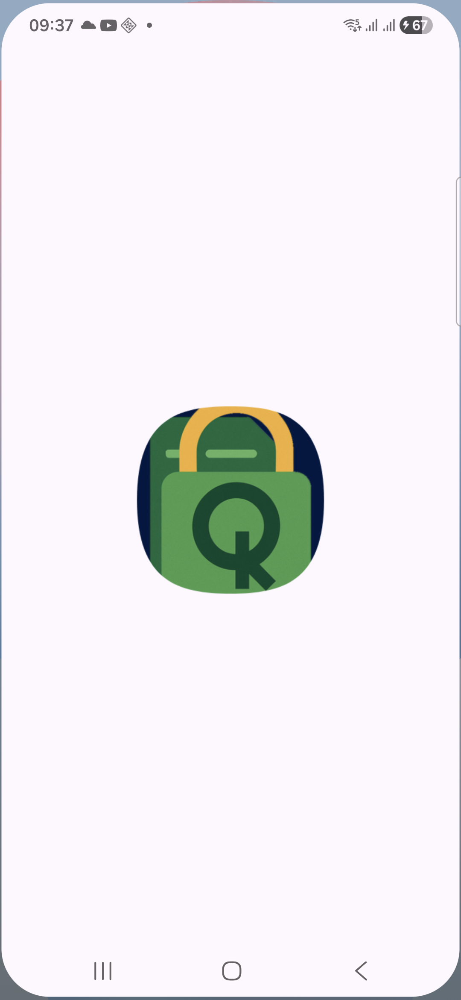

On first launch, Qcm Locker presents three onboarding slides:

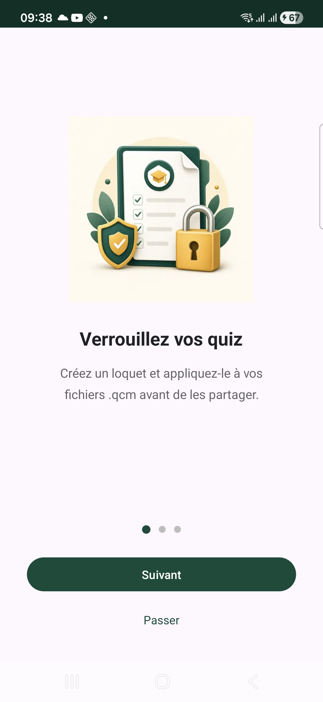

The first slide explains that the app creates locks and applies them to `.qcm` files.

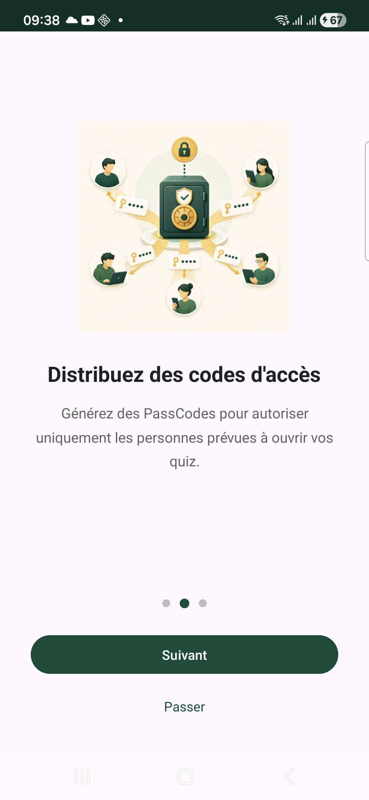

The second slide introduces PassCodes, which are distributed only to authorized users.

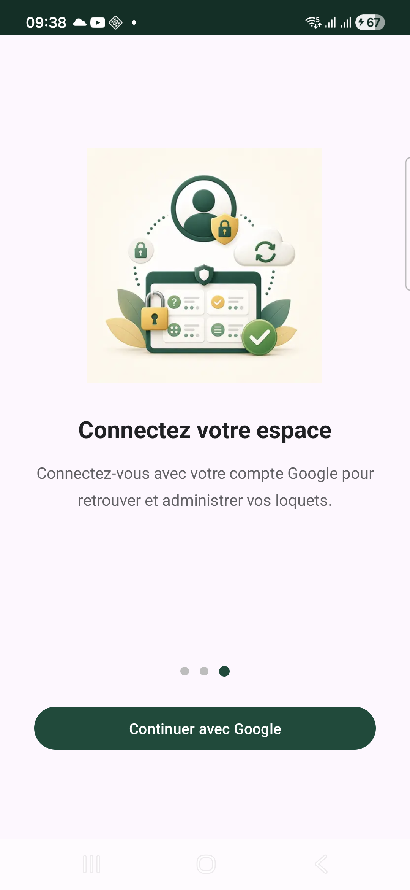

The third slide asks the administrator to connect a Google account. The button
`Continuer avec Google` means "Continue with Google".

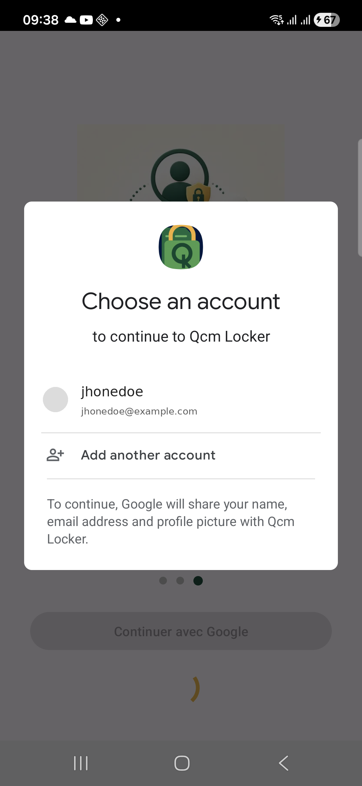

After choosing a Google account, the app opens the main lock dashboard.

## Home Screen

The Home screen is titled `Mes loquets`, meaning "My locks". It is the main list of
locks owned by the connected account.

When no lock exists, the screen shows an empty state and a link to create the first
lock.

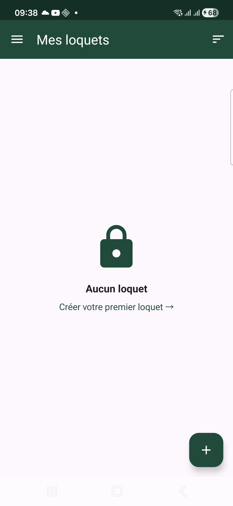

After locks are created, Home shows one card per lock. Each card displays:

- The lock icon.
- The lock name.
- The creation date.
- A chevron indicating that the card opens the detail screen.

The floating `+` button creates a new lock.

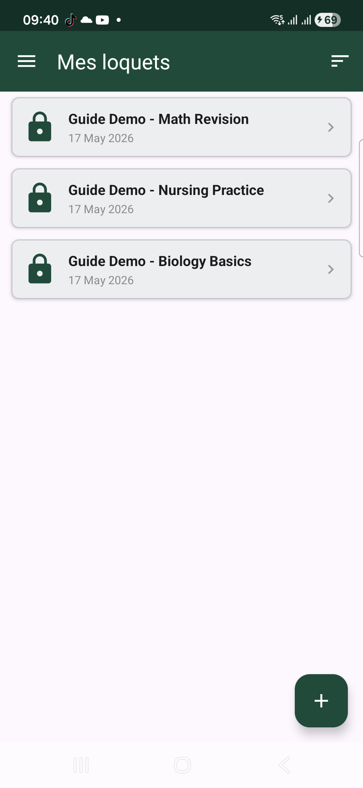

The sort icon in the top right opens the display order dialog. The current options are:

- Name A to Z.
- Name Z to A.
- Newest first.
- Oldest first.

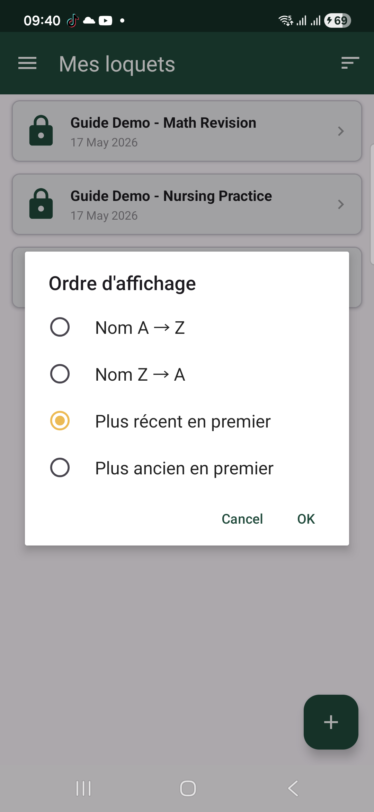

## Navigation Drawer

The drawer opens from the top-left menu icon. It contains account information and the
main app sections.

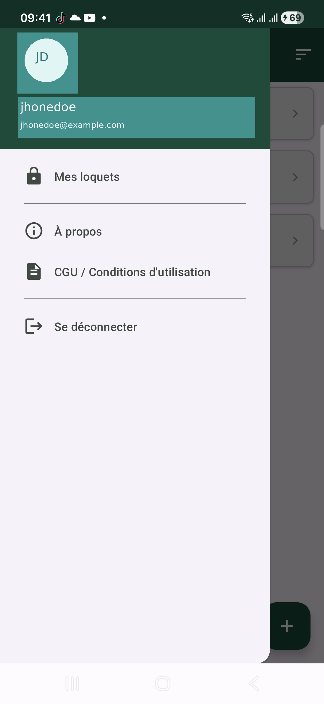

Drawer entries:

| Entry | Purpose |
|---|---|
| `Mes loquets` | Return to the lock list. |
| `A propos` | Open the About page. |
| `CGU / Conditions d'utilisation` | Open the terms of use page. |
| `Se deconnecter` | Sign out of the current Google session. |

## Creating A Lock

Tap the floating `+` button or the empty-state link to open the new lock form.

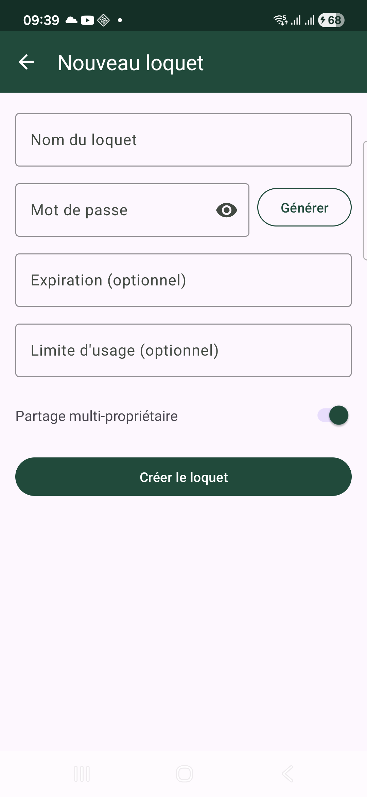

Fields:

| Field | Description |
|---|---|
| `Nom du loquet` | Lock name. This is the label shown in Home. |
| `Mot de passe` | Lock password. You can type one manually or generate one. |
| `Generer` | Generates a secure password for the lock. |
| `Expiration (optionnel)` | Optional lock expiration date. |
| `Limite d'usage (optionnel)` | Optional total usage/generation limit. |
| `Partage multi-proprietaire` | Multi-owner sharing switch. |
| `Creer le loquet` | Submit the form and publish the lock. |

If the required name is missing, the form displays a validation error.

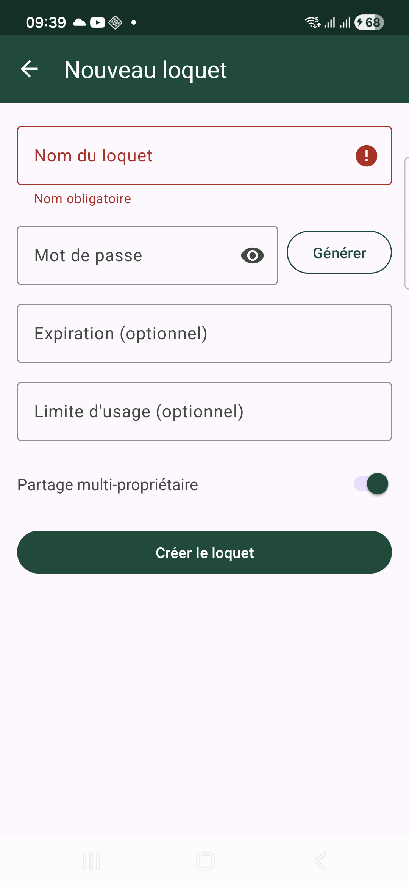

Tapping the expiration field opens the Android date picker. In the tested build, the
selected expiration time is set to the selected day at 23:59:59.

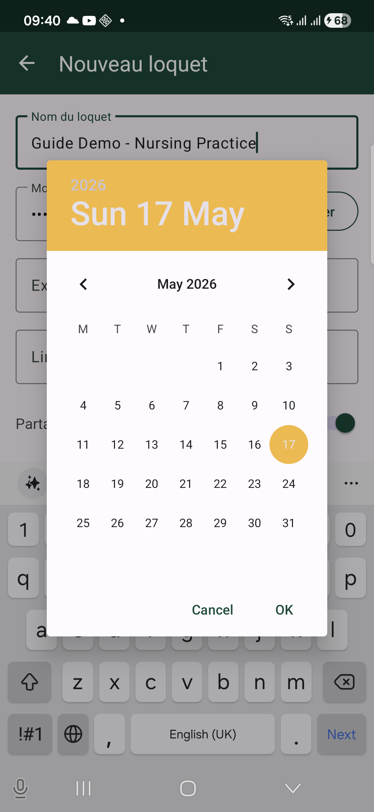

After filling the form, tap `Creer le loquet`.

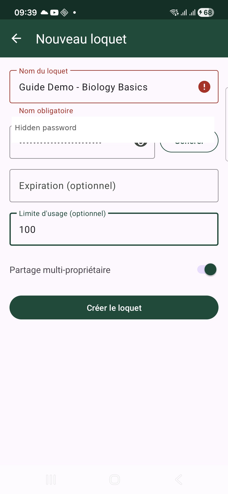

On success, the app returns to Home and refreshes the list.

## Lock Detail

Tap any lock card to open its detail screen.

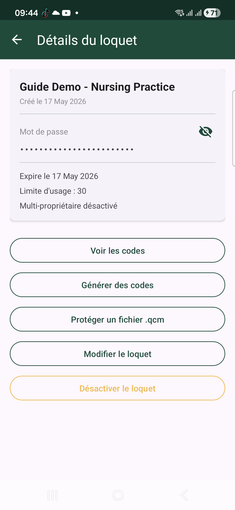

The detail card shows:

- Lock name.
- Creation date.
- Masked password.
- Expiration state.
- Usage limit.
- Multi-owner state.

The eye icon toggles password visibility. Treat the lock password as sensitive because
it is the technical key used to protect the quiz content.

Main actions:

| Button | Purpose |
|---|---|
| `Voir les codes` | Open the PassCode list for this lock. |
| `Generer des codes` | Generate a new pack of PassCodes. |
| `Proteger un fichier .qcm` | Pick a quiz file and save a protected copy. |
| `Modifier le loquet` | Open the edit screen. |
| `Desactiver le loquet` | Permanently disable the lock. |

## Generating PassCodes

From the detail screen, tap `Generer des codes`.

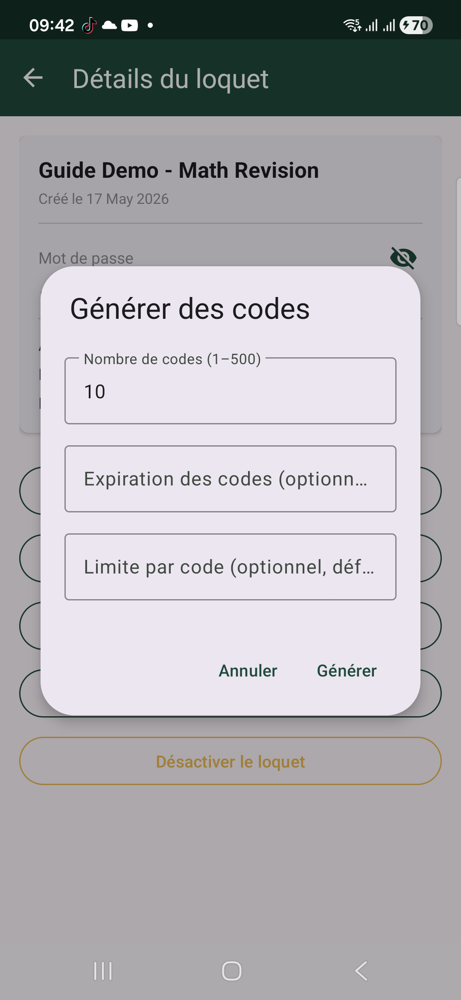

Dialog fields:

| Field | Description |
|---|---|
| `Nombre de codes (1-500)` | How many PassCodes to generate. The tested dialog defaults to 10. |
| `Expiration des codes (optionnel)` | Optional expiration date for the generated codes. |
| `Limite par code (optionnel, defaut : 1)` | Maximum uses per generated code. Empty means 1. |

Tap `Generer` to create the pack. On success, the app shows a snackbar with the number
of generated codes and a `Voir` action to open the code list.

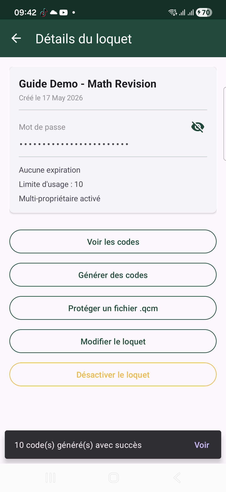

## PassCode List

The PassCode list is titled `Codes d'acces`.

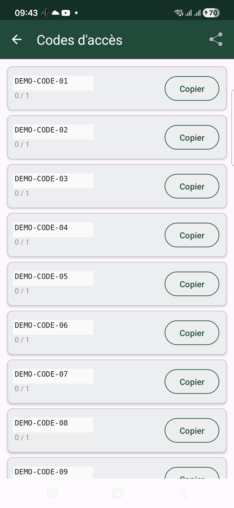

Each PassCode row shows:

- The PassCode value.
- Status, such as active.
- Usage count and usage limit.
- A `Copier` button.

The screenshot uses redacted demo values. In the real app, each row contains the actual
generated code that can be distributed to an authorized user.

Tap `Copier` to copy one code to the clipboard.

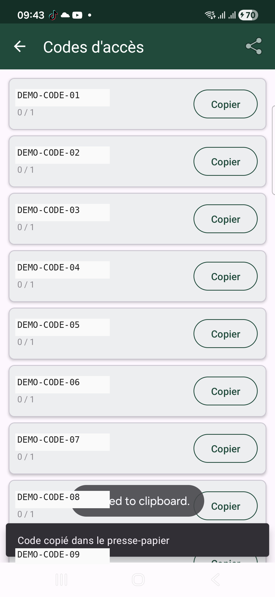

The share/export icon in the toolbar exports the list as CSV text through Android's
system share sheet.

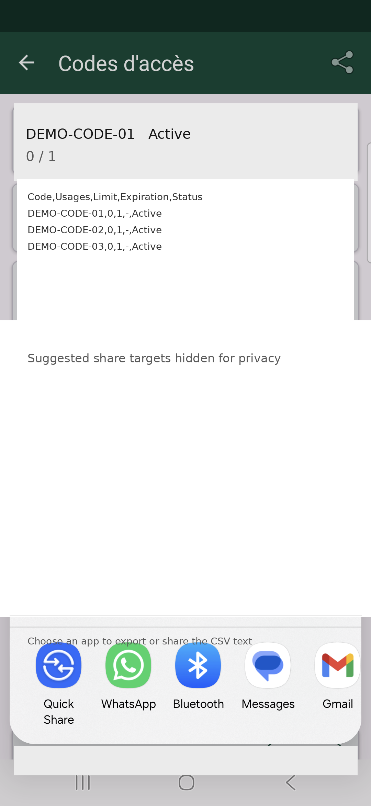

If no code has been generated for the selected lock, the page shows an empty state and
asks the user to generate codes from the detail screen.

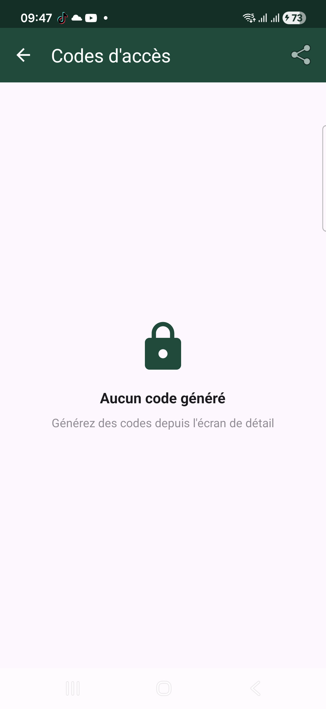

## Protecting A `.qcm` File

From the lock detail screen, tap `Proteger un fichier .qcm`.

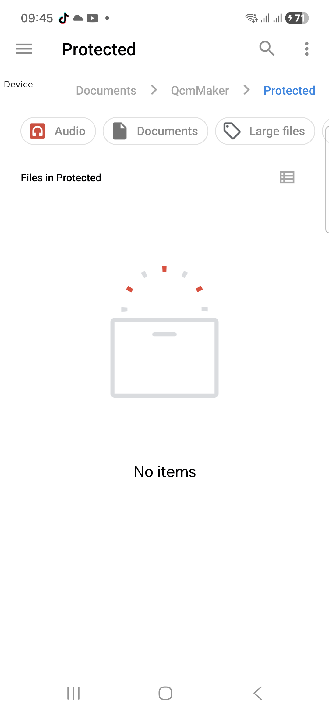

Android opens the system document picker. Choose the source `.qcm` file that should be
protected. In the captured test run, a sample file was pushed to Downloads and selected
from the picker.

After Qcm Locker processes the source quiz, Android opens a save screen for the
protected output file.

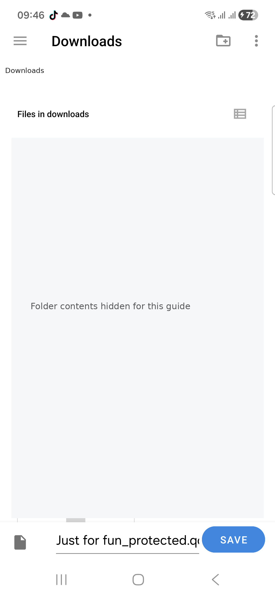

The default output name follows this pattern:

```text
<source title>_protected.qcm
```

Saving creates a protected `.qcm` copy. That file can then be shared normally through
Android file sharing, while access to the quiz content is controlled by the lock and
PassCodes.

## Editing A Lock

Tap `Modifier le loquet` from the detail screen.

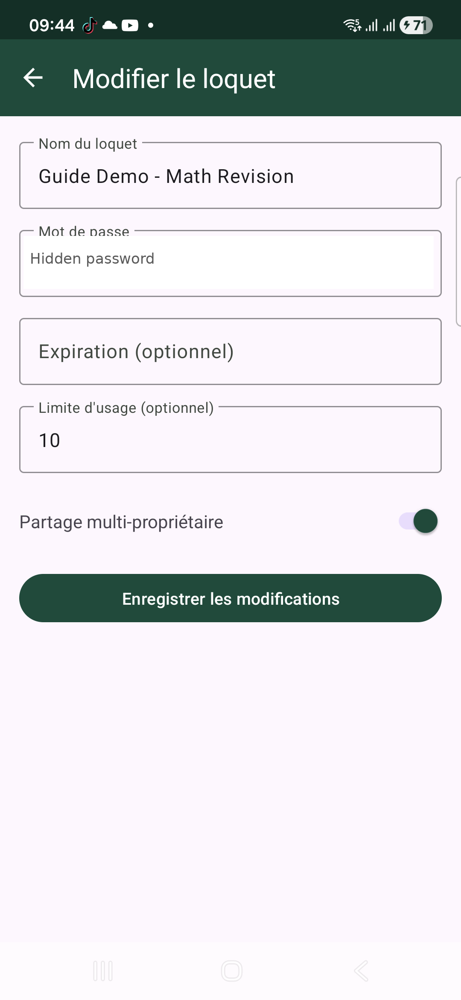

The edit screen lets you change the visible lock metadata:

- Name.
- Expiration.
- Usage limit.
- Multi-owner sharing.

In the current build, the password field is displayed but disabled. This means the
existing password is preserved when saving changes.

## Disabling A Lock

Tap `Desactiver le loquet` from the detail screen.

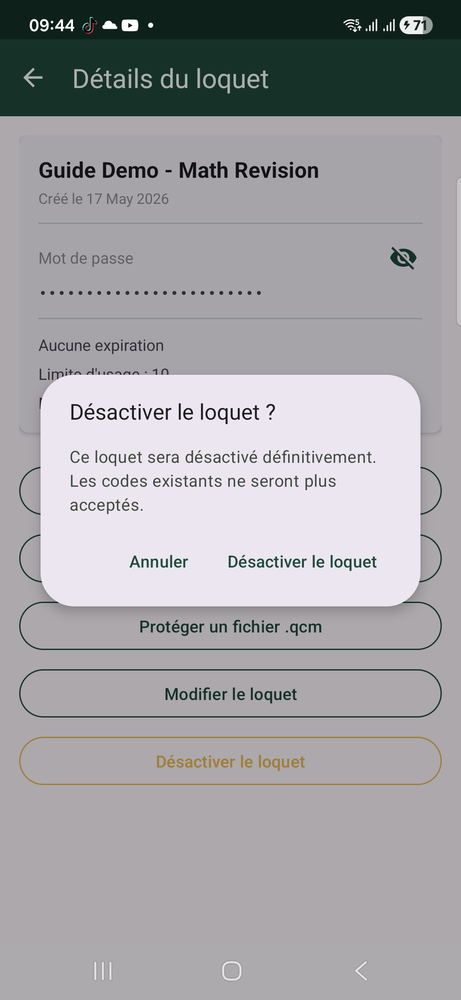

The confirmation explains that the lock will be permanently disabled and existing codes
will no longer be accepted. In the captured build, once the action is confirmed, the
disabled lock disappears from the active Home list.

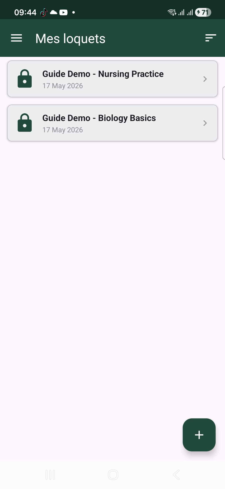

## Account, About, And Legal Screens

The About page explains the current purpose of Qcm Locker, lists the main features,
links community/contact options, and shows the app version.

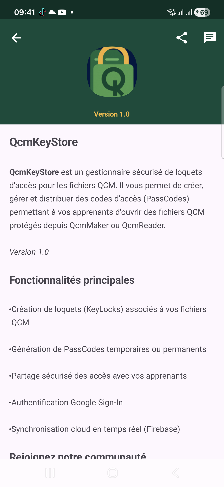

The CGU page opens the terms of use in the app's Markdown reader.

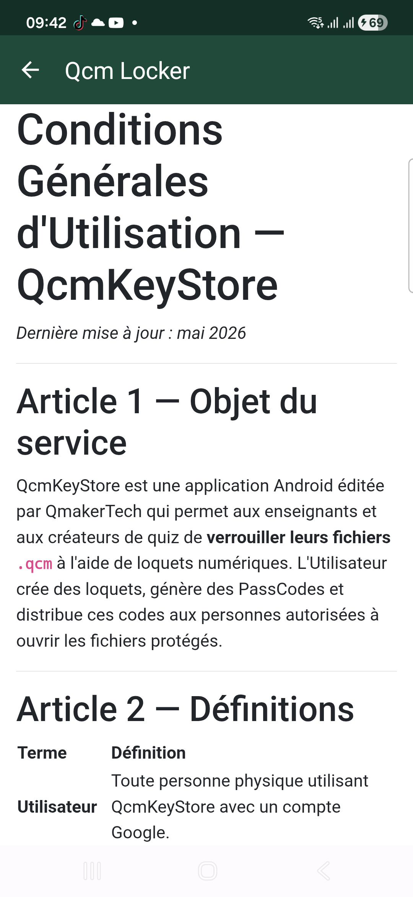

The sign-out action opens a confirmation dialog. Confirming sign-out redirects the user
to the connection/onboarding flow.

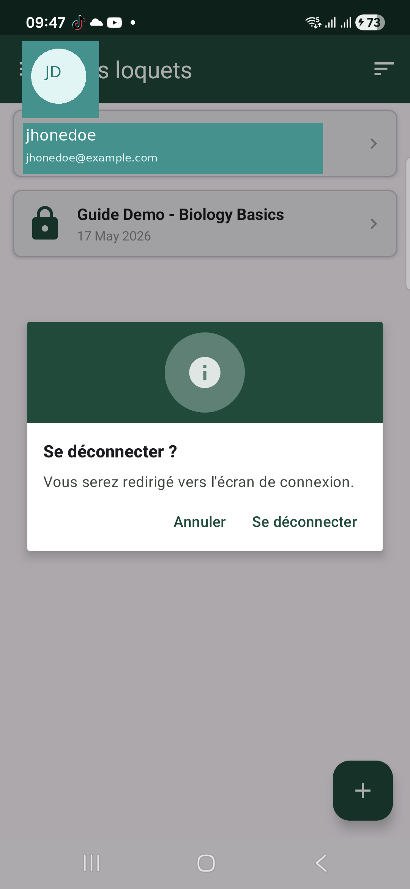

## Screen Inventory

| Screen or dialog | How to open it | Screenshot |
|---|---|---|
| Splash | Launch app | `images/splash.png` |
| Onboarding slide 1 | First launch, page 1 | `images/onboarding-slide-1.png` |
| Onboarding slide 2 | First launch, page 2 | `images/onboarding-slide-2.png` |
| Onboarding slide 3 | First launch, page 3 | `images/onboarding-slide-3.png` |
| Google account chooser | Tap Google sign-in | `images/google-signin.png` |
| Home empty state | Signed in account with no locks | `images/home-empty.png` |
| Home populated state | Signed in account with locks | `images/home-populated.png` |
| Sort dialog | Home toolbar sort icon | `images/sort-dialog.png` |
| Navigation drawer | Home menu icon | `images/navigation-drawer.png` |
| Create lock | Home `+` button | `images/create-lock-empty.png` |
| Create validation error | Submit create form without a name | `images/create-lock-validation.png` |
| Date picker | Tap expiration field | `images/create-lock-date-picker.png` |
| Lock detail | Tap a lock card | `images/lock-detail-active.png` |
| Generate codes dialog | Lock detail -> generate codes | `images/generate-codes-dialog.png` |
| Codes generated snackbar | Generate PassCodes successfully | `images/codes-generated-snackbar.png` |
| PassCode list | Lock detail -> view codes | `images/passcode-list.png` |
| PassCode copy snackbar | PassCode list -> copy | `images/passcode-copy-snackbar.png` |
| PassCode export share sheet | PassCode list -> export | `images/passcode-export-share.png` |
| Empty PassCode list | View codes for a lock without codes | `images/passcode-list-empty.png` |
| File picker | Lock detail -> protect `.qcm` file | `images/protect-file-picker.png` |
| Save protected file | After selecting a source `.qcm` file | `images/protect-save-dialog.png` |
| Edit lock | Lock detail -> edit | `images/edit-lock.png` |
| Disable confirmation | Lock detail -> disable | `images/disable-lock-dialog.png` |
| Home after disabling | Confirm disable | `images/home-after-disable.png` |
| About | Drawer -> About | `images/about.png` |
| Terms of use | Drawer -> CGU | `images/cgu.png` |
| Sign-out confirmation | Drawer -> sign out | `images/signout-dialog.png` |

Source-only pages found during inspection but not reachable from the current tested
navigation:

| Source page | Current status |
|---|---|
| `HomePage` | Present in source, not used by the current `mobile_navigation.xml` flow. |
| `LockHistoryPage` | Present in source, not used by the current `mobile_navigation.xml` flow. |
| `SimplePasswordLockStartingPage` | Legacy/simple lock page present in source, not reachable from the current manifest or navigation graph. |

## Current Limitations Observed

- The current app UI is mostly in French, even though this guide is written in English.
- Disabled locks were removed from the active Home list in the captured run.
- Some source pages are not exposed by the current tested navigation; they are listed
  separately in the screen inventory.
- Google sign-in is required before the administrator can manage locks.
- The protected file workflow relies on Android's system document picker and save UI, so
  exact file picker screens can vary by Android version and device manufacturer.
