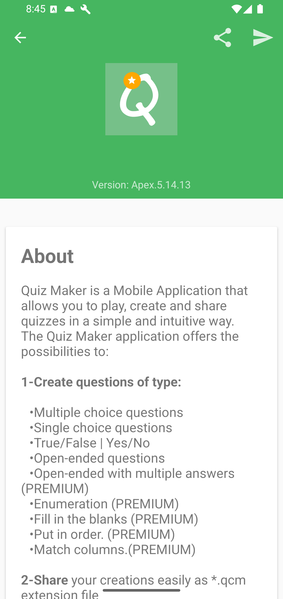
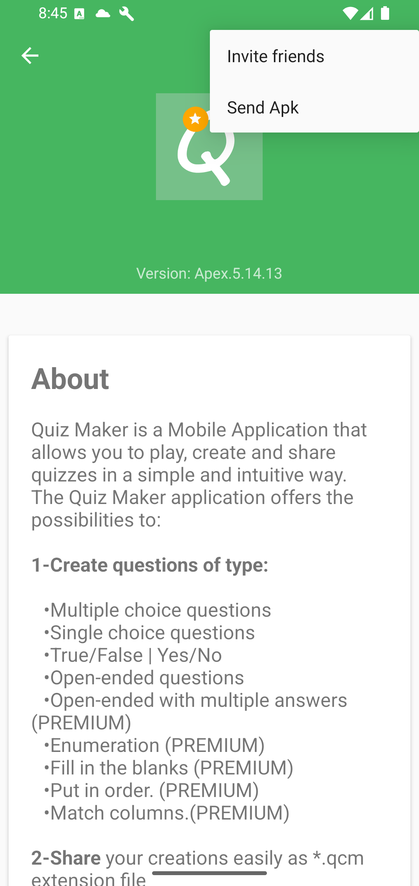
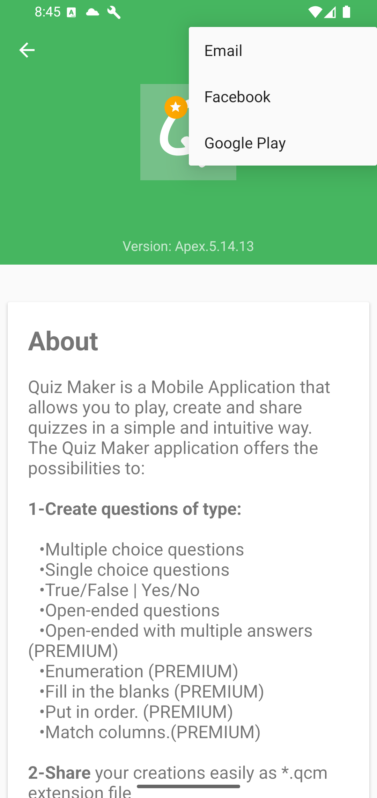

# About And Contact

Open the Home drawer, then choose **About**.

The toolbar includes sharing and contact actions.

Good to know: the About page is the best place to identify the installed app version before asking for help or reporting a problem.

The share menu can share QcmMaker or send the APK when supported.

The contact menu includes email, Facebook, and Google Play routes.

When contacting support, include what you were trying to do, what happened instead, and whether the issue concerns a specific `.qcm` file, premium access, import, sharing, or playback.
