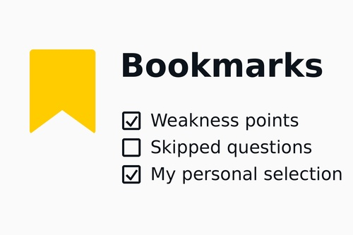
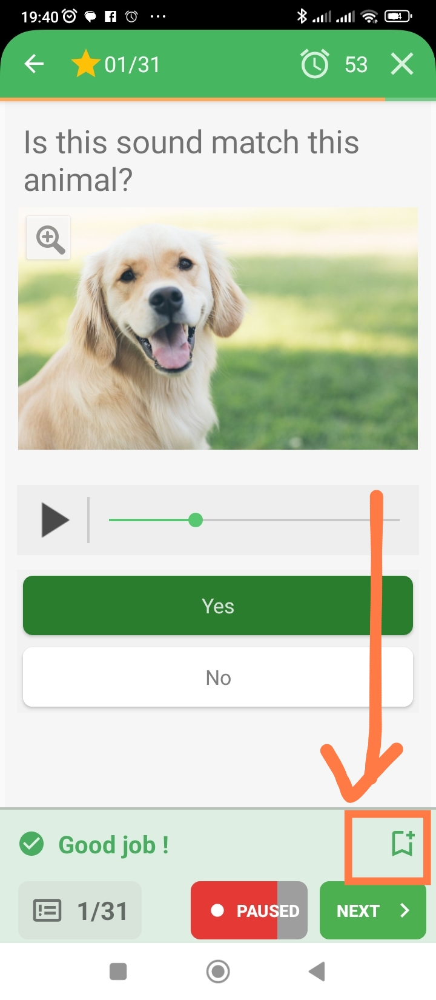
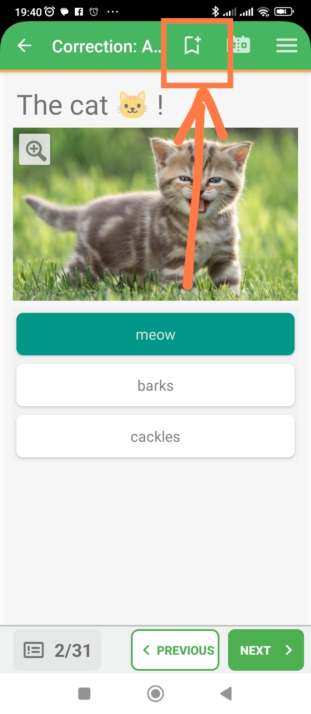
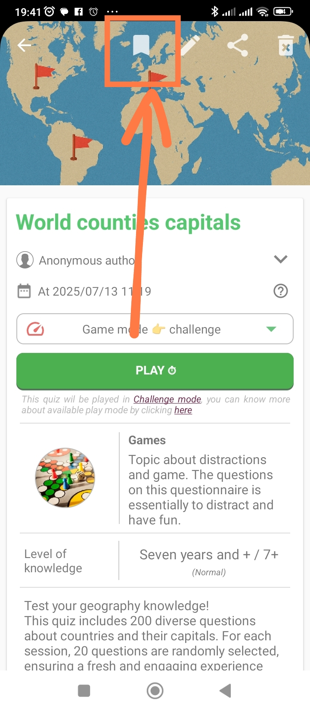
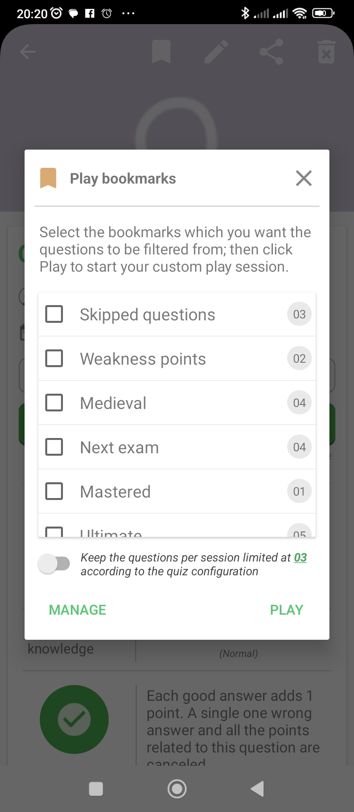
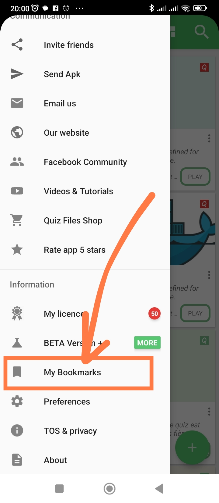
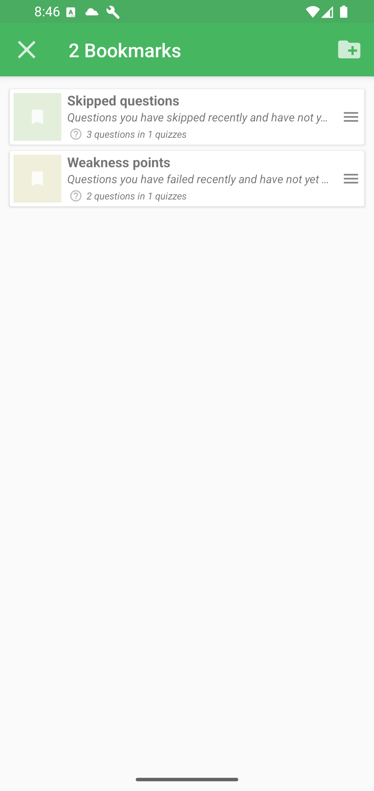
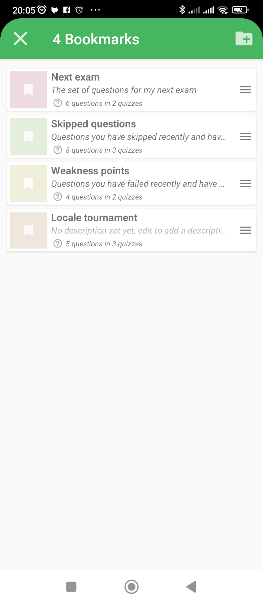
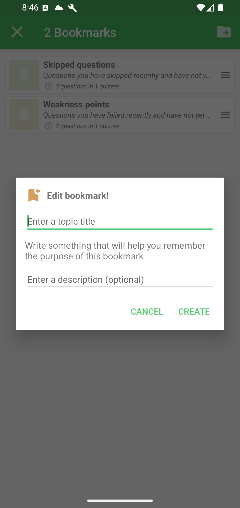

# Bookmarks

Bookmarks help you save specific questions so you can find them again, review
them, and replay them later.

Good to know: bookmarks are a study tool, not a copy of the whole quiz. They point you back to selected questions so you can focus on what matters most during review.

## What A Bookmark Is

A bookmark is a collection of quiz questions. You can use bookmarks to group
questions by study goal, difficulty, or revision status.

Common bookmark ideas include:

- **Weakness points**: questions you failed and want to train again.
- **Skipped questions**: questions you did not answer during a run.
- **Next exam**: questions you want to prepare before an upcoming test.
- **Personal selection**: questions you manually choose for your own review.

QcmMaker can also maintain system bookmarks, such as skipped questions or
weakness points. These are managed by the app and may not be editable like your
own custom bookmarks.

## Add A Question While Playing

While playing in Challenge mode, use the bookmark action on the question screen
to save the current question into a bookmark.

This is useful when a question feels important, difficult, or worth reviewing
again later.

## Add A Question During Correction

You can also add a question while reviewing correction after a test.

Correction is a good moment to bookmark questions you missed, skipped, or want
to explain again before the next attempt.

## Play Questions From Bookmarks

From a quiz preview page, use the bookmark action to list the bookmarks linked
to that quiz.

When the chooser appears, select the bookmarks you want to use.

QcmMaker will then load only the questions included in the selected bookmarks.
You can combine several bookmarks when you want a focused review session.

## Open The Bookmark Manager

Open the Home drawer, then choose **Bookmarks**.

The Bookmark Manager lists your bookmark groups and shows how many questions are
associated with each one.

## Manage Your Bookmarks

In the Bookmark Manager, you can create and organize custom bookmarks.

Use the add action to create a new bookmark.

Depending on the bookmark type, you can create, rename, edit, delete, clear, or
inspect bookmark groups. System bookmarks are automatically managed by QcmMaker
and may be locked from manual editing.

## Study Tip

Use bookmarks as short review sets. After a test, replay failed questions,
skipped questions, or a personal selection instead of restarting the whole quiz
every time.
