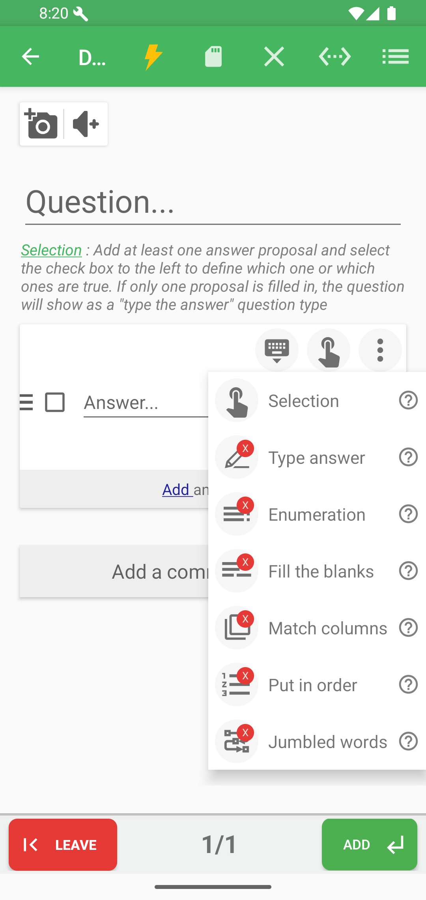
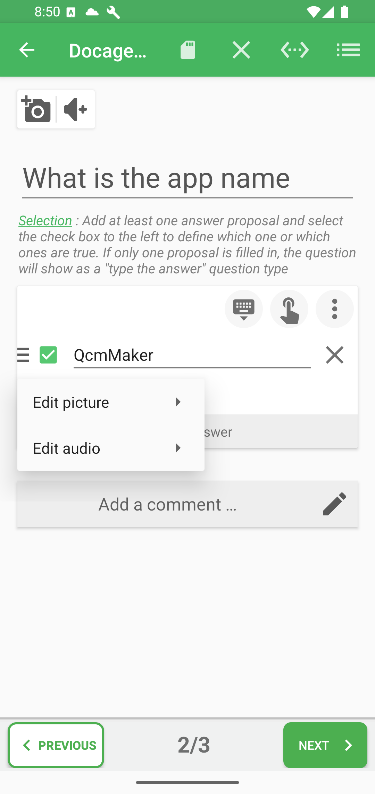
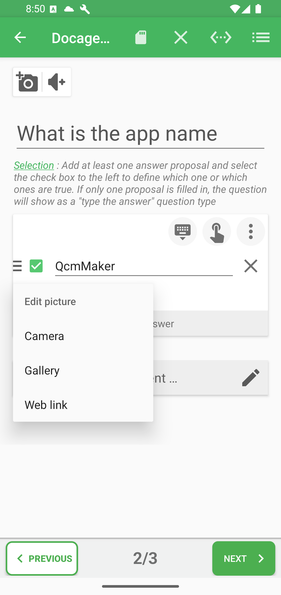
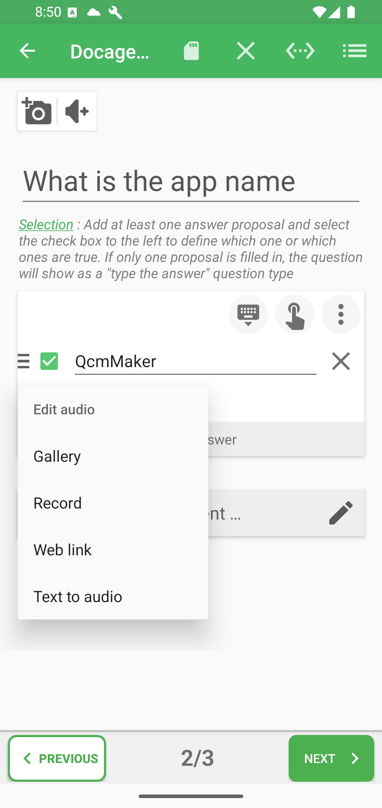
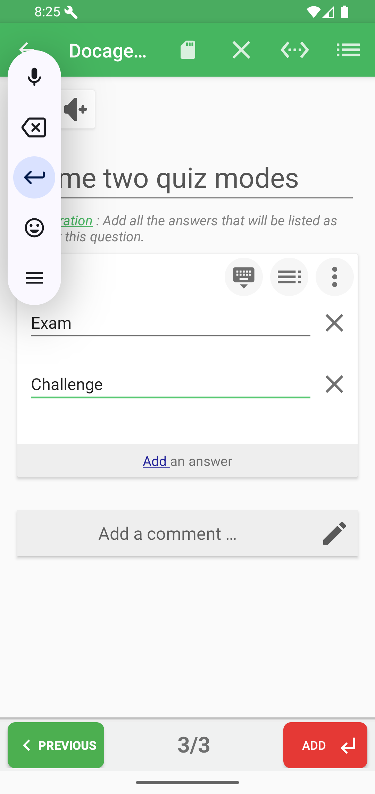
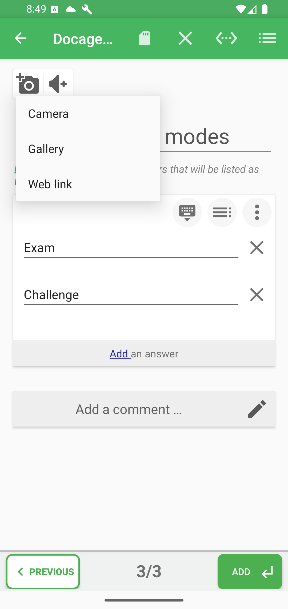
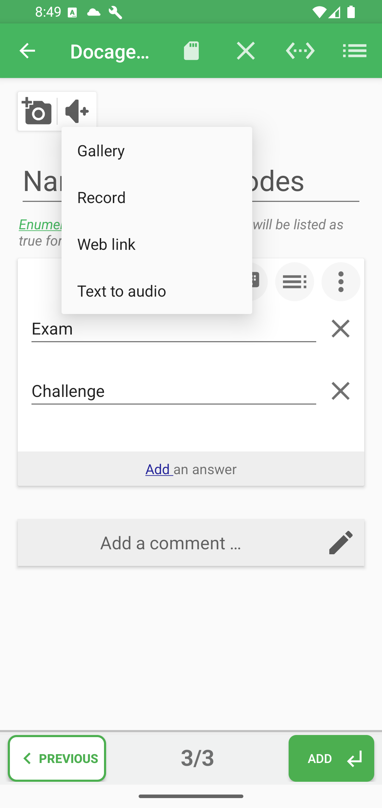
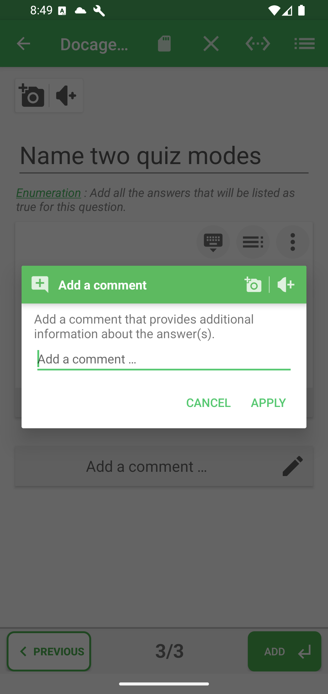

# Add A Question

Each question combines four ideas: the prompt, the expected answer logic, optional media, and optional correction help. The editor keeps these pieces together so the quiz can teach as well as test.

From the project viewer, tap **EDIT QUESTIONS**.

In the editor:

| Area | What it does |
|------|--------------|
| Question field | Type the question. |
| Picture/audio buttons | Attach media to the question. |
| Type icon | Choose the question type. |
| Answer field | Type an answer proposal. |
| Checkbox | Mark an answer as correct. |
| Add an answer | Add another proposal. |
| Add a comment | Add correction or explanation text. |
| Save | Save changes. |
| ADD | Add another question. |

## Choose a question type

Tap the type icon in the editor to open the selector.

Common formats:

| Type | Use it for |
|------|------------|
| Selection | One or more correct answers among proposals. |
| Typed answer | A short answer the learner must enter. |
| Enumeration | Several expected answers listed by the learner. |

To see how these and other question families appear while learners play, open
the [Exam question type reference](../play-modes/exam-question-types/README.md).

Good to know: answer propositions do not mean the same thing for every question type. In a Selection question, propositions are choices. In Enumeration, they are expected items. In Put in order, they become items the learner must arrange.

## Selection question

For a selection question, add several answers and tick the correct proposal or proposals.

The proposition options menu lets you attach media to a specific answer.

Picture sources include camera, gallery, and web link.

Audio sources include gallery, recording, web link, and text-to-audio.

## Typed-answer question

If a selection question has only one filled answer, QcmMaker plays it as a typed-answer question.

What this means: a single expected answer becomes something the learner must type instead of choose from a list. Use this when remembering the answer matters more than recognizing it.

## Enumeration question

For an enumeration question, add every expected item as a separate answer line.

## Question Media

Use the picture and audio buttons above the question text to attach media to the question itself.

## Comments

Use **Add a comment** to add correction notes or explanations. The comment dialog also supports picture and audio attachments from the header icons.

When to use comments: add a comment when the learner should understand why an answer is correct, why a common mistake is wrong, or what to review before the next attempt. Comments make the correction screen more useful than a simple score.

## Proposition Options By Type

| Type | Answer proposition behavior |
|------|-----------------------------|
| Selection | Check one or more propositions as true answers. |
| Typed answer | A single filled proposition becomes the expected typed answer. |
| Enumeration | Each proposition is one expected answer item. |
| Fill the blanks | Propositions represent blank values. |
| Match columns | Propositions are matched as pairs. |
| Put in order | Propositions are ordered by the learner. |
| Jumbled words | Propositions are words/fragments to reconstruct. |
