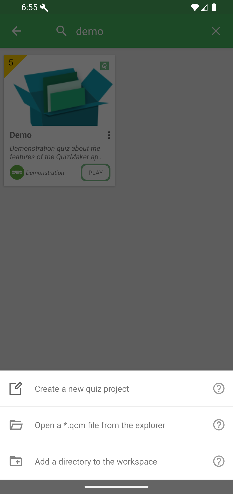
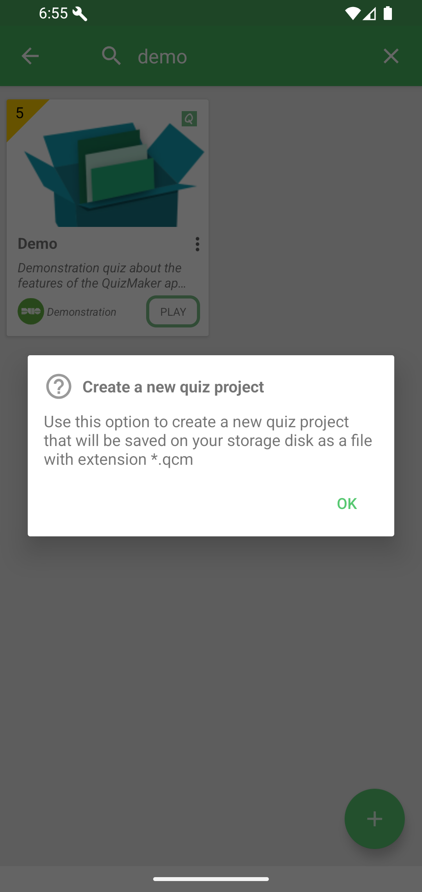
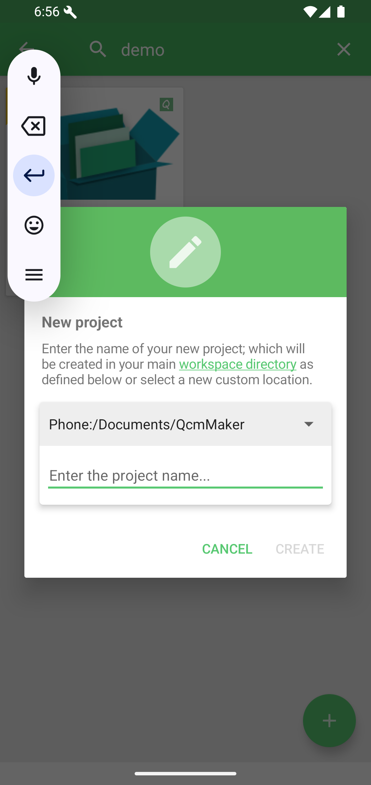

# Create A Quiz

Creating a quiz prepares a new `.qcm` file in your workspace. This file is the container that will hold the quiz title, questions, answers, media, comments, and player settings.

Open the workspace actions menu from Home, then tap **Create a new quiz project**.

The help icon explains that the new project is saved as a `.qcm` file.

Enter a name and tap **CREATE**.

What happens next: QcmMaker opens the project viewer for this new file. From there, you can edit quiz information, add questions, test the quiz, or later share the resulting `.qcm` file.
