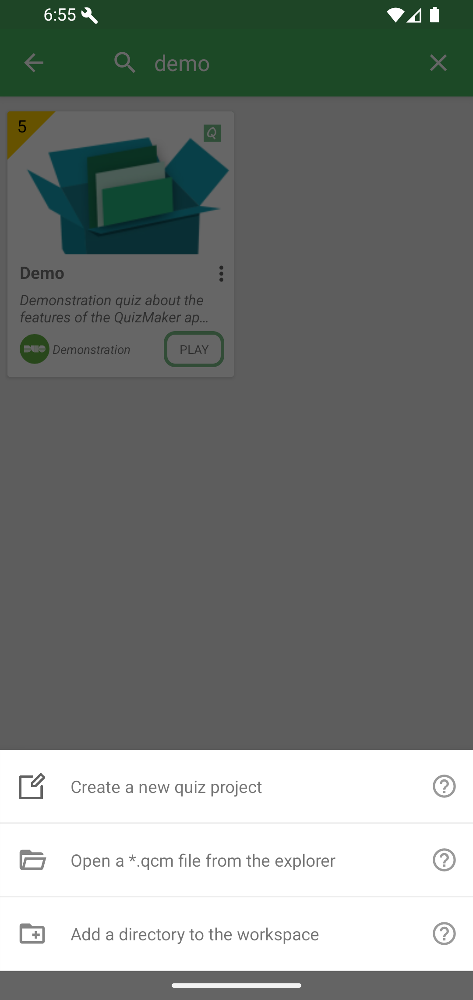
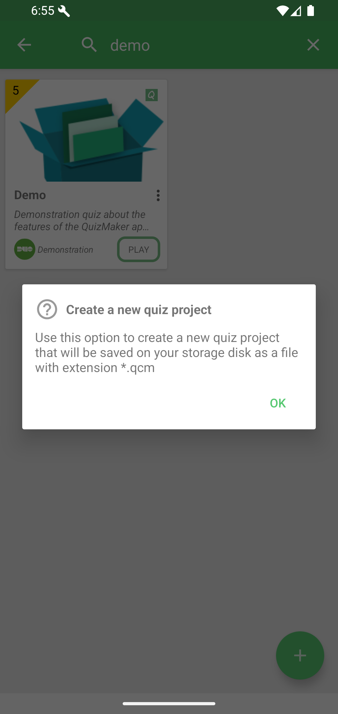

# Create A Quiz

**Goal:** create an empty `.qcm` file that you can configure and fill with questions.

**Starting point:** the QcmMaker Home screen.

Creating a quiz prepares a new `.qcm` file in your workspace. This file will contain the quiz information, questions, answers, media, correction comments, and player settings.

Open the workspace actions menu from Home, then tap **Create a new quiz project**.

The help icon explains that the new project is saved as a `.qcm` file.

Enter a name and tap **CREATE**.

The name identifies the quiz file in the workspace. Choose a short, recognizable name; you can give the quiz a more descriptive title and description on the next screen.

## Expected result

QcmMaker opens the project information screen for the new quiz. The file already exists, but it does not yet contain a complete quiz.

**Next:** [add the quiz information and session settings](edit-information.md), then [create the questions](../editor/README.md).
