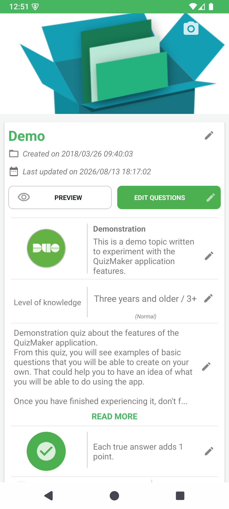
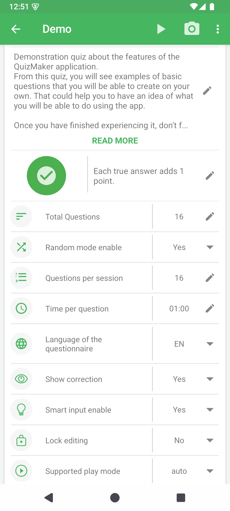

# Modifier les informations du quiz

> Les captures montrent le quiz Demo avec l'interface en anglais.

**Objectif :** expliquer le contenu du quiz et définir le comportement d'une session de jeu.

**Point de départ :** ouvrez un quiz, puis choisissez **Edit information / Modifier les informations**. Après la création d'un quiz, QcmMaker ouvre automatiquement cet écran.

Les informations descriptives aident à reconnaître et comprendre le quiz. Les réglages de session déterminent le nombre de questions, leur ordre, le temps, la correction et le mode de jeu.

## Décrire le quiz

Touchez le crayon placé à côté d'une ligne pour la modifier.

| Information | Rôle | Conseil |
|---|---|---|
| Image de couverture | Identifie visuellement le quiz | Choisissez une image reconnaissable même sous forme de vignette. |
| Titre | Nomme le quiz | Préférez un titre précis à un nom générique. |
| Sujet | Définit le domaine, son icône et sa courte présentation | Indiquez le thème réellement évalué. |
| Niveau de connaissance | Présente le public ou la difficulté attendue | Faites-le correspondre au niveau des questions. |
| Description | Explique l'objectif avant le démarrage | Mentionnez le but, le périmètre et les consignes utiles. |
| Politique de notation | Explique comment les réponses rapportent des points | Vérifiez-la pour les questions ayant plusieurs bonnes réponses. |

Le nom du fichier et le titre du quiz sont distincts : le premier sert à retrouver le fichier `.qcm`, tandis que le second fait partie du contenu présenté aux participants.

## Configurer une session

Faites défiler l'écran sous les informations descriptives.

| Réglage | Effet |
|---|---|
| Nombre total de questions | Indique le nombre de questions actuellement enregistrées. |
| Mode aléatoire | Modifie l'ordre de sélection ou de présentation des questions. |
| Questions par session | Limite une session à une partie du quiz. |
| Temps par question | Définit le temps disponible lorsque le mode choisi utilise un chronomètre. |
| Langue du questionnaire | Identifie la langue du contenu. |
| Afficher la correction | Autorise ou masque la correction après la réponse ou la session. |
| Saisie intelligente | Active les aides de saisie prises en charge. |
| Verrouiller l'édition | Protège le quiz contre les modifications ordinaires. |
| Mode de jeu pris en charge | Impose un mode compatible ou laisse QcmMaker le choisir automatiquement. |

Un réglage peut ne pas influencer tous les modes. Testez toujours le quiz dans le mode qui sera réellement utilisé.

## Continuer

- Touchez **EDIT QUESTIONS / MODIFIER LES QUESTIONS** pour [modifier les questions](../editor/README-fr.md).
- Touchez **PREVIEW / APERÇU** pour contrôler les informations visibles par le participant.
- Lancez le quiz pour vérifier les réglages.

**Étape suivante :** [choisir un type et ajouter une question](../editor/question-types/README-fr.md).
