# Modifier les questions

L'éditeur de questions permet de rédiger l'énoncé, choisir la manière de répondre, joindre des médias, définir les réponses acceptées, ajouter une explication et organiser le quiz. Chaque page correspond à une question.

## Accès

Ouvrez un quiz, puis touchez **Edit questions / Modifier les questions**.

## Comprendre l'écran

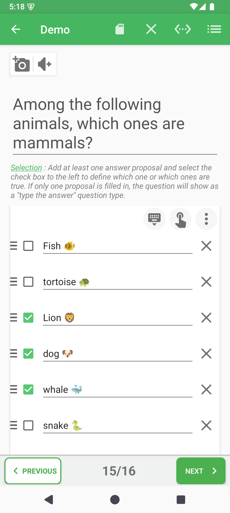

La zone supérieure contient l'énoncé et les commandes image/audio. La carte de réponses contient les entrées rapides, le type de question et les options avancées. Chaque ligne possède à gauche une poignée et son menu d'options, puis le contrôle de validité lorsqu'il s'applique, le texte et le bouton de suppression. L'index central de la barre inférieure ouvre la navigation rapide.

## Types de questions pris en charge

| Type | Action de l'apprenant | Données à définir |
|---|---|---|
| Sélection | Choisir une ou plusieurs réponses | Au moins deux propositions et une réponse vraie cochée. Une seule proposition remplie devient une réponse à saisir. |
| Réponse à saisir | Saisir librement une réponse | Une ou plusieurs réponses acceptées. |
| Énumération | Donner plusieurs éléments attendus | Les éléments attendus et leur mode d'évaluation. |
| Texte à trous | Compléter les parties manquantes | Le texte et la valeur attendue de chaque trou. |
| Association de colonnes | Associer deux colonnes | Des paires gauche/droite complètes. |
| Mise en ordre | Restaurer le bon ordre | Au moins deux propositions saisies dans l'ordre de référence. |
| Mots mélangés | Remettre les mots en ordre | La phrase complète de référence. |

Touchez l'icône de type dans la carte de réponses. La consigne située au-dessus s'adapte au type choisi.

## Section de réponses vide ou complétée

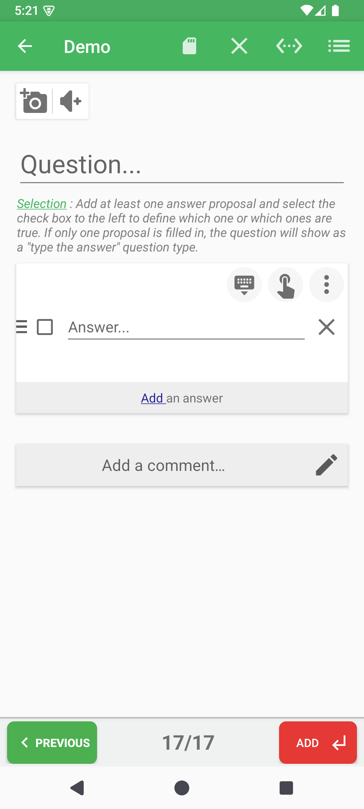

Une nouvelle question de sélection commence avec une ligne vide. Rédigez l'énoncé, remplissez la première proposition, utilisez **Add an answer / Ajouter une réponse**, puis cochez chaque réponse vraie. La poignée réordonne une ligne et **X** la supprime.

Les cases cochées sont les réponses vraies ; les autres lignes remplies sont des distracteurs. Pour une mise en ordre, l'ordre affiché dans l'éditeur est l'ordre de référence.

## Options avancées de la question

Touchez les trois points verticaux en haut à droite de la carte. Selon le type, le panneau permet de régler la sensibilité à la casse, l'aide à la saisie et le mélange des propositions.

## Options propres à chaque proposition

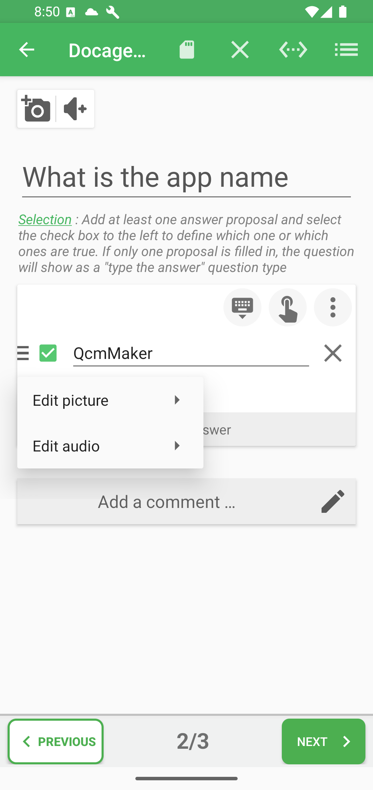

Touchez la zone d'options à gauche d'une ligne. Selon le type, vous pouvez joindre une image, joindre/enregistrer/générer un son, choisir l'évaluation du texte (égalité, contenu ou motif), ajouter un indice ou réordonner la proposition. Les réponses ouvertes et les énumérations n'offrent pas les médias de proposition, contrairement aux variantes de sélection, association, texte à trous et ordre.

## Image et audio de la question

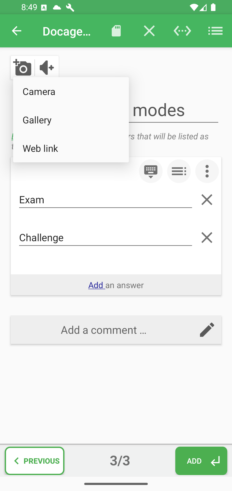

Le bouton appareil photo permet de prendre une photo, choisir une image, utiliser un lien web ou retirer l'image. Des commandes de recadrage/disposition peuvent apparaître lorsqu'une image existe.

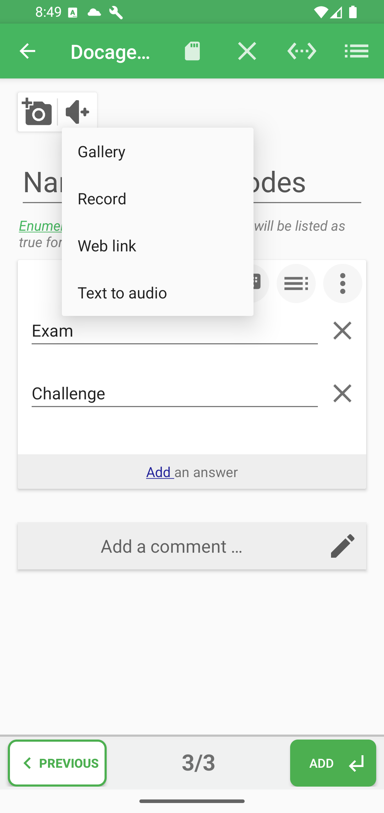

Le bouton audio permet de choisir un fichier, enregistrer un son, utiliser un lien web ou générer de l'audio à partir d'un texte. Le lecteur permet ensuite d'écouter et de modifier ce média.

## Commentaire : texte, image et son

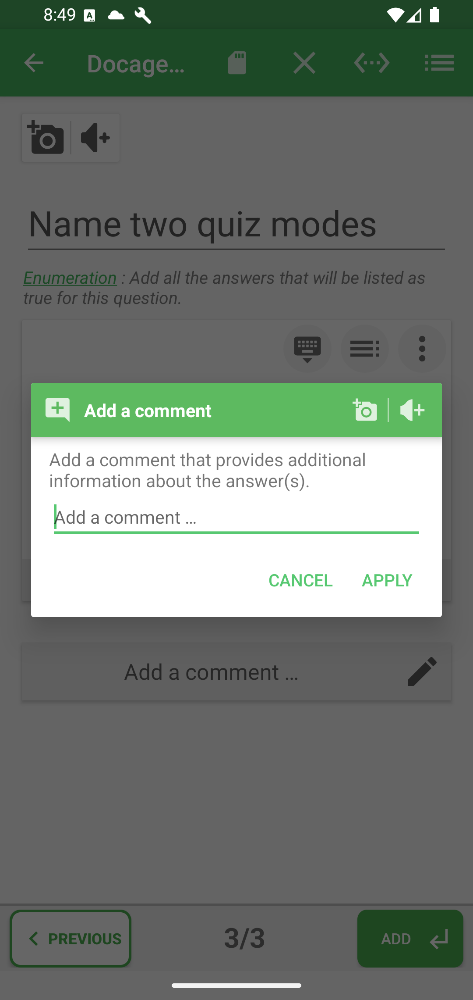

Touchez **Add a comment / Ajouter un commentaire** ou le crayon. Ce commentaire sert d'explication lors de la correction et peut combiner texte, image et audio. **Apply** applique le dialogue ; il faut encore enregistrer le quiz depuis l'éditeur.

## Erreurs de validation

QcmMaker valide la page lors du passage à la suite ou de l'enregistrement. La consigne devient rouge et un message signale que la page est incomplète.

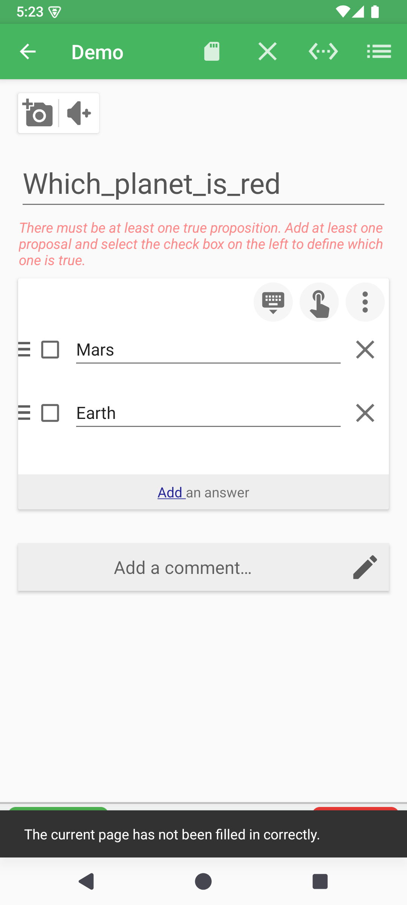

Pour une **sélection**, dès que plusieurs propositions sont remplies, au moins une doit être cochée comme vraie.

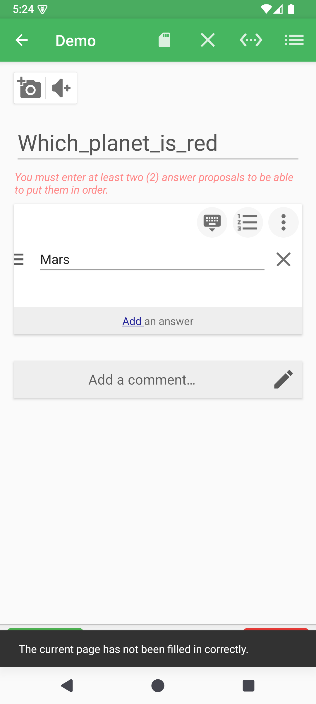

Pour une **mise en ordre**, au moins deux propositions sont nécessaires. Les autres types structurés refusent également les paires, trous ou ensembles attendus incomplets. Une page finale entièrement vide n'est pas une question valide : complétez-la ou laissez-la hors du contenu enregistré.

## Barre d'actions

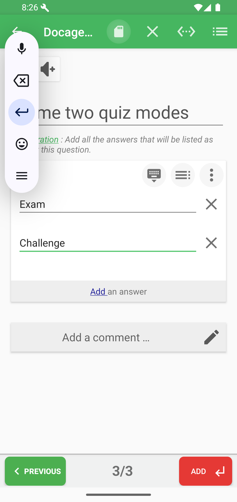

| Commande | Rôle |
|---|---|
| Retour | Quitte l'éditeur et propose d'enregistrer ou d'abandonner en cas de modification. |
| Enregistrer | Enregistre, enregistre et lance, ou choisit un mode de jeu. |
| Supprimer (X) | Efface/supprime la question courante. |
| Insérer | Duplique, insère avant/après, colle ou importe des questions. |
| Liste | Ouvre le tiroir des questions. |

## Tiroir, réordonnancement et menu d'index

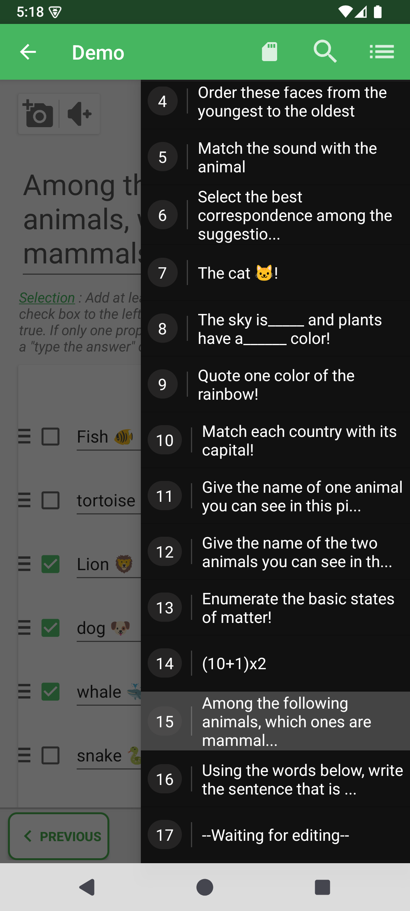

Le tiroir droit liste les questions et surligne la page courante. Touchez le texte pour naviguer. Maintenez puis faites glisser une ligne pour réordonner. Touchez son numéro d'index pour ouvrir le popup : **Move** explique le déplacement et **Delete** supprime la question.

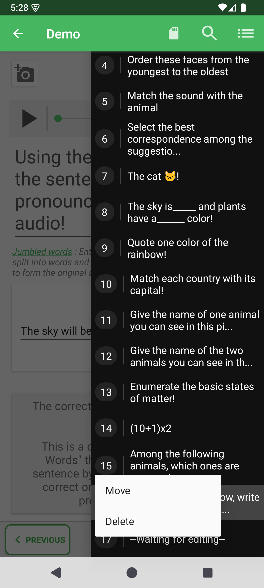

## Navigation rapide

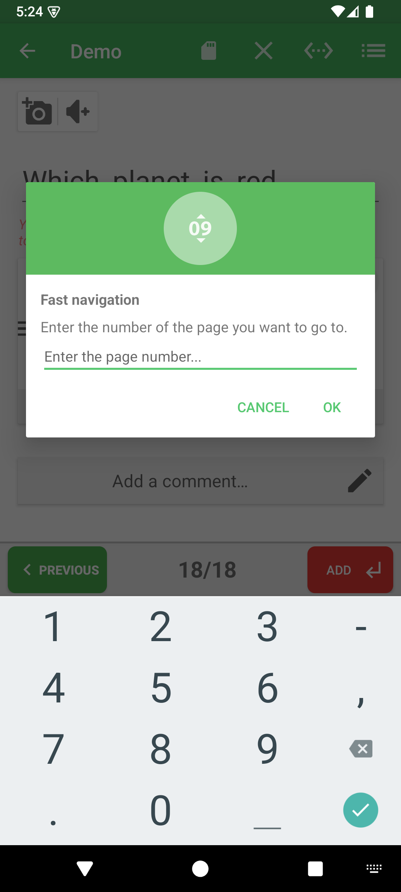

Touchez l'index central (par exemple `15/16`), saisissez un numéro et validez avec **OK**. Cette méthode est adaptée aux longs quiz.

## Avant de quitter

Enregistrez lorsque le quiz est prêt. Corrigez toute consigne rouge au préalable. Quitter sans enregistrer abandonne les modifications de la session, y compris les nouveaux médias.
