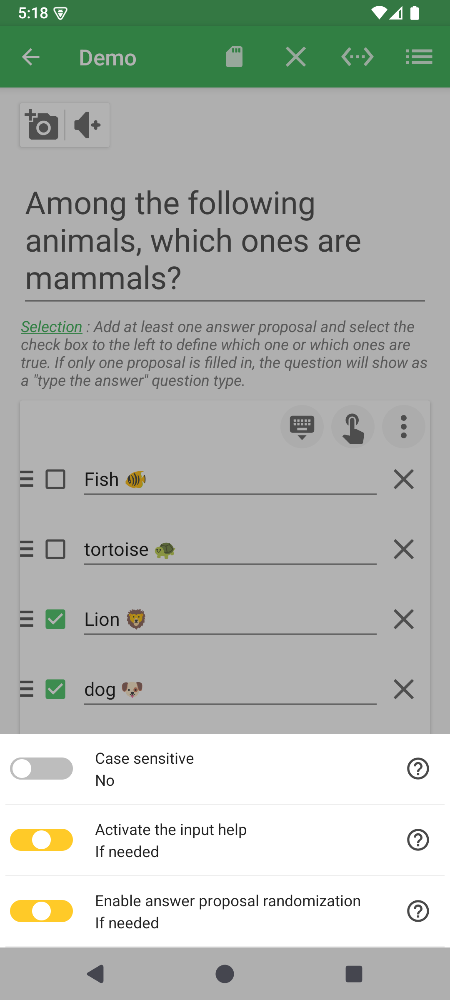
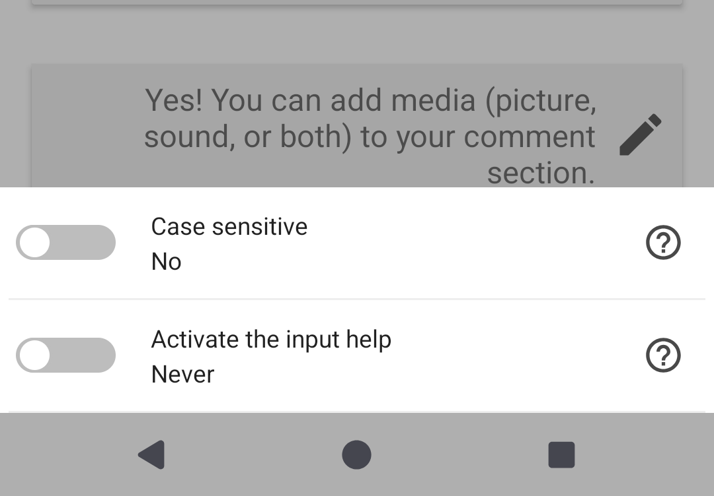
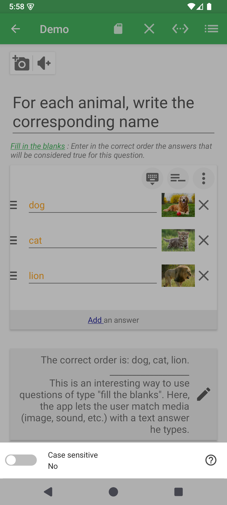
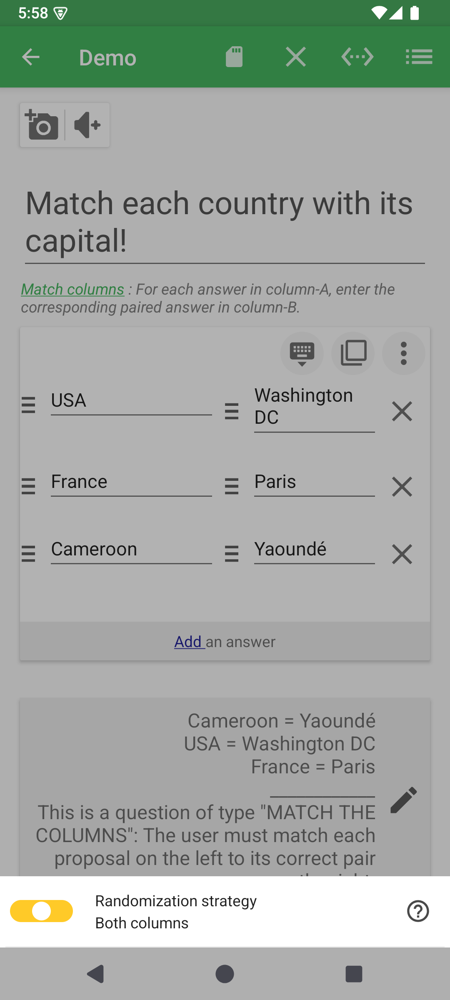
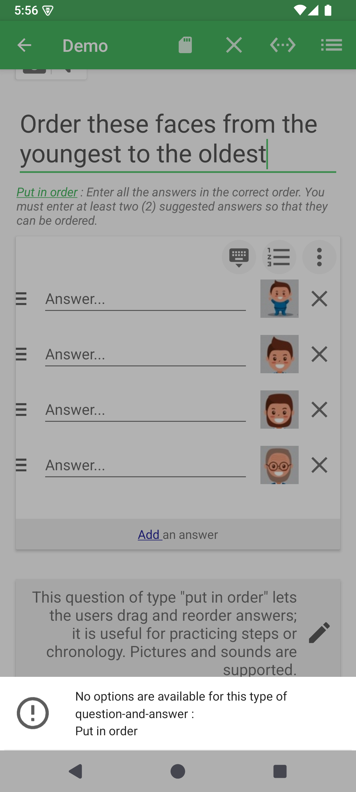

# Options de la question et des réponses

La carte de réponses possède deux zones d'options. Les trois points verticaux en haut à droite modifient toute la question. La commande placée à gauche d'une ligne ne modifie que cette réponse.

## Options de toute la question

Touchez les trois points verticaux. QcmMaker affiche uniquement les réglages compatibles avec le type actif.

| Famille visuelle | Types | Options visibles |
|---|---|---|
| Sélection | Variantes de sélection | Casse, aide à la saisie, mélange et limites d'affichage éventuelles |
| Réponses textuelles | Réponse à saisir, Énumération | Casse et aide à la saisie |
| Texte à trous | Variantes de texte à trous | Casse |
| Association | Association de colonnes | Mélanger la gauche, la droite ou les deux colonnes |
| Sans option | Mise en ordre, Mots mélangés | Message explicatif à la place des réglages |

### Sélection

Le mélange évite de mémoriser la position d'une bonne réponse. Les limites d'affichage permettent d'utiliser seulement une partie d'un grand ensemble de propositions.

### Réponse à saisir et énumération

### Texte à trous

### Association de colonnes

Les deux côtés peuvent être mélangés séparément. Les paires enregistrées restent la référence de correction.

### Types sans options générales

## Options d'une ligne de réponse

Touchez la zone d'options à gauche d'une réponse. Le menu dépend du type et de l'état de cette réponse.

| Types | Options de ligne |
|---|---|
| Sélection, Association, Mise en ordre | Image et audio |
| Réponse à saisir, Énumération | Évaluation du texte : égalité, contenu ou motif |
| Texte à trous | Image, audio, évaluation et indice |
| Mots mélangés | Conservez des fragments textuels ; les médias peuvent être refusés à la validation |

Une image existante ajoute l'affichage, le recadrage et la suppression. Un son existant ajoute l'écoute et la suppression. Un indice existant peut être modifié ou supprimé.

**Précédent :** [Modifier les questions](README-fr.md)

**Suivant :** [Ajouter des médias et commentaires](media-and-comments-fr.md)
