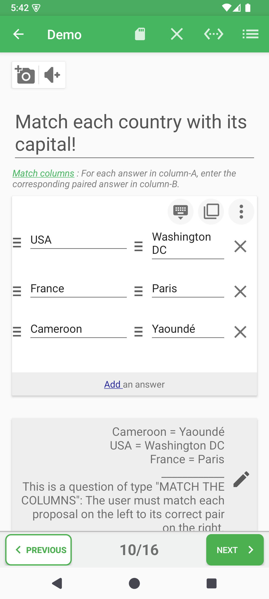

# Association de colonnes

Utilisez ce type pour relier des éléments associés : pays et capitale, terme et définition, événement et date.

## Une grille à deux colonnes

Contrairement aux autres types, l'association n'est pas une liste de réponses pleine largeur. Chaque ligne visuelle forme une paire sémantique : l'élément de la colonne A correspond à celui de la colonne B sur la même ligne.

| Ligne | Colonne A | Colonne B |
|---|---|---|
| Paire 1 | USA | Washington DC |
| Paire 2 | France | Paris |
| Paire 3 | Cameroon | Yaoundé |

## Ajouter, modifier et supprimer

- **Add an answer / Ajouter une réponse** crée une paire A/B complète.
- Remplissez les deux cellules avant d'avancer.
- La suppression retire toute la paire.
- Les options de chaque cellule gèrent les médias propres à cette cellule.

Les colonnes ne sont pas deux listes indépendantes. La ligne enregistrée reste la référence de correction, même si une ou deux colonnes sont ensuite mélangées pendant le jeu.

## Options de la question

Le panneau peut mélanger la gauche, la droite ou les deux côtés sans modifier les paires enregistrées.

## Validation

Créez au moins deux associations complètes. Une ligne dont seule la colonne A ou B est remplie doit être complétée ou retirée.

**Précédent :** [Texte à trous](fill-in-blanks-fr.md)

**Suivant :** [Mise en ordre](put-in-order-fr.md)
