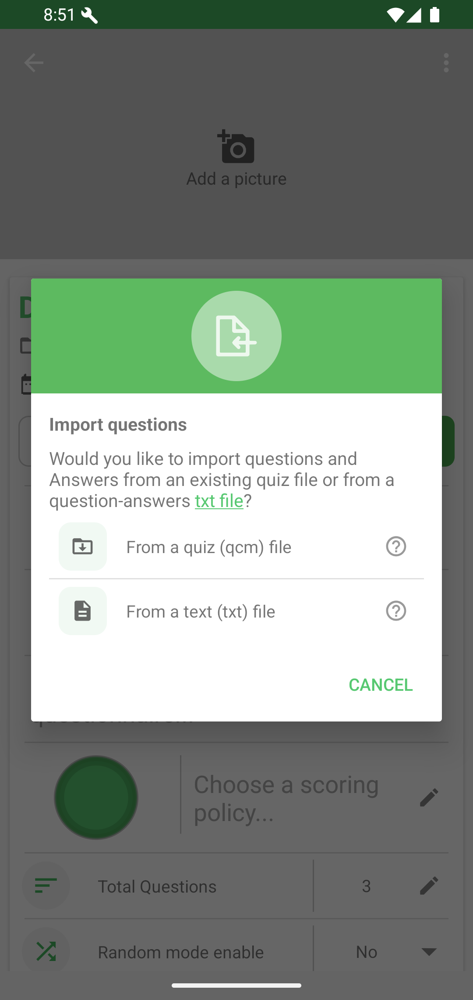

# Import & Export

QcmMaker can import questions into an existing quiz from another `.qcm` quiz file or from a plain text file.

From the project information page, open **More options**, then choose **Import questions**.

Choose whether the source is a QCM file or a text file.

## Import from a QCM file

For a `.qcm` file, Android opens the file picker. Select the source file to continue the import.

## Import from a text file

You can also prepare questions and answers in a `.txt` file, including from a computer, then import that file into QcmMaker.

Start with the standard format if you are discovering text import. It is the fastest way to create a ready-to-import file with questions, answers, and optional explanations.

| Need | Recommended guide |
|---|---|
| Create a simple question-and-answer text file quickly | [Standard TXT import](import-txt-standard.md) |
| Add question types, media links, metadata, or styled content | [Advanced TXT import](import-txt-advanced.md) |

Export and backup actions are available from project-level actions when the current project state supports them.
