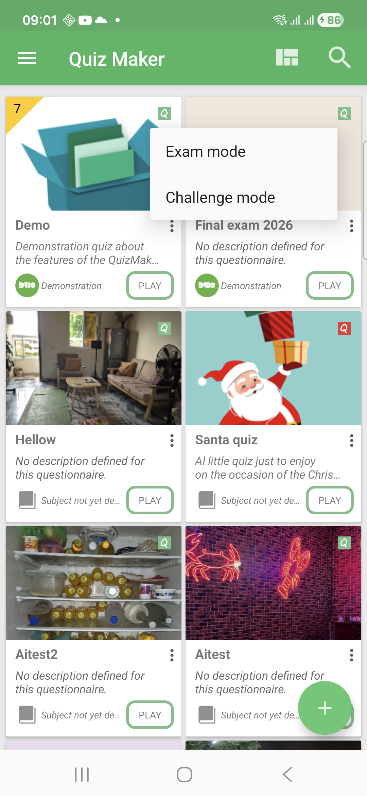
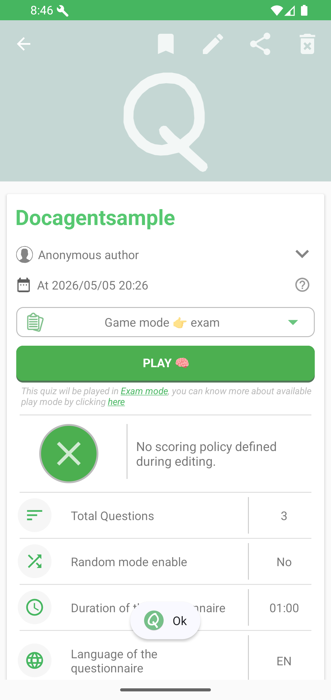
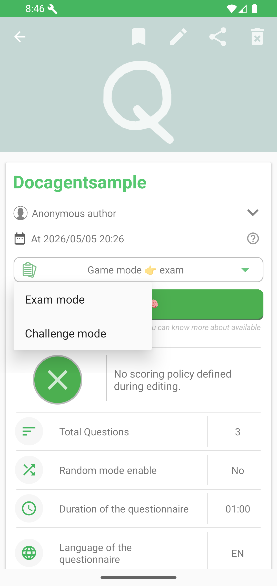
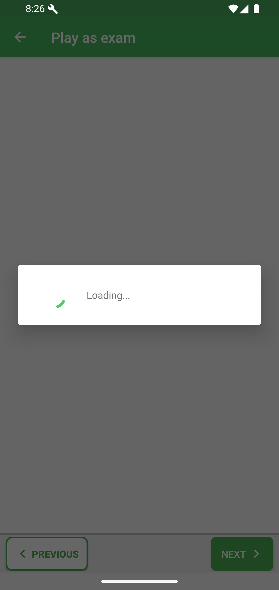
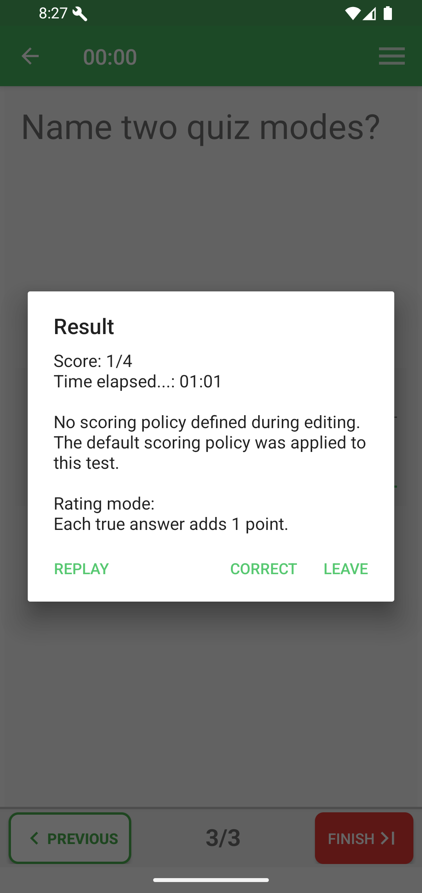
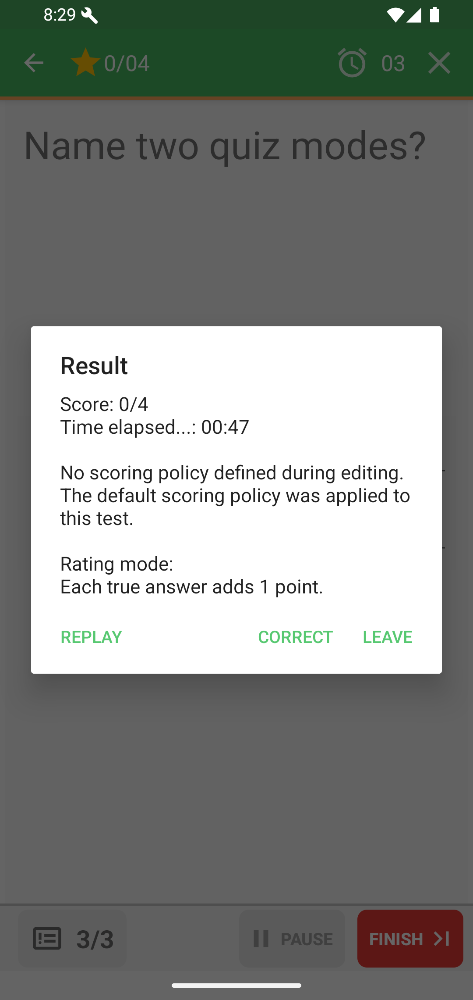
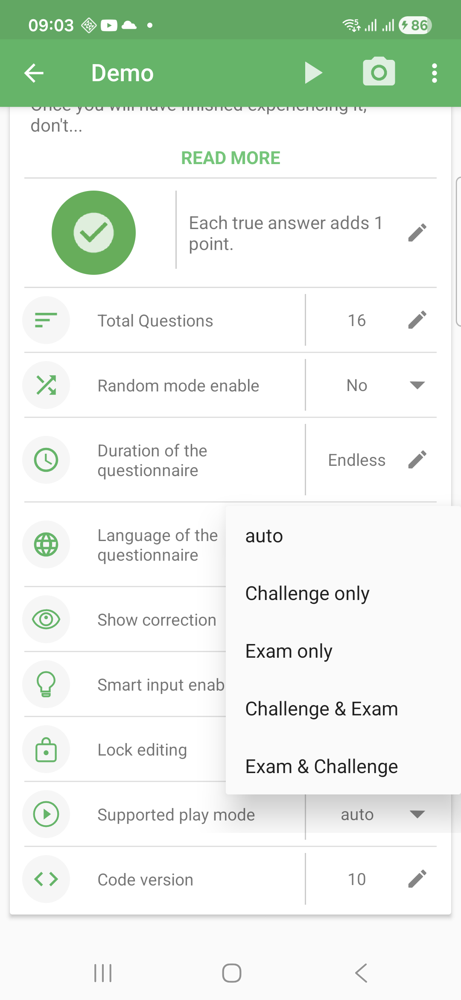
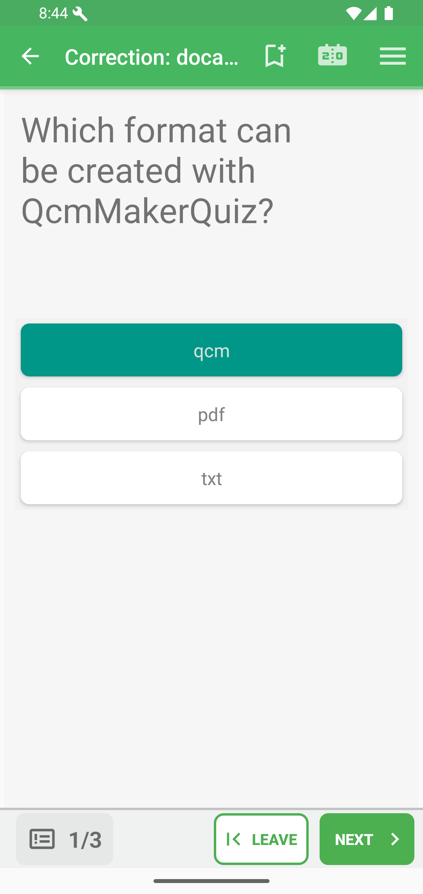
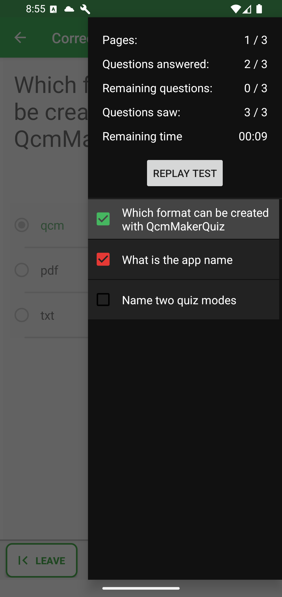
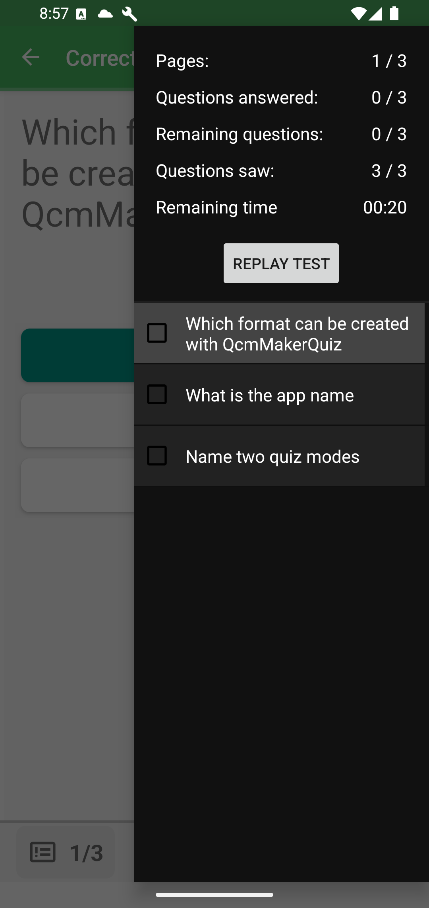

# Play Modes

QcmMaker can launch a quiz in **Exam mode** or **Challenge mode**. You can choose
the mode before playing, and quiz authors can also define which modes a shared
`.qcm` file supports.

Good to know: the two modes are not only visual styles. They create different learning experiences. Exam mode protects the feeling of a real test; Challenge mode helps practice through quick feedback.

| Choose this mode | When you want |
|---|---|
| Exam mode | To simulate an evaluation, manage time across the whole quiz, and see feedback after finishing. |
| Challenge mode | To train quickly, answer under pressure, and learn from immediate feedback. |

## Choose A Mode Before Playing

From the home **Questionnaires** tab, tap the small **Q** icon on a quiz card to
switch between **Exam mode** and **Challenge mode**. The icon is green for Exam
mode and red for Challenge mode.

From a quiz detail page, use the **Game mode** selector before pressing **Play**.

From the editor, open **Save**, choose **Save & play using**, then select a mode.

Choosing a mode this way controls how the quiz starts for you. It does not
change the modes that the quiz file itself allows.

## Exam Mode

Exam mode works like a test or exam simulator. You can navigate between
questions during the test, use the timer for the whole questionnaire, and review
feedback after finishing.

For visual examples of each supported question family in Exam mode, see
[Exam question types](exam-question-types/README.md).

At the end, QcmMaker shows the score, elapsed time, scoring policy, and actions to replay, correct, or leave.
See [Result and replay](result-and-replay.md) for the actions available after a test.

## Challenge Mode

Challenge mode is more immediate, like a game against the clock. Questions are
shown one after another, each answer is checked as you play, and QcmMaker can
move automatically to the next question depending on the quiz and player
settings.

For visual examples of captured immediate feedback by question family, see
[Challenge question types](challenge-question-types/README.md).

The result dialog keeps the same core actions: replay, correct, or leave. See
[Result and replay](result-and-replay.md) for the result dialog and replay
choices.

## Supported Play Mode

When editing a quiz, the **Supported play mode** setting defines which modes the
exported `.qcm` file can use. Open the quiz information editor, then change the
**Supported play mode** row.

The available values are:

- **auto**: lets QcmMaker use the quiz and app default behaviour.
- **Challenge only**: the quiz can only be played in Challenge mode.
- **Exam only**: the quiz can only be played in Exam mode.
- **Exam & Challenge**: both modes are allowed, with Exam mode proposed first
  when the player has not explicitly chosen a mode.
- **Challenge & Exam**: both modes are allowed, with Challenge mode proposed
  first when the player has not explicitly chosen a mode.

This setting belongs to the quiz authoring configuration. It is different from
the play-mode selector shown on the home and detail pages, which only selects
the mode for the current play session.

What happens when you share the quiz: the supported play mode setting travels with the exported `.qcm` file. It tells other compatible readers which experience the author intended to allow.

## Correction And Score

After a result, choose **Correct** to review the quiz with the answers and navigation controls.

The Score action reopens the result summary.

The menu icon in correction opens the question/status drawer. In Exam correction, green checked items indicate correct answers, red checked items indicate incorrect answers, and empty items indicate unanswered or neutral state.

Challenge correction uses the same drawer structure with Challenge timing context.

Good to know: correction availability depends on the quiz configuration. Some authors may allow full correction, partial correction, or no correction at all. When correction is available, use it to understand mistakes before replaying.
