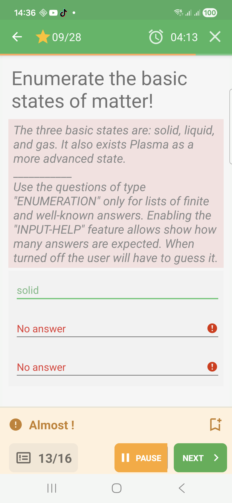

# Enumeration Questions In Challenge Mode

Enumeration questions ask the learner to list several expected answers.

## Empty State

Before answering, the expected entry fields are empty.

## Filled State

The learner enters one item per field before submitting.

## Feedback Success

When all expected items are present, QcmMaker marks the entries in green and
shows a success band.

## Feedback Failure

When expected items are missing, QcmMaker marks the fields in red and shows
failure feedback.

## Feedback Partial

When some expected items are present but others are missing, QcmMaker can show a
partial result.

## How To Answer

Enter each expected item clearly. When several fields are shown, fill as many as
the question expects before submitting.
