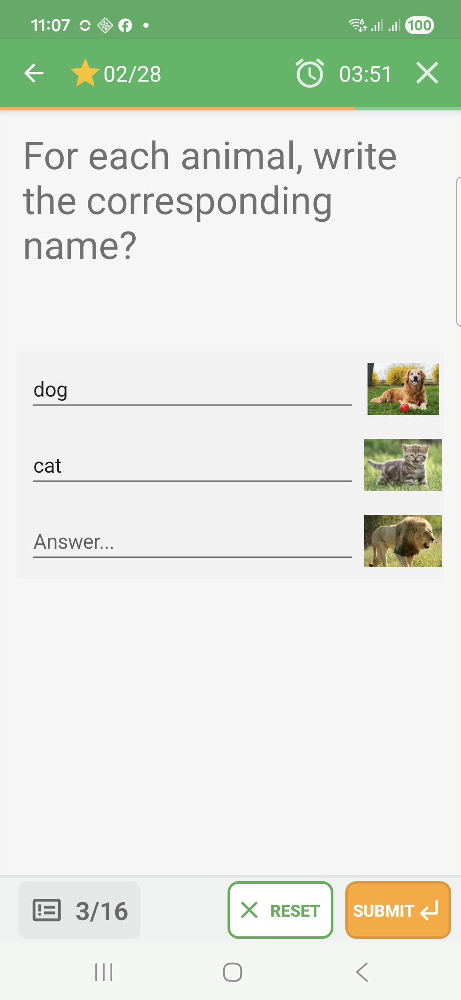
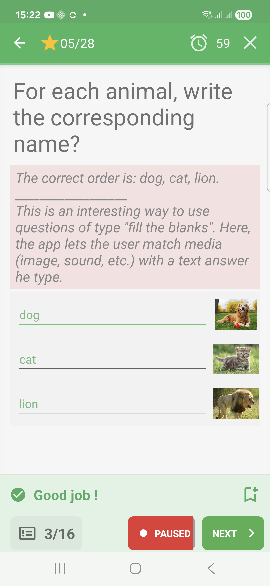
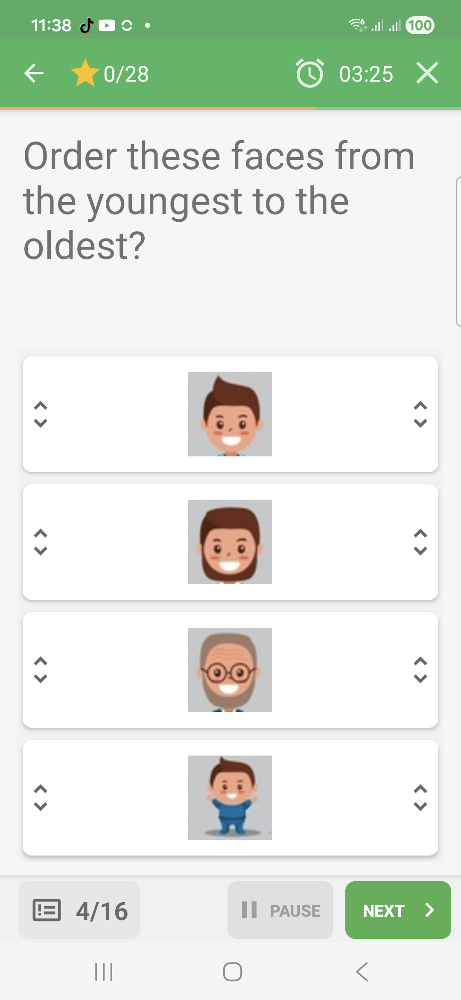
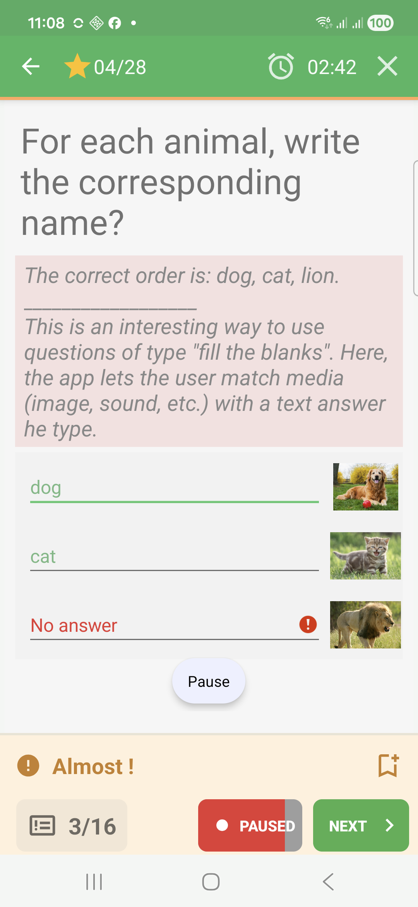

# Fill-In-Blanks Questions In Challenge Mode

Fill-in-blanks questions ask the learner to enter values in the displayed
fields, usually in a fixed order.

## Empty State

The question shows every field that must be filled.

## Filled State

The learner enters answers before submitting.

## Feedback Success

When every blank matches the expected answer, QcmMaker marks the fields in green
and shows a success band.

## Feedback Failure

Missing or invalid fields are marked in red during immediate feedback.

## Feedback Partial

When some blanks are correct and others are missing, QcmMaker can show partial
feedback.

## How To Answer

Fill each field in the order shown by the question, then submit.
