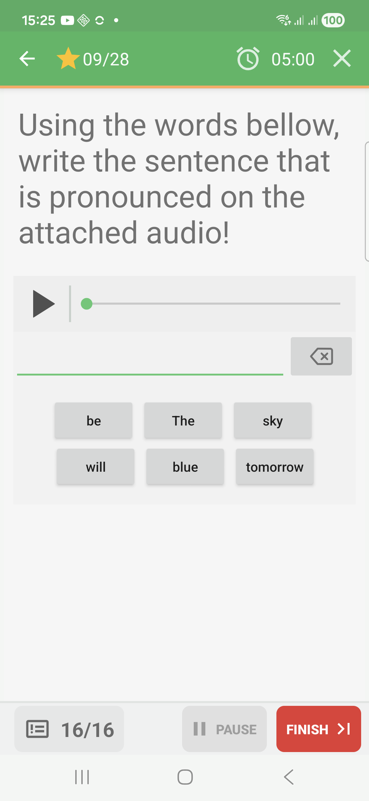
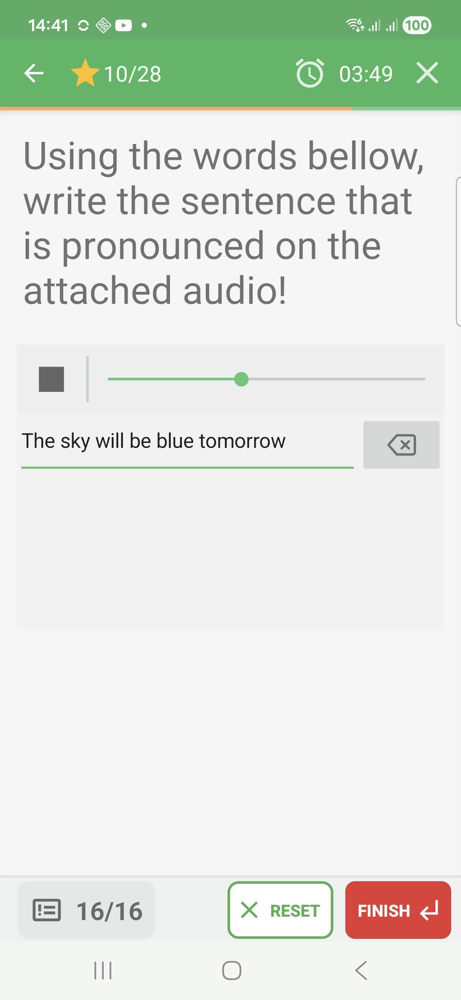
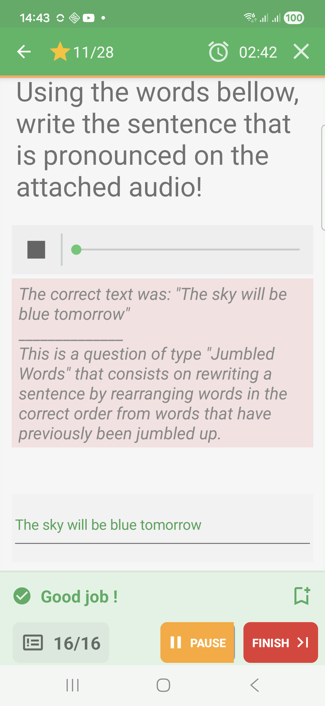
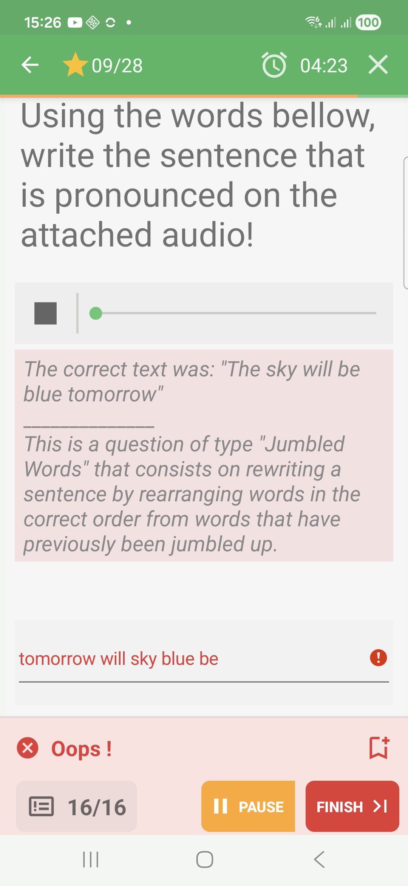

# Jumbled-Words Questions In Challenge Mode

Jumbled-words questions ask the learner to rebuild a sentence from shuffled
words or fragments.

## Empty State

Before answering, the sentence line is empty and the available words are shown
as separate chips.

## Filled State

The learner taps words to build the sentence before submitting.

## Feedback Success

When the sentence is correct, QcmMaker marks the reconstructed answer in green
and shows a success band.

## Feedback Failure

When the sentence is incorrect, QcmMaker shows the expected text and marks the
submitted sentence in red.

## How To Answer

Listen to or read the prompt, then tap the words in the order that forms the
expected sentence. Challenge mode checks the reconstructed sentence when it is
submitted or when the quiz validates the answer.

Partial feedback is not shown for the captured jumbled-words example; the
sentence is accepted or rejected as a whole.
