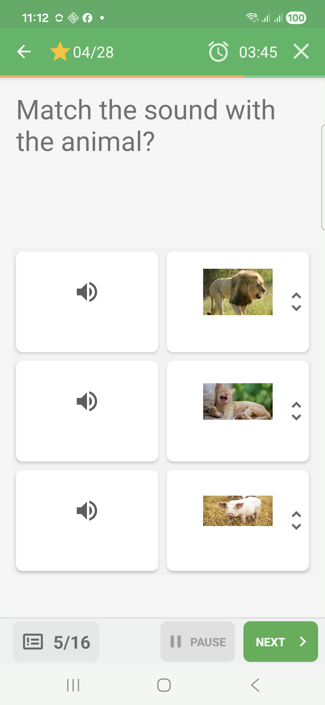
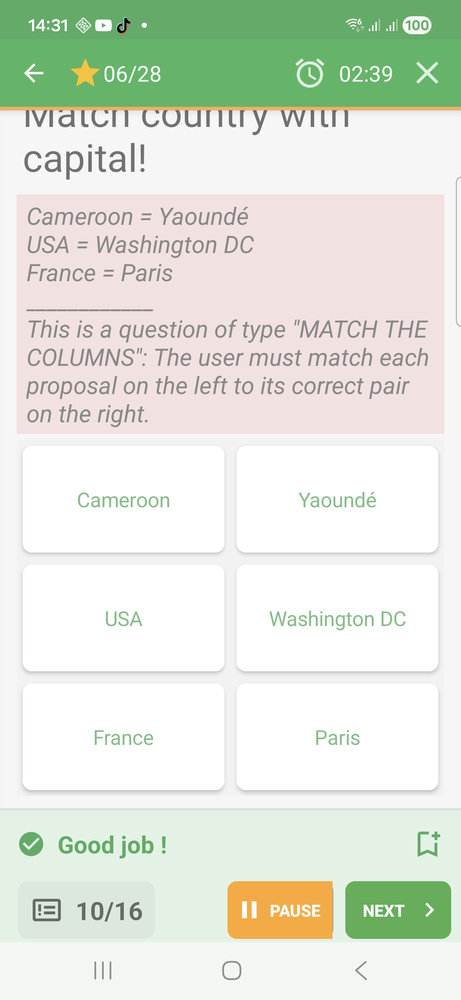
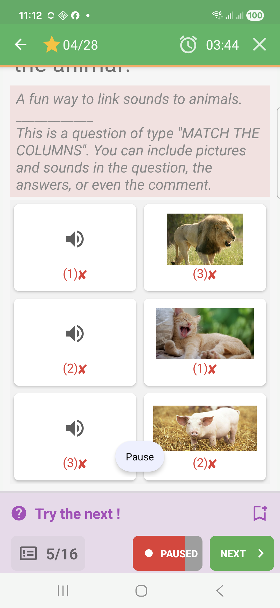

# Match-Columns Questions In Challenge Mode

Match-columns questions ask the learner to pair items from two columns.

## Empty State

The left and right columns appear as separate items.

## Filled State

The learner changes the right-side order until the rows form the intended
pairs.

## Feedback Success

When every row is correctly paired, QcmMaker marks the matched rows in green and
shows a success band.

## Feedback Failure

Incorrect pairings are marked in red during immediate feedback.

## Feedback Partial

When some pairs are correct and others are wrong, QcmMaker can show a mixed
result.

## How To Answer

Reorder the items so each row contains a correct pair, then submit or validate.
