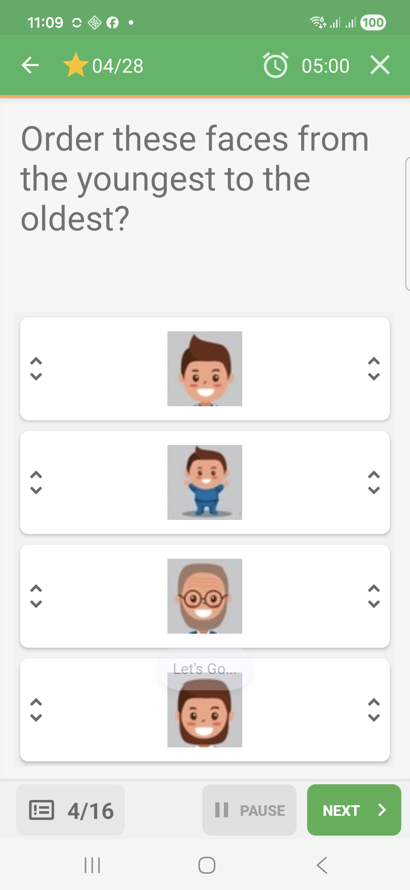
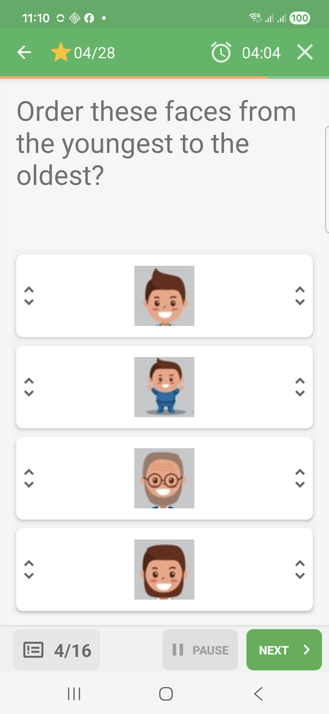
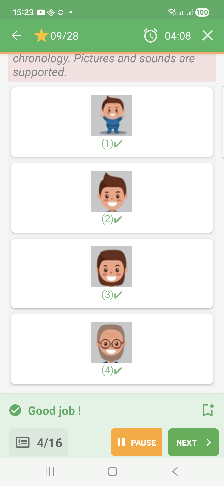
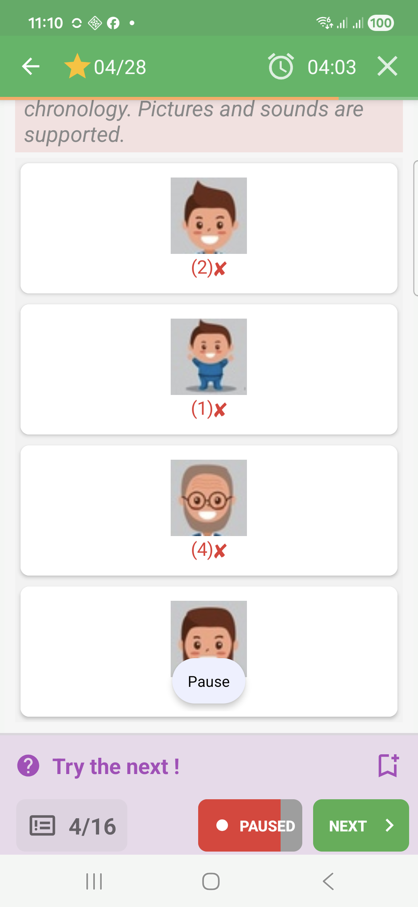

# Put-In-Order Questions In Challenge Mode

Put-in-order questions ask the learner to arrange items into a specific
sequence.

## Empty State

The items are displayed in the current order.

## Filled State

The learner changes the order before validating.

## Feedback Success

When the sequence is correct, QcmMaker numbers the items and marks each one as
accepted.

## Feedback Failure

An incorrect sequence is marked as rejected during immediate feedback.

## How To Answer

Place the items from first to last according to the question. The observed
Challenge feedback marks the sequence as correct or incorrect as a whole.
