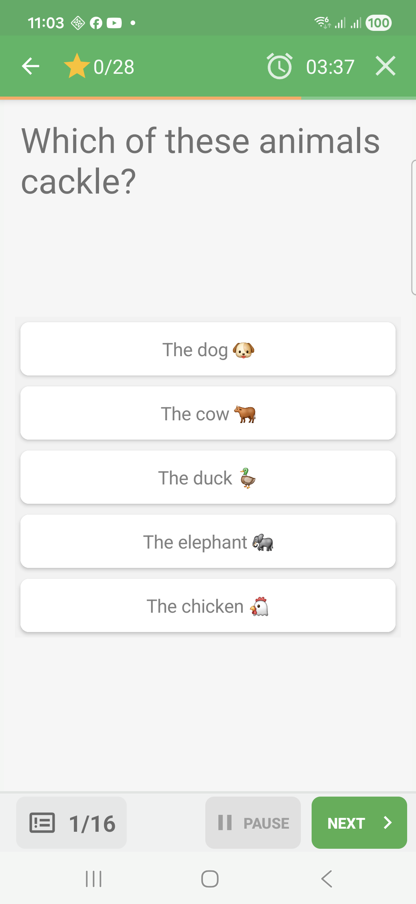
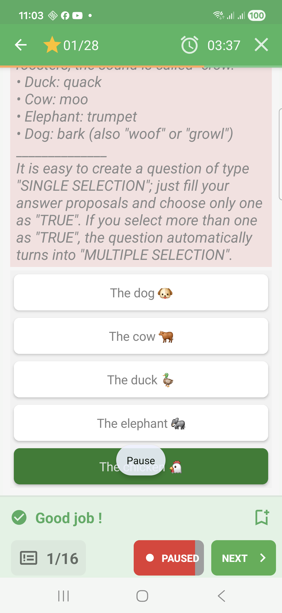
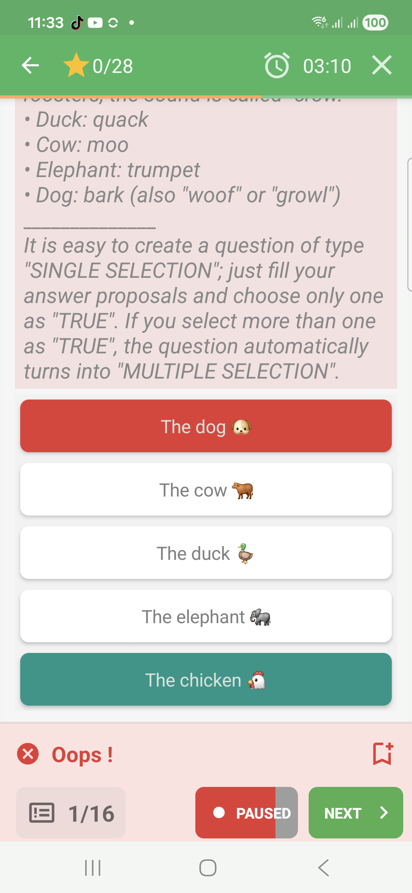
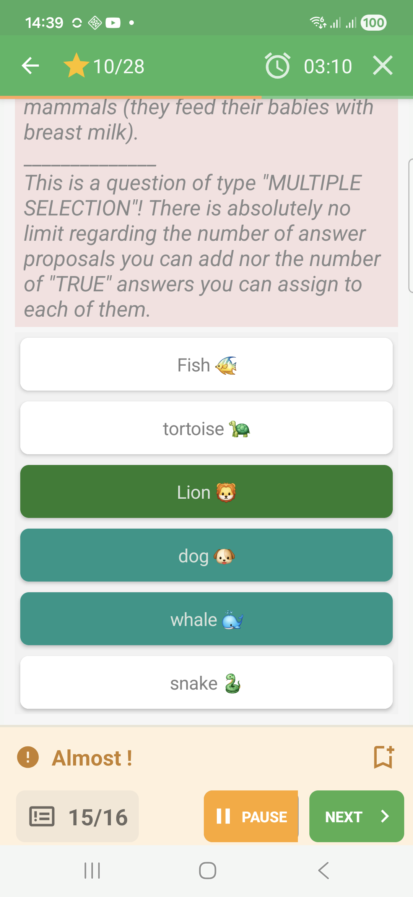

# Selection Questions In Challenge Mode

Selection questions ask the learner to choose one or more proposals. In
Challenge mode, simple selection can validate immediately after a tap. Multiple
selection can keep selected proposals visible until the learner validates.

## Empty State

Before answering, all proposals are neutral.

## Feedback Success

When the selected answer is correct, QcmMaker marks it as accepted and shows a
green success band.

## Feedback Failure

When the selected answer is wrong, QcmMaker marks the selected proposal in red
and shows an error band.

## Feedback Partial

When the answer includes only part of the expected set, QcmMaker can show a
partial result and highlight what was missing.

## How To Answer

Tap the proposal you want to choose. For multiple-selection questions, select
the expected proposals before validating when the question allows several
choices.
