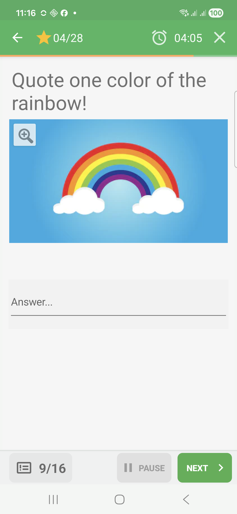
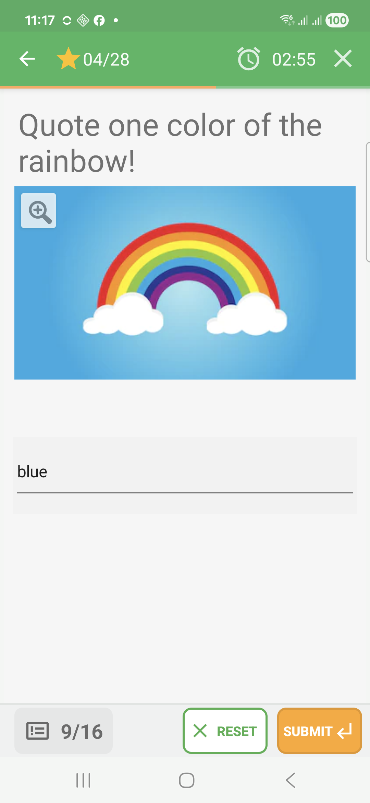
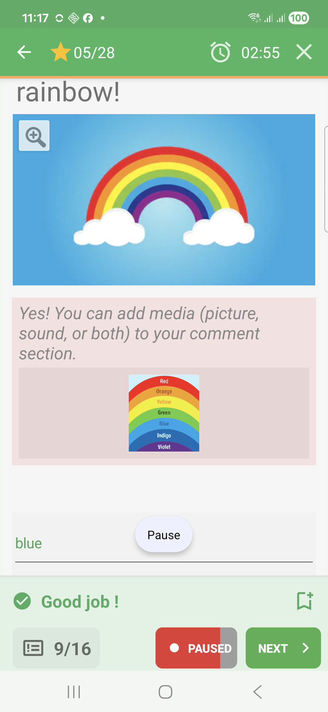
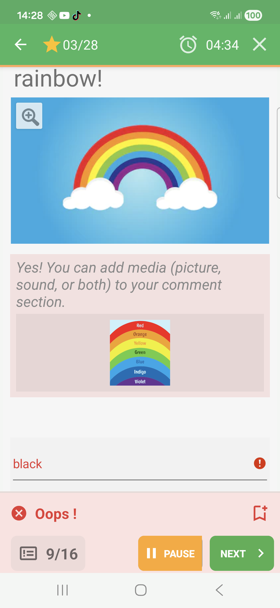

# Typed-Answer Questions In Challenge Mode

Typed-answer questions ask the learner to type a short answer, then submit it
for immediate feedback.

## Empty State

Before answering, the input field is empty.

## Filled State

After typing an answer, the learner can submit it from the bottom action button.

## Feedback Success

An accepted typed answer is shown in green with a success band.

## Feedback Failure

An incorrect typed answer is shown in red, and the feedback can display the
expected answer when the quiz allows it.

## How To Answer

Tap the answer field, type a short answer, then submit. If the question accepts
several values, any accepted value can be enough. Partial feedback is not shown
for the captured typed-answer example; the answer is accepted or rejected as a
whole.
