# Types de questions en mode Examen

> Les captures actuelles montrent l’interface en anglais. Les explications de
> cette page utilisent les noms français des actions et des états.

> Les captures détaillées des différents types de questions ont été réalisées
> en mode Examen afin de conserver une présentation visuelle cohérente. Les
> mêmes familles de questions peuvent être utilisées en mode Challenge, mais le
> rythme de navigation et le moment où la correction apparaît diffèrent.

En mode Examen, renseignez vos réponses puis terminez l’épreuve. Les couleurs et
explications apparaissent ensuite dans la correction, si elle est autorisée.

| Famille | Interaction attendue | Correction |
|---|---|---|
| Sélection | Cochez une ou plusieurs propositions. | Une sélection multiple évaluée élément par élément peut être partielle. |
| Réponse textuelle | Saisissez une réponse courte au clavier. | La réponse complète est acceptée ou refusée. |
| Texte à trous | Remplissez chaque champ dans l’ordre affiché. | La variante « chaque trou » peut montrer un résultat partiel ; la variante « ensemble complet » valide tout le groupe. |
| Énumération | Ajoutez les éléments attendus, sans imposer leur position dans une phrase. | La variante « chaque élément » peut être partielle ; la variante « ensemble complet » est globale. |
| Association de colonnes | Réorganisez les éléments pour former les bonnes paires. | « Chaque paire » peut être partiel ; « toutes les paires » évalue l’ensemble. |
| Remise en ordre | Faites glisser les éléments dans la séquence attendue. | La séquence observée est correcte ou incorrecte, sans état partiel. |
| Mots mélangés | Touchez les mots dans l’ordre pour reconstruire la phrase. | La phrase observée est correcte ou incorrecte, sans état partiel. |

## Exemples visuels

### Sélection

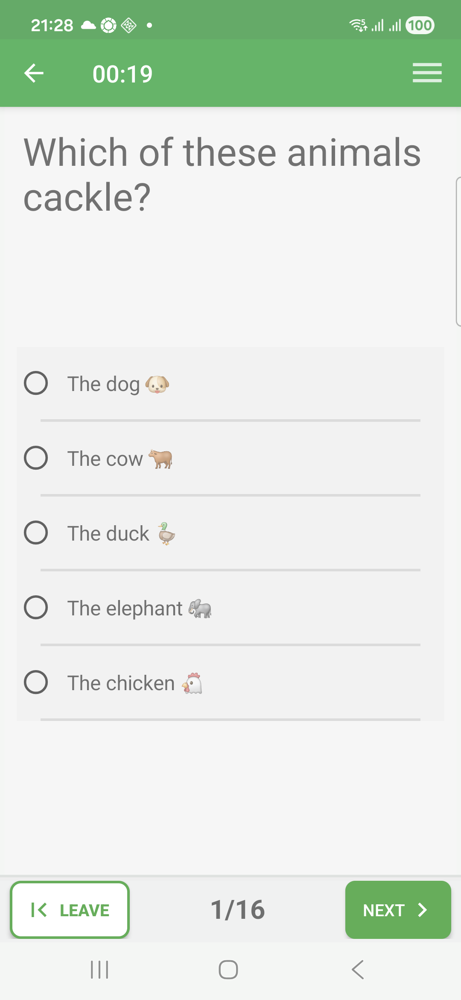

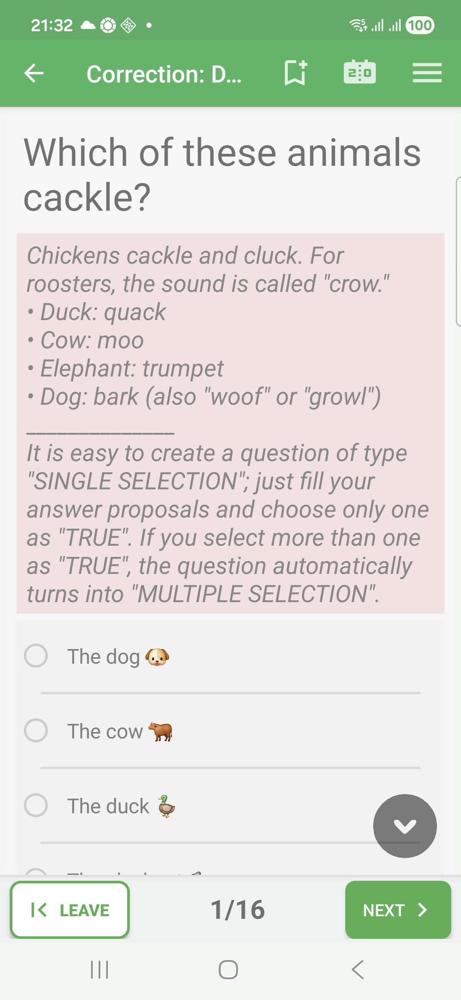

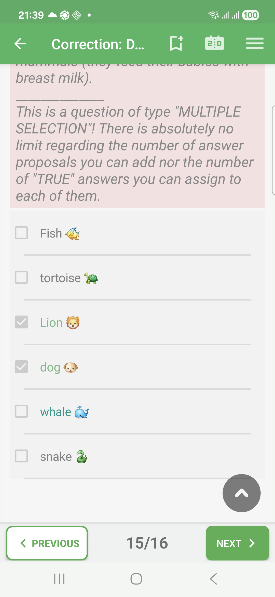

### Réponse textuelle

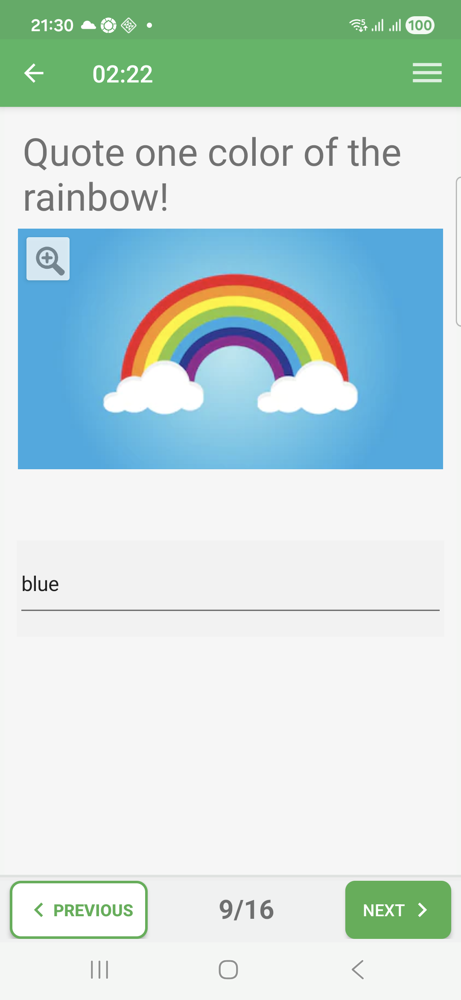

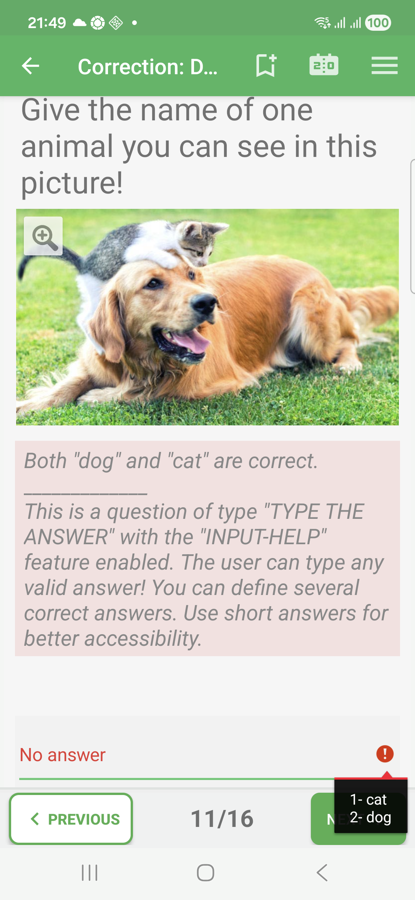

### Texte à trous

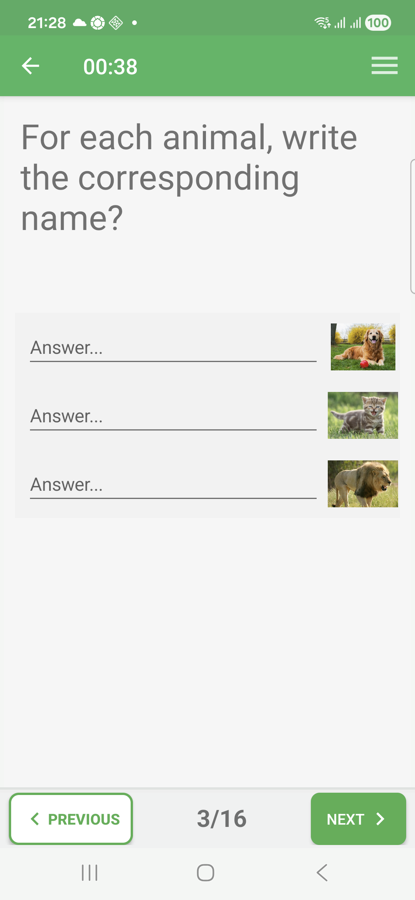

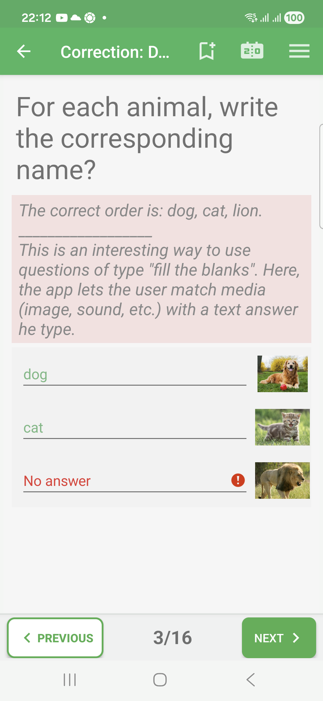

### Énumération

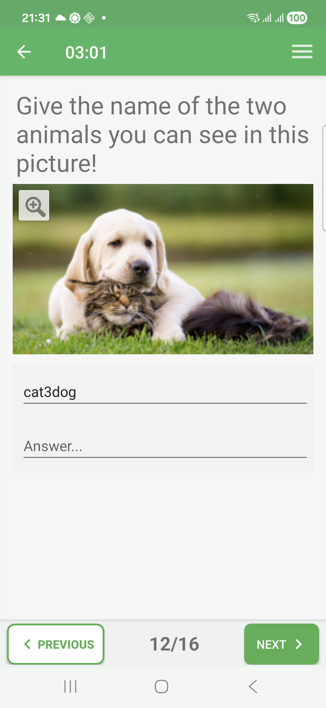

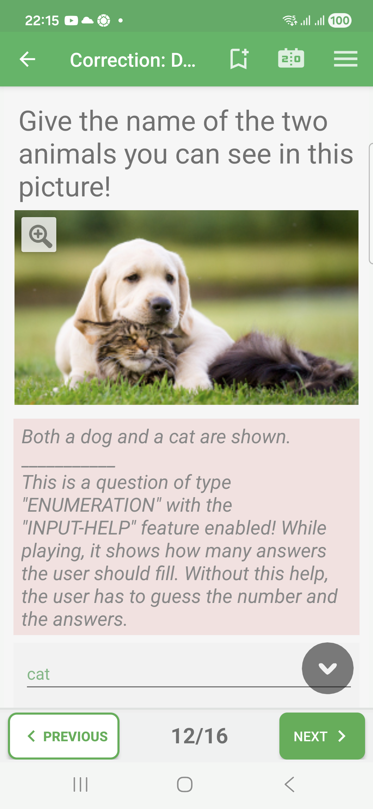

### Association de colonnes

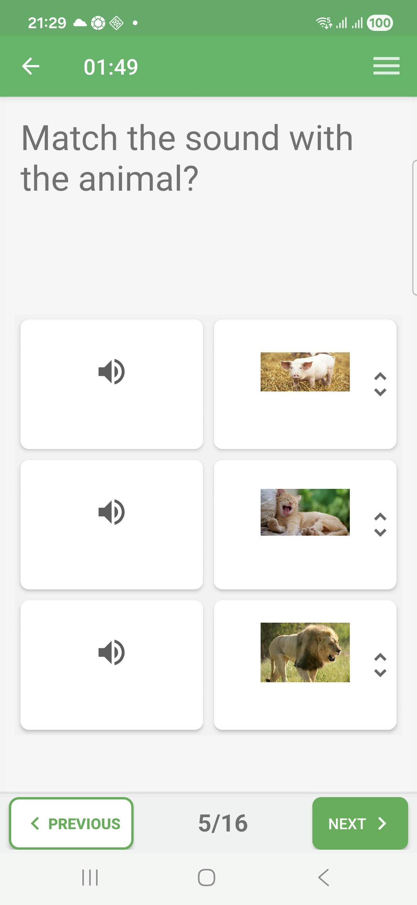

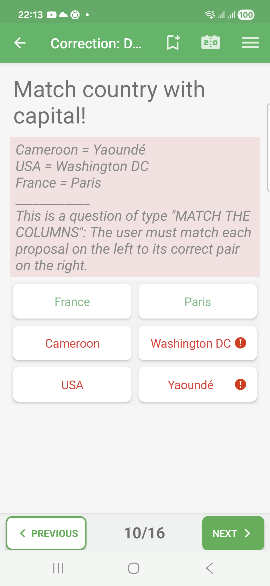

### Remise en ordre

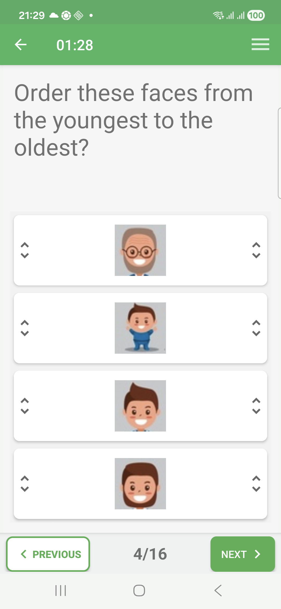

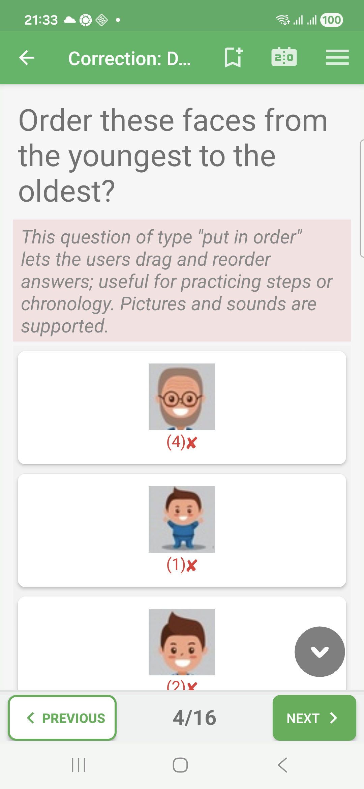

### Mots mélangés

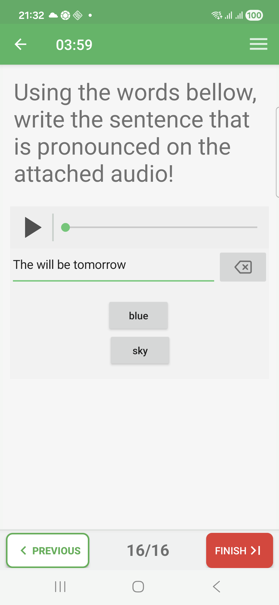

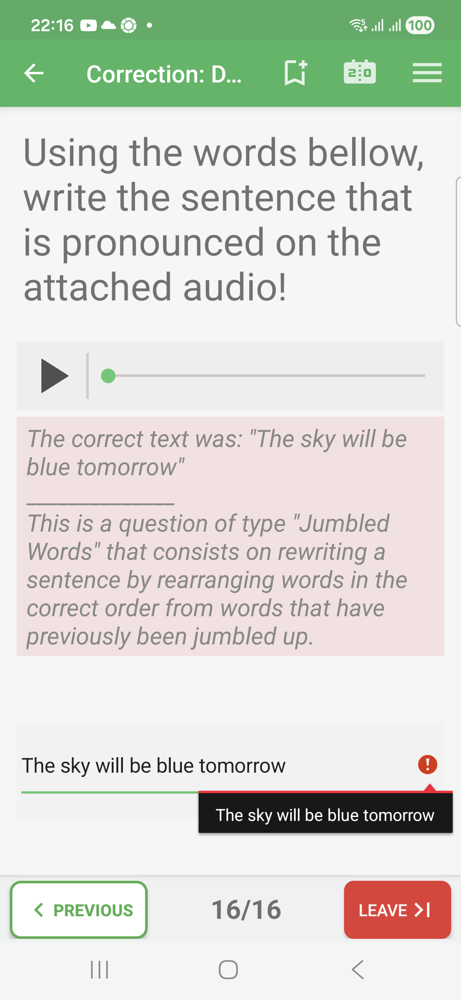

Les énoncés et propositions peuvent contenir du texte, une image ou un son.
Utilisez les contrôles visibles pour consulter ces médias. Un état partiel n’est
présenté que lorsque la notation évalue réellement les éléments séparément.
