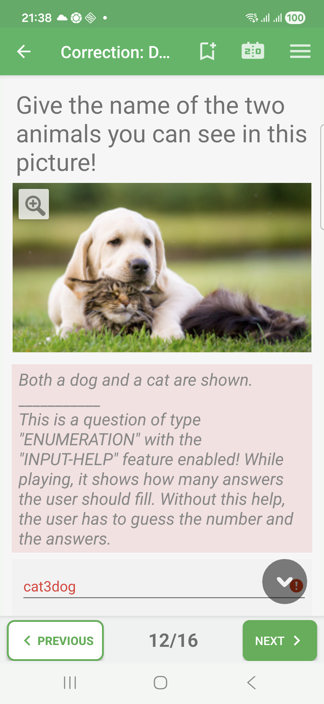

# Enumeration Questions In Exam Mode

Enumeration questions ask the learner to list several expected answers.

Unlike fill-in-blanks questions, enumeration focuses on the expected items
rather than a strict visual position in a sentence.

## Empty State

The question can show one or more answer fields depending on the quiz settings.

## Filled State

The learner enters the list items before moving to the next question.

## Correction Success

When the expected items are provided, the correction review marks the answer as
correct.

## Correction Failure

In correction review, incomplete or invalid enumeration entries are marked in
red. The correction comment can show the expected list.

## Correction Partial

For enumeration questions evaluated item by item, QcmMaker can show a partial
result when some expected items are present and others are missing.

## How To Answer

Enter each expected item clearly. When the question tells you how many answers
are expected, provide that number of items before continuing.
