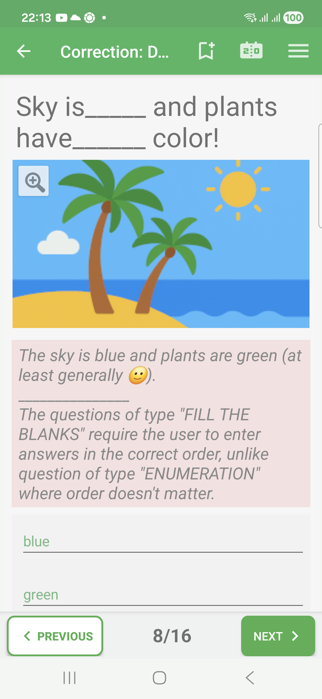
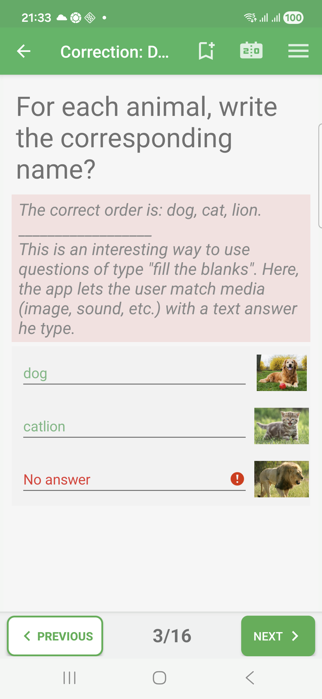

# Fill-In-Blanks Questions In Exam Mode

Fill-in-blanks questions ask the learner to enter values in a fixed order.

Use this format when the position of each answer matters, such as matching a
blank inside a sentence or filling labels in a known sequence.

## Empty State

The question shows the blank areas or answer fields that must be filled.

## Filled State

The learner enters the answers in the displayed fields. In Exam mode, the page
does not show whether the values are correct until the correction review.

## Correction Success

When every blank contains an accepted value, the correction review marks the
answer as correct.

## Correction Failure

In correction review, missing or incorrect fields are marked in red. The
correction comment can explain the expected order.

## Correction Partial

For questions where blanks are evaluated one by one, QcmMaker can show a
partial result when only some fields are correct.

## How To Answer

Fill each field in the order shown by the question. If the same words would be
accepted in a different order, use an enumeration question instead.
