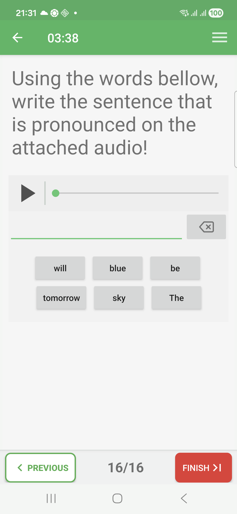
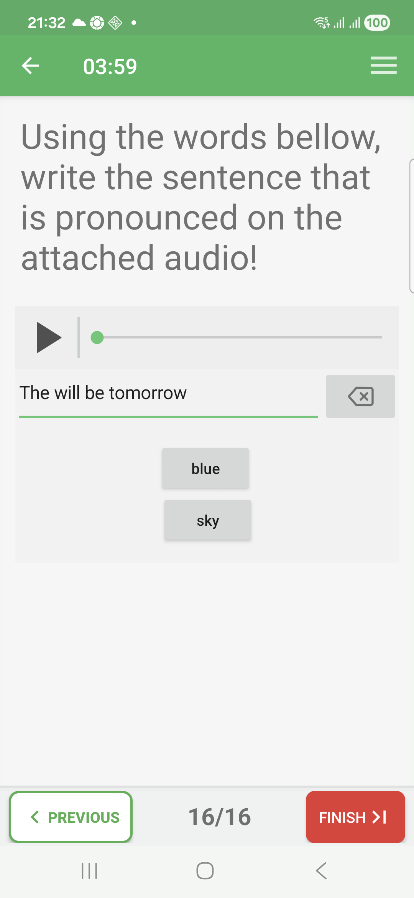
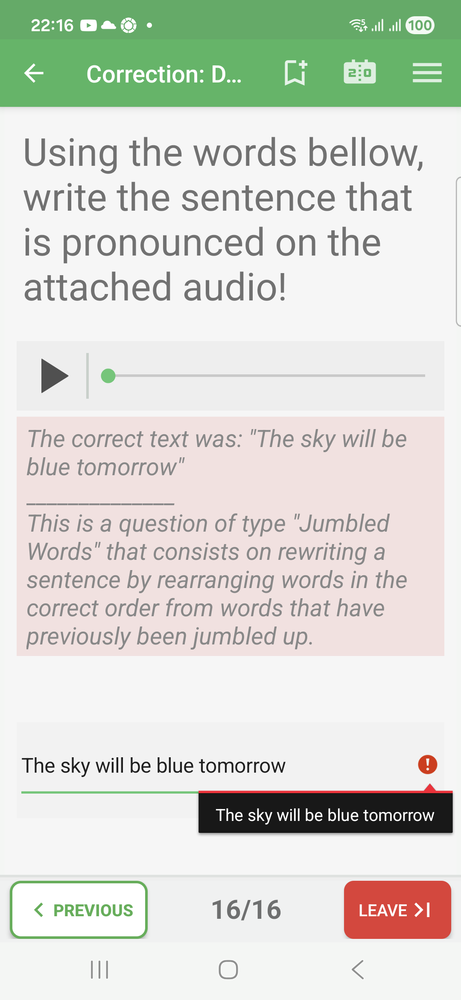
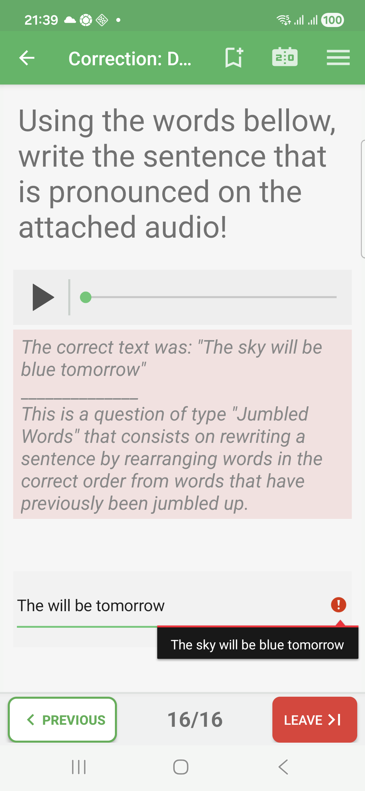

# Jumbled-Words Questions In Exam Mode

Jumbled-words questions ask the learner to rebuild a sentence from shuffled
words or fragments.

The prompt can include text, audio, or both. The learner selects words in the
order that reconstructs the expected sentence.

## Empty State

The available words are shown as selectable blocks.

## Filled State

Selected words appear in the answer area in the order chosen by the learner.

## Correction Success

When the selected words rebuild the expected sentence, the correction review
marks the answer as correct.

## Correction Failure

In correction review, an incomplete or wrongly ordered sentence is marked in
red. The correction hint can show the expected sentence.

## How To Answer

Listen to or read the prompt, then tap the words in the order that forms the
sentence. If a word is missing or out of order, the reconstructed sentence is
not fully correct.
