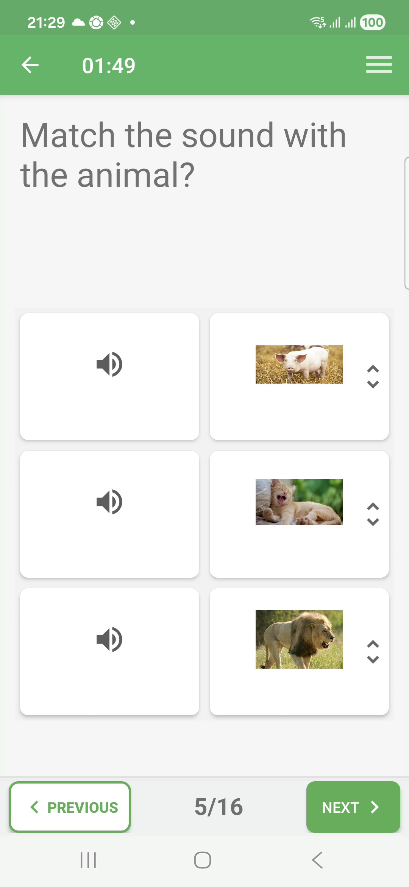
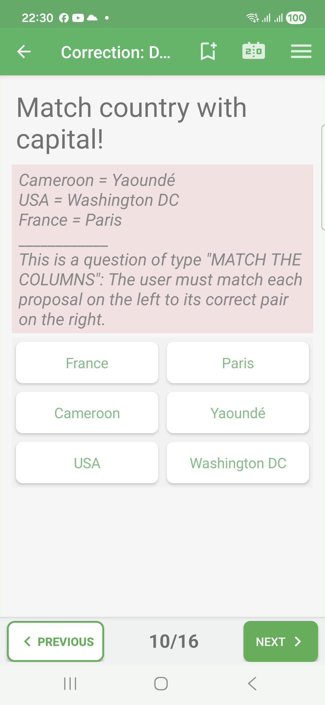
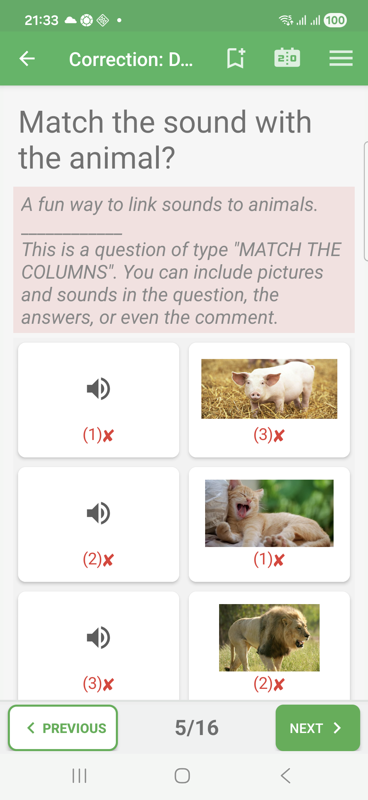

# Match-Columns Questions In Exam Mode

Match-columns questions ask the learner to pair items from two columns.

This format is useful for pairs such as sound and animal, country and capital,
term and definition, or image and label.

## Empty State

The left and right columns appear as separate items.

## Filled State

The learner changes the right-side order until each row forms the intended
match. In Exam mode, feedback is shown only after completion.

## Correction Success

When each row contains the expected pair, the correction review marks the
answer as correct.

## Correction Failure

In correction review, incorrect pairs are marked in red. The correction comment
can list the correct pairings.

## Correction Partial

For match-column questions evaluated pair by pair, QcmMaker can show a partial
result when some pairings are correct and others are wrong.

## How To Answer

Move or reorder the items so that each row contains a correct pair. Check every
row before moving on, because one wrong row can make the answer incomplete.
