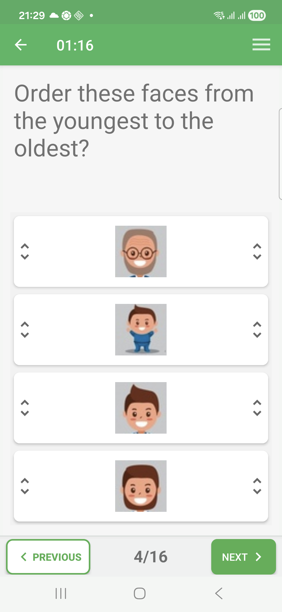
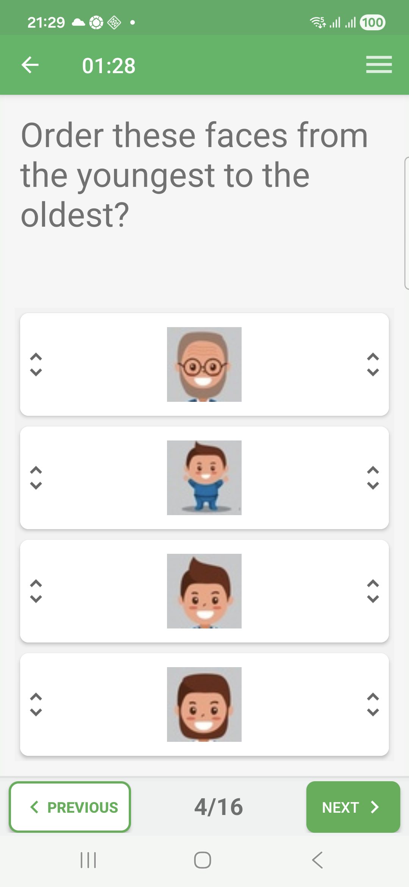
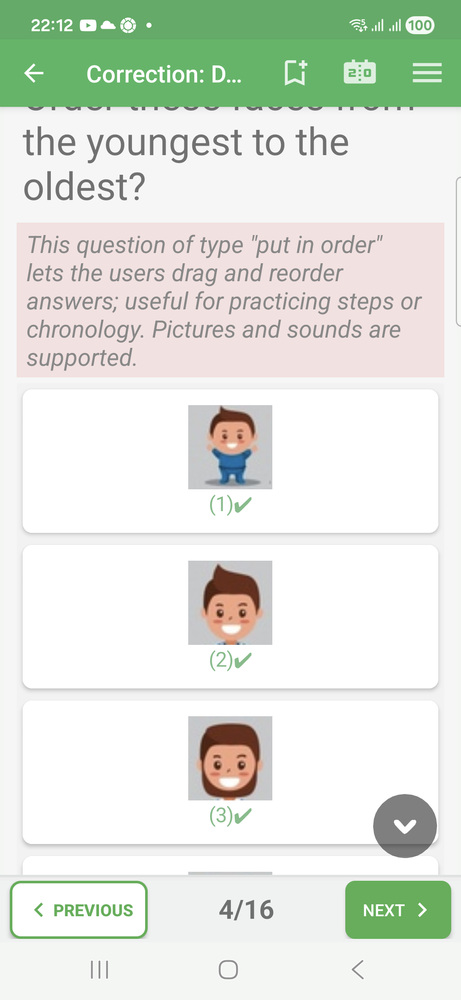
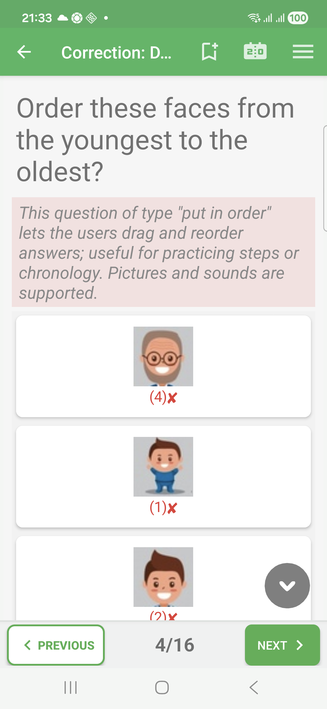

# Put-In-Order Questions In Exam Mode

Put-in-order questions ask the learner to arrange items into a specific
sequence.

This format is useful for steps, chronology, ranking, or any answer where the
order matters.

## Empty State

The items are displayed in the question area.

## Filled State

The learner drags or reorders the items into the desired sequence. Exam mode
keeps the chosen order until the correction review.

## Correction Success

When every item is in the expected sequence, the correction review marks the
answer as correct.

## Correction Failure

In correction review, an incorrect sequence is marked in red. The correction
comment can explain the expected order.

## How To Answer

Place the items from first to last according to the question. If every item is
correct but the order is wrong, the answer is still incorrect.
