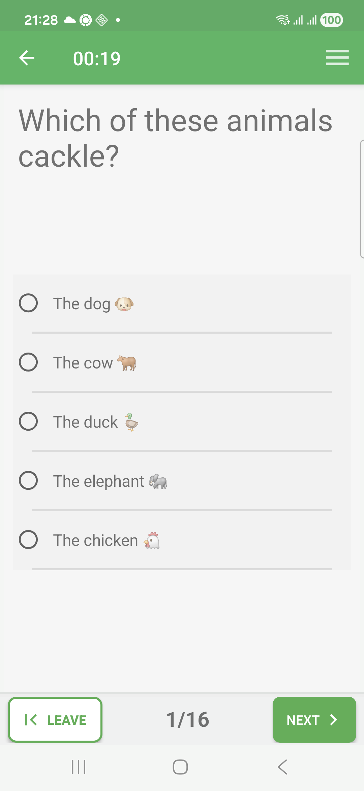
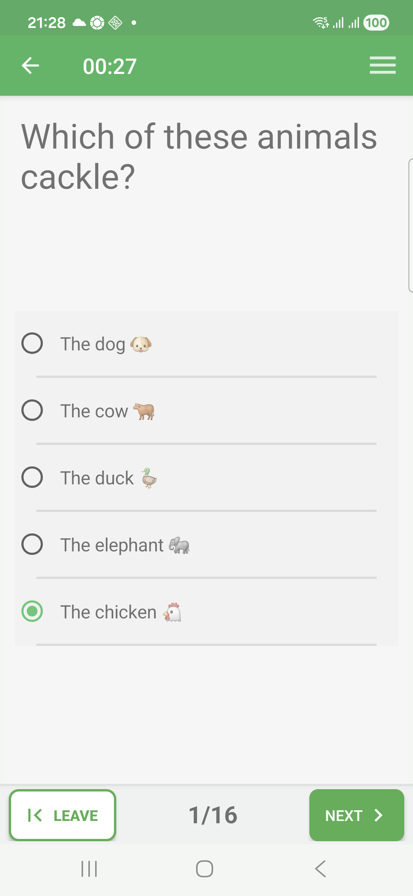
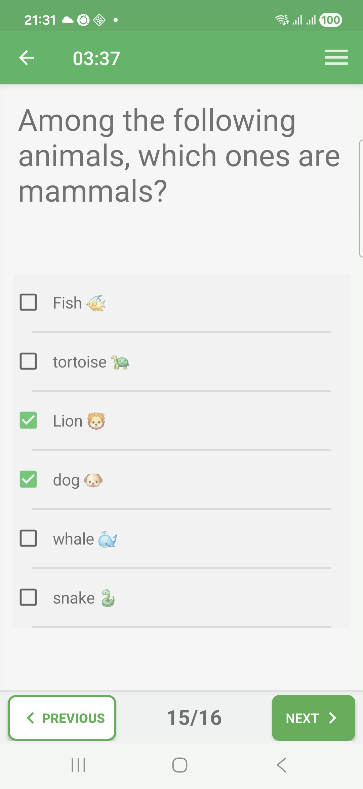
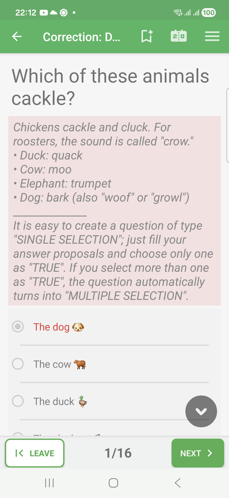
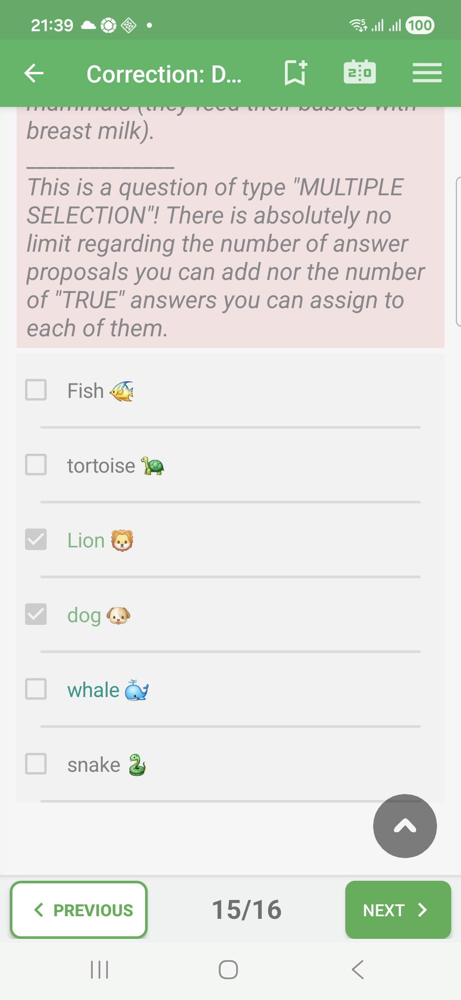

# Selection Questions In Exam Mode

Selection questions ask the learner to choose one or more proposals.

This family covers simple single-choice questions, true/false style questions,
and multiple-selection questions. If several answers are expected, the learner
must select every correct proposal to get the full result.

## Empty State

Before answering, each proposal is unchecked.

## Filled State

After the learner selects an answer, the checkbox shows the current choice. In
Exam mode, this is not validated immediately.

For multiple-selection questions, several boxes can be checked. This example is
filled but incomplete because one correct proposal is still missing.

## Correction Success

In correction review, accepted answers are marked in green.

## Correction Failure

When the selected answer is wrong, QcmMaker marks the answer in red during the
correction review.

## Correction Partial

When only part of a multiple-selection answer is correct, QcmMaker can show a
partial correction: selected correct items remain accepted, while missing or
incorrect items keep the answer from being fully correct.

## How To Answer

Tap each proposal you want to select. If the question expects more than one
answer, select every correct proposal before moving to the next page.
