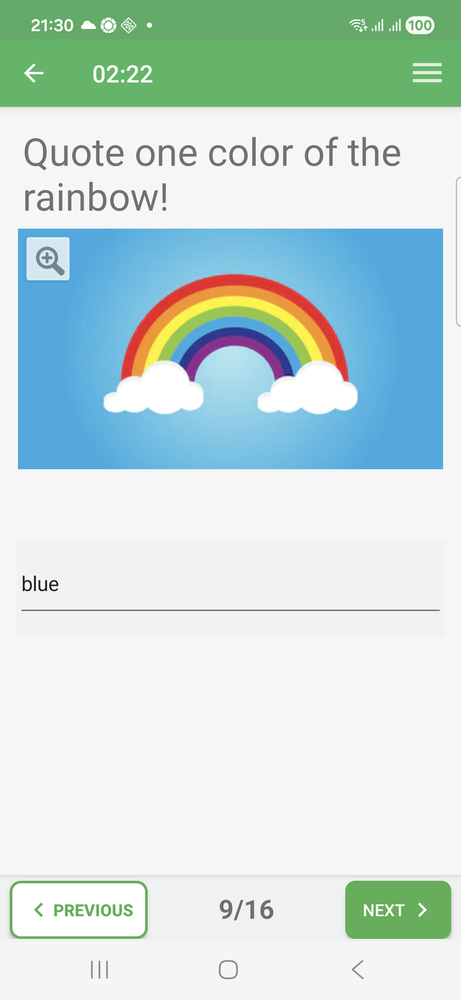
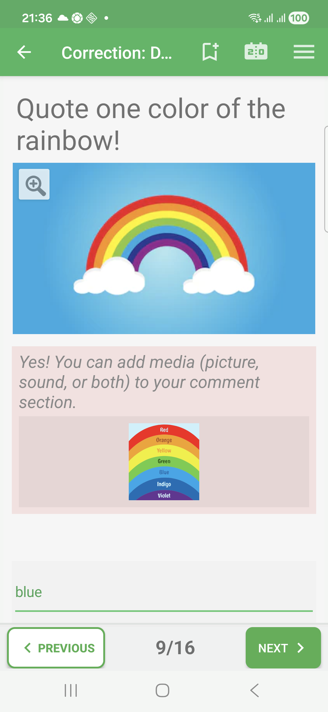
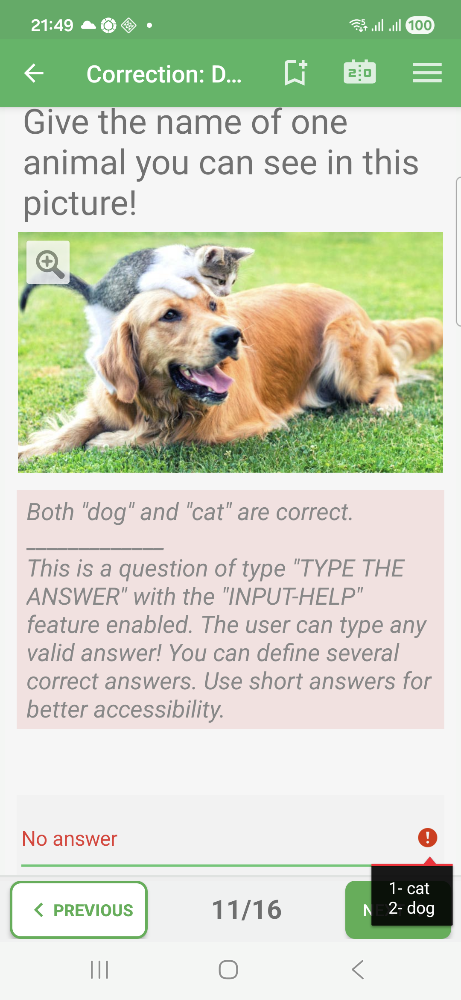

# Typed-Answer Questions In Exam Mode

Typed-answer questions ask the learner to type a short answer.

The expected answer can be one exact value, or one value among several accepted
answers. Keep typed answers short when possible, especially for mobile use.

## Empty State

Before answering, the input field is empty.

## Filled State

The learner types an answer in the text field. In Exam mode, QcmMaker keeps the
answer and waits until the end of the quiz before showing feedback.

## Correction Success

In correction review, an accepted typed answer is shown in green. The correction
comment can also include extra explanation or media.

## Correction Failure

If the typed value is not accepted, the correction review marks the answer in
red and can show the expected value or an explanation.

## How To Answer

Tap the answer field, type the expected short answer, then move to the next
question. If the question allows several valid answers, any accepted value can
be enough.
