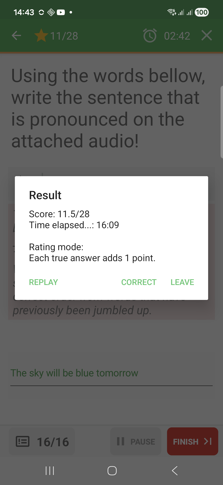
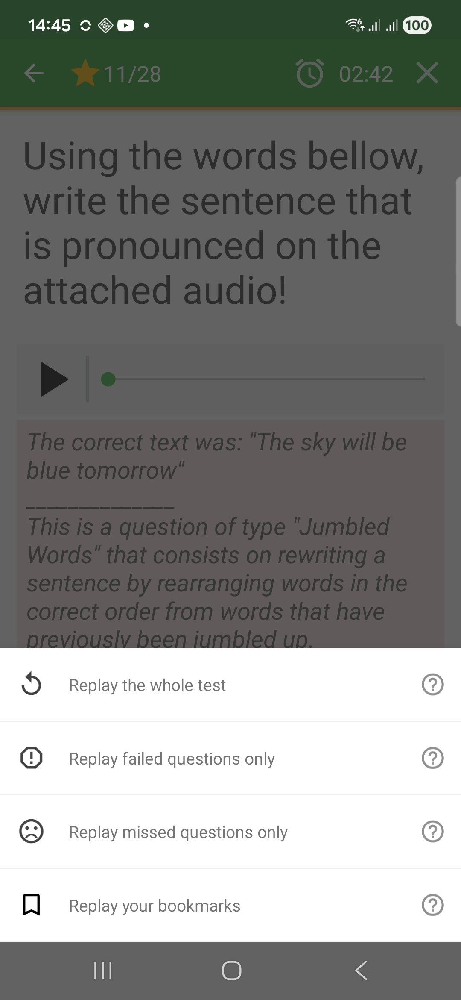

# Result And Replay

At the end of a test, QcmMaker shows a result dialog with the score, elapsed
time, and available next actions. This applies after both Exam mode and
Challenge mode.

## Exam Result

In Exam mode, the result appears after the learner finishes the test. Feedback is
usually reviewed after the run, so the result dialog is the main entry point for
correction and replay.

## Challenge Result

In Challenge mode, answers are checked during the run, but the end of the test
still shows a result dialog with the final score and the same main actions.

## Result Actions

The result dialog usually gives three main choices after either play mode:

- **Replay** starts another run from the same quiz.
- **Correct** opens the correction view so you can review questions and answers.
- **Leave** closes the player and returns to the previous screen.

## Replay Choices

When several replay options are available, QcmMaker asks what should be replayed.

The available choices depend on the quiz and on the last run. Common options
include replaying the whole test, replaying failed questions only, replaying
missed questions only, or replaying bookmarked questions.

Use **Replay failed questions only** when you want focused practice after a run.
Use **Replay the whole test** when you want a fresh complete attempt.
