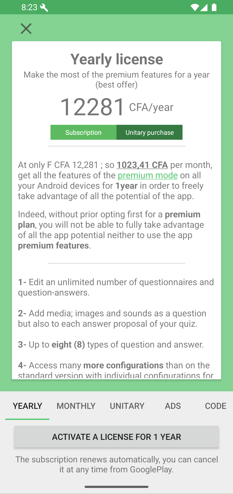
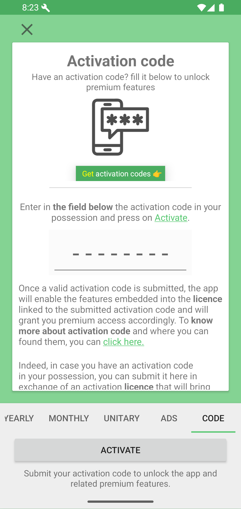
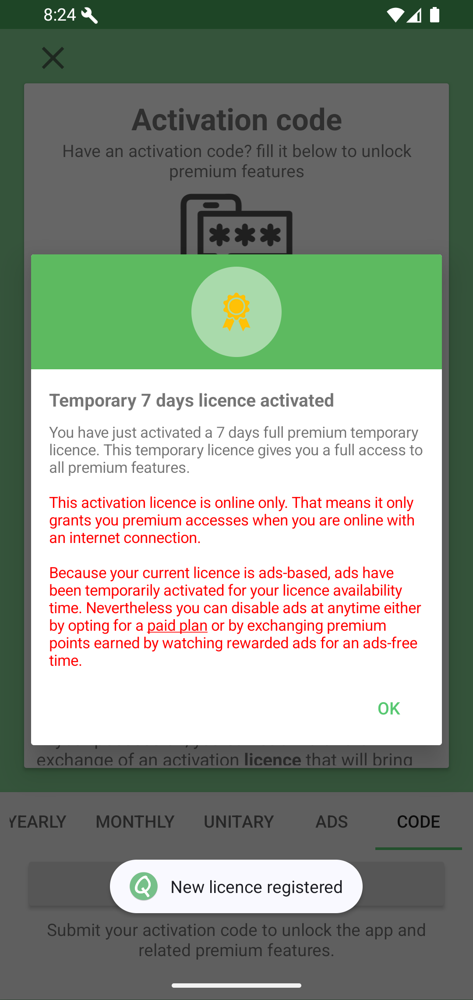
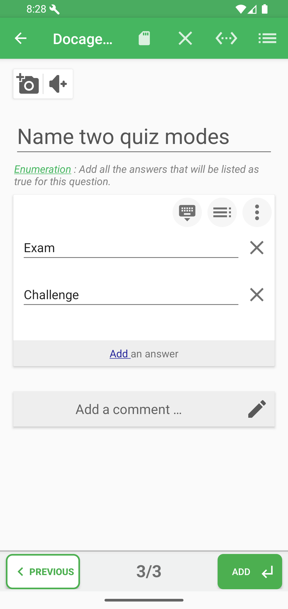

# Premium Features

Some advanced tools, such as advanced question types, can require premium access.

When access is needed, QcmMaker can offer a feature purchase, a trial, or the premium plans page.

Good to know: premium access controls advanced capabilities. It does not delete your existing `.qcm` files or take ownership of quizzes already saved in your workspace.

## Plans

The plans page includes yearly, monthly, unitary, ads-based, and activation-code options.

When to use this: choose a plan when you want continued access to advanced features after a trial or when a specific locked feature asks for premium access. If you already purchased access, look for the restore option before buying again.

Trial access, when offered, is meant to let you evaluate premium tools before choosing a longer access option.

## Activation code

If you have an activation code, open the **Code** tab, enter the code, then tap **Activate**.

After successful activation, QcmMaker confirms the license duration and access type.

## Ads-based access

An ads-based license can unlock premium features while showing ads from time to time.

What to check if access stays locked: keep the device online, confirm you are using the same Google account for purchases, and use the restore or activation option shown in the premium area when available.
