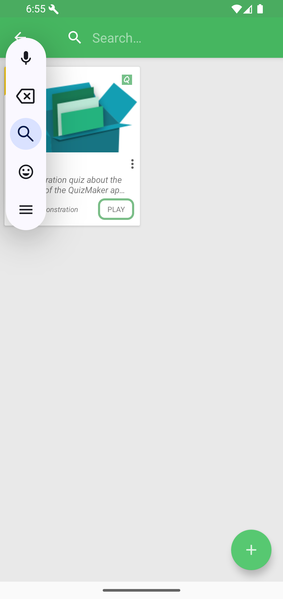

# Search

Tap the search icon on Home to filter workspace quizzes.

Type a word from the quiz title or metadata. Tap the clear button to reset the query, or press Back/collapse to return to the normal toolbar.

Good to know: search filters the quizzes QcmMaker can currently see in the workspace. If a file is stored outside the workspace, add its folder or open the file first before expecting it in search results.
