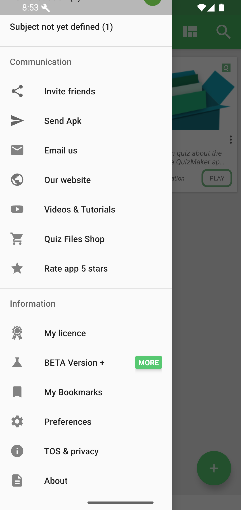
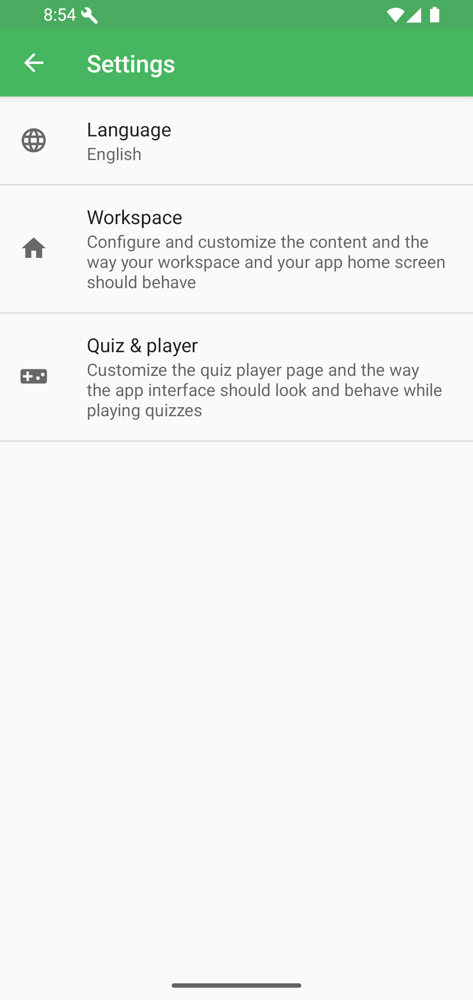
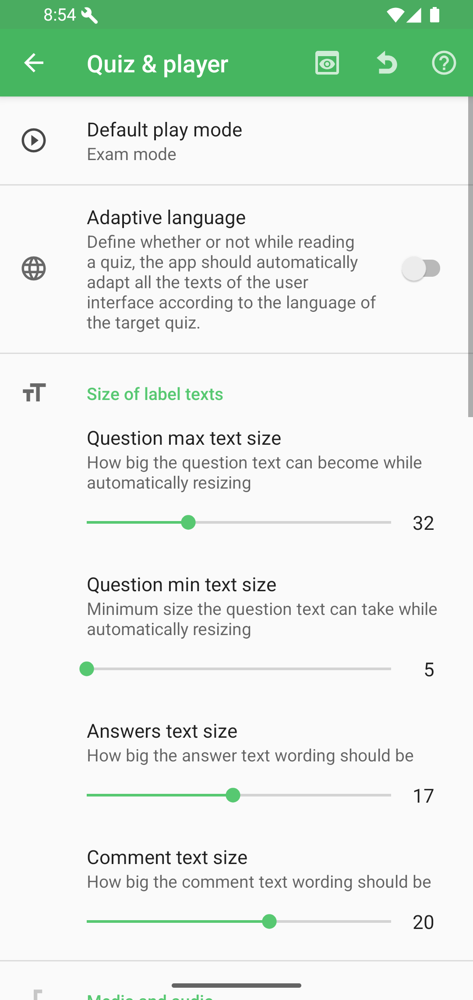
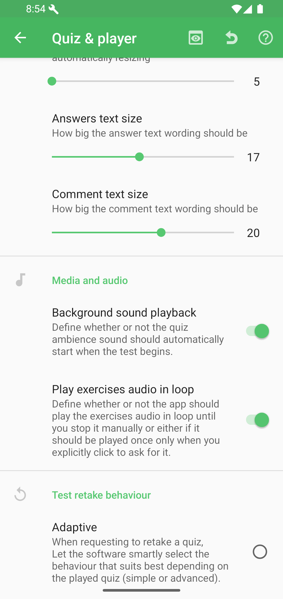

# Settings

Open the navigation drawer from the home screen and scroll to **Preferences**.

The settings page groups Language, Workspace, and Quiz & player settings.

Good to know: settings can change how QcmMaker displays quizzes, where it looks for files, and how the player behaves by default. They do not rewrite every quiz file automatically.

## Quiz & Player

The Quiz & player page controls the default play mode, adaptive language, and player text sizes.

Further down, it includes media/audio behavior and test retake behavior.

When to review these settings: check them when a quiz starts in an unexpected mode, text feels too small, audio behaves differently than expected, or replay rules do not match your study flow.
