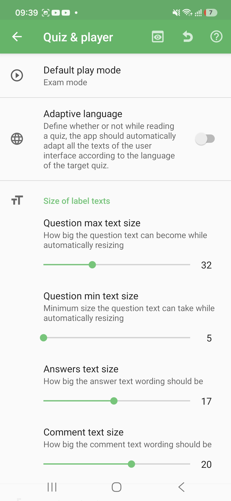
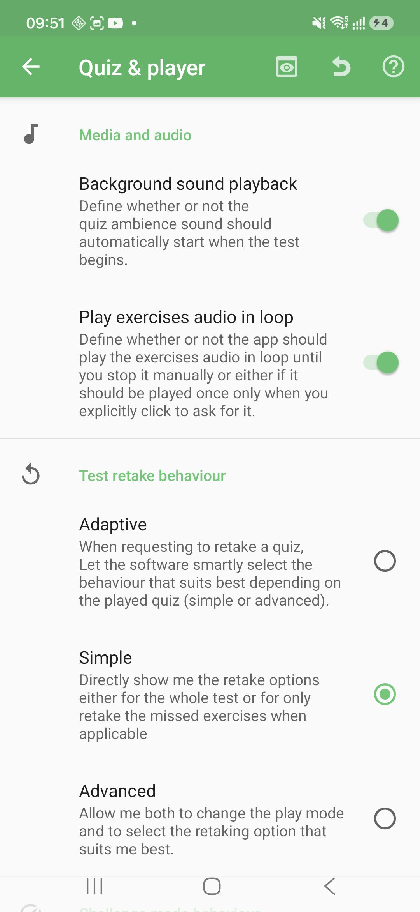
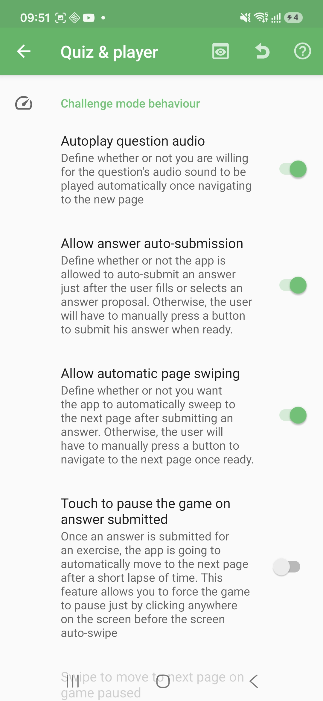
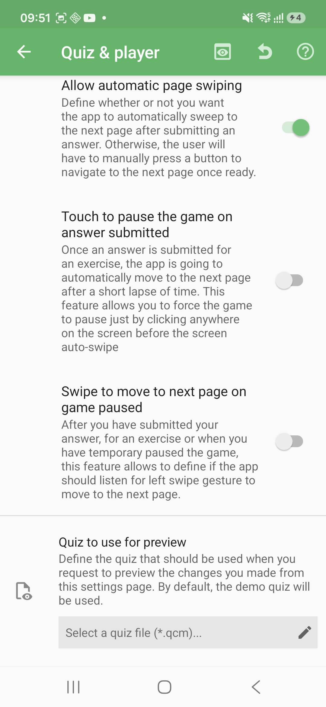

# Quiz & Player Settings

The Quiz & player settings define how QcmMaker opens quizzes by default and how the player behaves while you study, review, or replay a quiz. These are app-level defaults: a quiz file can still contain its own content, language, media, and questions.

## How to access

Home → Navigation drawer → **Preferences** → **Quiz & player**

## Default play mode and language

| Setting | What it does |
|---------|--------------|
| Default play mode | Chooses whether quizzes should open by default in Exam mode or Challenge mode when no other mode is explicitly selected. |
| Adaptive language | Lets the player adapt the interface language to the quiz language while reading a quiz. Use it when you frequently open quizzes written in different languages. |

Exam mode is closer to a test simulation: you answer first, then review correction and results. Challenge mode is more immediate and game-like: answers can be submitted and followed by faster navigation depending on the Challenge settings below.

## Text size

| Setting | What it does |
|---------|--------------|
| Question max text size | Caps how large the question wording can become when the player automatically resizes it. |
| Question min text size | Sets the smallest size allowed for question wording during automatic resizing. |
| Answers text size | Changes the size used for answer proposal wording. |
| Comment text size | Changes the size used for correction comments and explanations. |

Increase these values when the player feels too dense or when the device is used at distance. Lower them when long questions or comments need more room on the screen.

## Media and audio

| Setting | What it does |
|---------|--------------|
| Background sound playback | Starts a quiz ambience sound automatically when a test begins, when the quiz provides one. |
| Play exercises audio in loop | Repeats exercise audio until you stop it manually; when disabled, audio plays once when requested. |

These settings only affect quizzes that contain the corresponding audio resources.

## Test retake behavior

| Option | What happens |
|--------|--------------|
| Adaptive | QcmMaker chooses the retake behavior that best fits the quiz and context. |
| Simple | QcmMaker directly offers the main replay choices, such as replaying the whole quiz or missed exercises when available. |
| Advanced | QcmMaker lets you change the play mode and choose a more precise replay option. |

If you disable the current retake handler, QcmMaker warns you first. Without a retake handler, replay starts more directly and advanced retake choices are no longer suggested.

## Challenge mode behavior

| Setting | What it does |
|---------|--------------|
| Autoplay question audio | Plays the question audio automatically when a new Challenge page opens. |
| Allow answer auto-submission | Submits the answer as soon as the player has filled or selected an answer proposal. When disabled, the user confirms manually. |
| Allow automatic page swiping | Moves to the next page automatically after an answer is submitted. |
| Touch to pause the game on answer submitted | Lets you pause the automatic move by touching the screen before the next page is shown. This depends on automatic page swiping. |
| Swipe to move to next page on game paused | Lets a left swipe continue to the next page after the game has paused. |

Use these settings to decide whether Challenge mode should feel fast and automatic or slower and more controlled.

## Preview quiz

| Setting | What it does |
|---------|--------------|
| Quiz to use for preview | Selects the quiz used when you preview player setting changes from this screen. If none is selected, QcmMaker uses the built-in demo quiz. |

The toolbar preview action can launch the selected preview quiz in Exam or Challenge mode. Use it to check text size, audio, and navigation behavior before leaving settings.

© QmakerTech — Last updated: 2026-07-12
