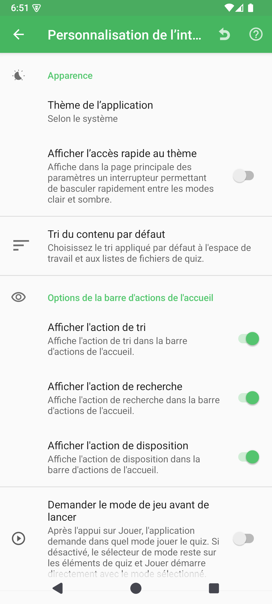

# Paramètres de personnalisation de l’interface

La personnalisation de l’interface regroupe les choix qui modifient l’apparence de QcmMaker ainsi que la manière dont l’espace de travail de l’accueil présente et ouvre vos quiz. Ces préférences agissent sur l’interface de l’application ; elles ne réécrivent pas le contenu de vos fichiers `.qcm`.

## Comment y accéder

Accueil → Menu de navigation → **Préférences** → **Personnalisation de l’interface**

L’ancienne entrée **Comportement de l’espace de travail** a été remplacée par cette entrée directe dans la page principale des paramètres.

## Apparence

| Paramètre | Effet |
|-----------|-------|
| Mode du thème | Suit le thème du système ou maintient QcmMaker en mode Clair ou Sombre. |
| Afficher l’accès rapide au thème | Affiche un raccourci de thème sur la page principale des paramètres. |

## Tri du contenu par défaut

Le tri du contenu par défaut choisit la propriété et l’ordre appliqués aux listes de l’espace de travail et de fichiers quiz. Le sélecteur propose le nom, la dernière modification, le nombre de questions, la dernière lecture, le nombre de lectures et l’emplacement, avec un ordre croissant, décroissant ou personnalisé.

L’ordre personnalisé vous permet d’organiser vous-même l’accueil. Consultez [Trier et réordonner l’espace de travail](../../workspace-sorting/README-fr.md) pour connaître le geste complet et le fonctionnement de la mémorisation.

## Options de la barre d’actions de l’accueil

| Paramètre | Effet |
|-----------|-------|
| Afficher l’action de tri | Affiche le raccourci de tri sur l’accueil. |
| Afficher l’action de recherche | Affiche le raccourci de recherche sur l’accueil. |
| Afficher l’action de disposition | Affiche le raccourci permettant d’alterner entre les grilles et les listes. |

Masquer une action retire uniquement son raccourci de l’accueil. Aucun fichier quiz n’est supprimé et la préférence associée n’est pas réinitialisée.

## Lancement de la lecture et options du quiz

**Demander le mode de jeu avant de lancer** affiche le choix du mode après un appui sur Jouer. Lorsque cette option est désactivée, le sélecteur de mode reste visible sur chaque carte et Jouer démarre avec le mode sélectionné.

**Style du menu d’options du quiz** permet de choisir entre un menu contextuel flottant compact et une boîte de dialogue dédiée en bas de l’écran. Les deux styles donnent accès aux actions prises en charge pour le quiz sélectionné.

## Réinitialisation et aide

L’action Réinitialiser restaure les valeurs par défaut de cette page après confirmation. L’action Aide ouvre le présent guide.

© QmakerTech — Dernière mise à jour : 2026-08-21

