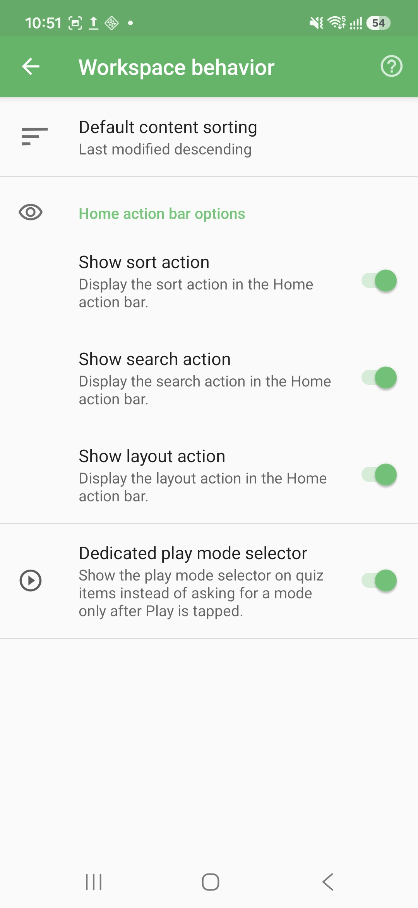

# Workspace Behavior Settings

Workspace behavior settings define how the Home workspace presents quiz files and which quick actions are visible in the Home action bar.

## How to access

Home → Navigation drawer → **Preferences** → **Workspace** → **Behavior & available options**

## Default content sorting

Default content sorting chooses the order applied to workspace and quiz file lists when QcmMaker refreshes or reopens them.

Available sorting choices include:

| Sorting family | Examples |
|----------------|----------|
| Name | Name ascending, name descending |
| Modification | Last modified ascending, last modified descending |
| Quiz size | Question count ascending, question count descending |
| Usage | Last played, play count |
| Location | Local files first, remote files first |

Changing this setting clears the previously persisted sort choice for Home and file lists so the new default can apply.

## Home action bar options

| Setting | What it controls |
|---------|------------------|
| Show sort action | Displays the sort shortcut in the Home action bar. |
| Show search action | Displays the search shortcut in the Home action bar. |
| Show layout action | Displays the layout/disposition shortcut in the Home action bar. |

Disable an action when you want a simpler Home toolbar. The feature itself is not deleted; the shortcut is only hidden from the action bar.

## Dedicated play mode selector

The dedicated play mode selector shows the play mode choice directly on quiz items. When it is disabled, QcmMaker asks for the play mode only after you tap Play.

Enable it if you often alternate between Exam and Challenge mode. Disable it if you prefer a lighter quiz list with fewer visible controls.

© QmakerTech — Last updated: 2026-07-12
