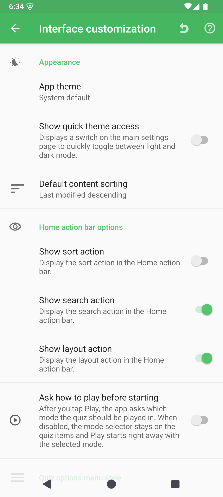

# App Customization Settings

App customization brings together the choices that change how QcmMaker looks and how the Home workspace presents and opens your quizzes. These preferences affect the app interface; they do not rewrite the contents of your `.qcm` files.

## How to access

Home → Navigation drawer → **Preferences** → **Interface customization**

The former **Workspace behavior** entry has been replaced by this direct entry on the main Settings screen.

## Appearance

| Setting | What it controls |
|---------|------------------|
| Theme mode | Uses the system theme or keeps QcmMaker in Light or Dark mode. |
| Show quick theme access | Shows a theme shortcut on the main Settings page. |

## Default content sorting

Default content sorting chooses the property and order QcmMaker applies to workspace and quiz-file lists. The selector offers Name, Last modified, Question count, Last played, Play count, and Location, combined with Ascending, Descending, or Custom order.

Custom order lets you arrange the Home workspace yourself. See [Sort and reorder the workspace](../../workspace-sorting/README.md) for the complete gesture and persistence behavior.

## Home action bar options

| Setting | What it controls |
|---------|------------------|
| Show sort action | Displays the sort shortcut on Home. |
| Show search action | Displays the search shortcut on Home. |
| Show layout action | Displays the shortcut that cycles between grid and list layouts. |

Hiding one of these actions only removes its Home shortcut. It does not delete quiz files or reset the related preference.

## Play launch and quiz options

**Ask how to play before starting** displays the play-mode choice after you tap Play. When it is disabled, the mode selector remains visible on each quiz card and Play starts with that selected mode.

**Quiz options menu style** chooses between a compact floating popup and a dedicated bottom-of-screen dialog. Both styles provide the supported actions for the selected quiz.

## Reset and help

The Reset action restores the defaults for this page after confirmation. The Help action opens this guide.

© QmakerTech — Last updated: 2026-08-21

