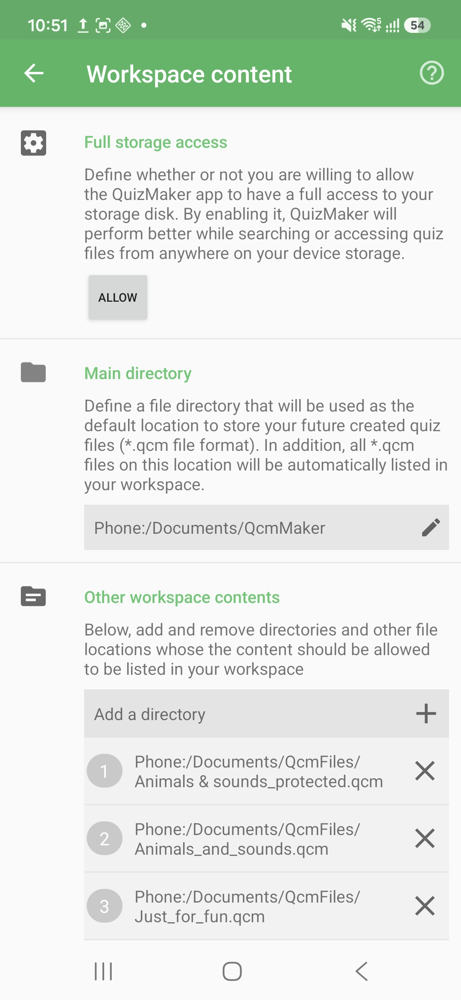

# Workspace Content Settings

Workspace content settings define which folders QcmMaker is allowed to read and list in your workspace. This is especially important on recent Android versions, where apps should access only the folders you explicitly select.

## How to access

Home → Navigation drawer → **Preferences** → **Workspace** → **Content & directories**

## Main directory

The main directory is the default place where QcmMaker stores new `.qcm` files you create or export. Every `.qcm` file found in this directory is also listed in the workspace.

Tap **Click here to select a directory** to choose or replace the main workspace directory. Android opens its system folder picker so you can grant QcmMaker access to that folder.

## Other workspace contents

Other workspace contents are additional folders that QcmMaker can scan and list on Home. Use them when your quiz files are spread across several folders, such as downloads, class folders, or shared storage locations.

| Action | What happens |
|--------|--------------|
| Add a folder | Android asks you to choose a folder and grant persistent access. QcmMaker then lists compatible `.qcm` files from it. |
| Remove a folder | QcmMaker removes that location from the workspace and releases its access permission. The files remain on the device. |
| Tap a listed folder | QcmMaker asks Android to open that location in a file explorer when possible. |

When a folder is removed, QcmMaker may show an undo snackbar before the permission is finally released.

## Storage access

Depending on Android version and distribution, QcmMaker can work either with scoped folder access or with broader storage access.

Scoped folder access is the privacy-friendly default: you choose the exact folders QcmMaker may use. Full storage access, when available, lets QcmMaker scan and manage quiz files more broadly across storage, but it gives the app wider access than most users need.

Choose scoped access unless you specifically need QcmMaker to manage quiz files from many locations without selecting each folder.

© QmakerTech — Last updated: 2026-07-12
