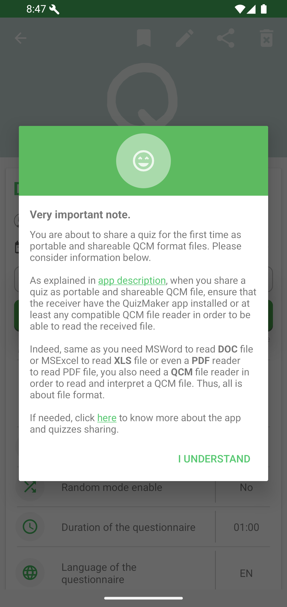
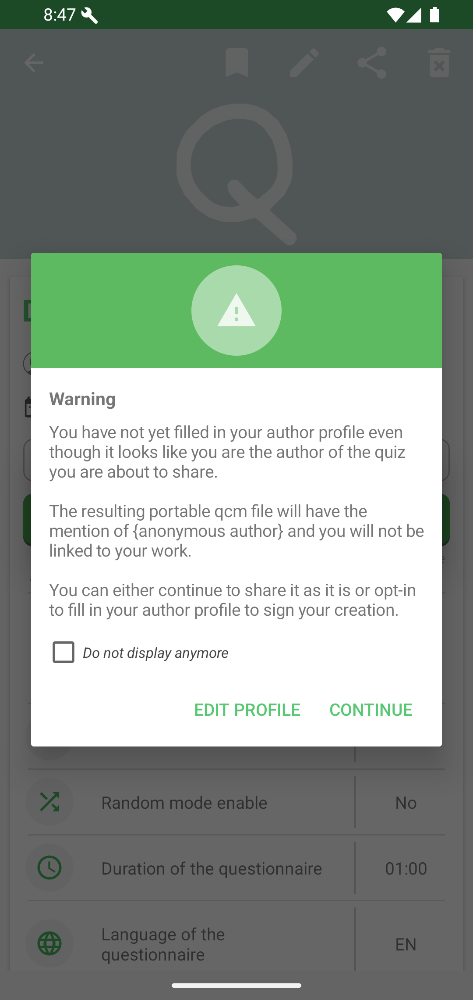
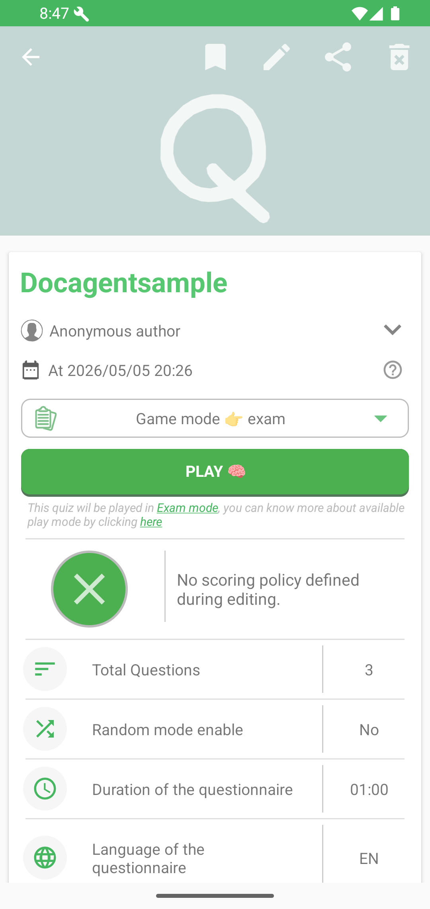

# Sharing

Use the Share action on a quiz detail page or project page to send a portable `.qcm` file.

Good to know: sharing a quiz sends a quiz file, similar to sending a document. It does not automatically create a live classroom session, and it does not change the original file stored in your workspace.

The first time, QcmMaker explains that the receiver needs QcmMaker or another compatible QCM reader.

If your author profile is empty, QcmMaker warns that the file will be shared with an anonymous author.

What this means: the receiver can still open the quiz, but the file may not clearly identify you as the author. Fill in your author profile when you want shared quizzes to carry your signature.

After confirmation, Android shows the standard share sheet.

## Open Shared Quiz Links

QcmMaker can also open supported QcmMaker and QcmFile web links directly in the app. These links can preview a quiz, start quiz mode, start exam mode, open a project, or show documentation.

See [Open shared quiz links](open-quiz-links.md).
