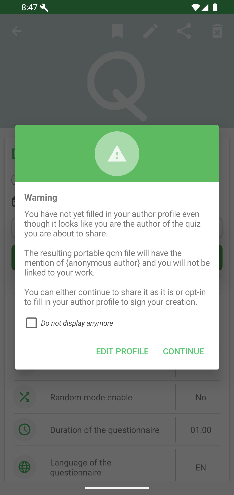
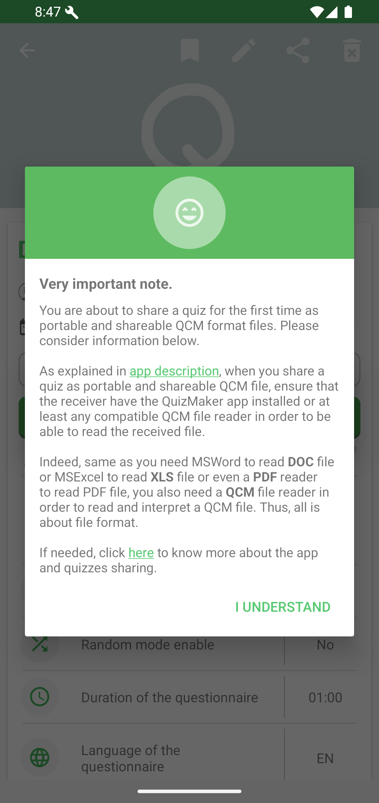
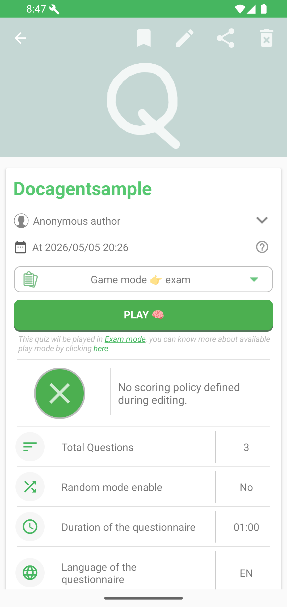

# Partager un quiz sous forme de fichier `.qcm`

La manière native de partager un quiz avec QcmMaker consiste à envoyer le fichier `.qcm` lui-même. Ce fichier est le quiz : il peut embarquer ses questions, ses réponses, ses paramètres, ses informations de correction, ses images et ses sons dans un seul ensemble portable.

Vous pouvez l'envoyer par e-mail, application de messagerie, Bluetooth, partage à proximité, stockage amovible, espace cloud ou tout autre service capable de transporter un fichier. Le moyen de transport n'a pas besoin de comprendre le quiz.

## Pourquoi partager le fichier lui-même ?

| Avantage | Ce que cela signifie pour vous et le destinataire |
|----------|---------------------------------------------------|
| Quiz portable | Le quiz et son contenu intégré voyagent ensemble dans un seul fichier `.qcm`. |
| Contrôle de votre copie | Vous décidez où votre fichier est conservé, quelles copies vous gardez et à qui vous en transmettez une. |
| Partage décentralisé | Aucun catalogue de quiz ni service central de partage particulier n'est nécessaire pour transporter le fichier. |
| Utilisation locale et hors ligne | Dès que le fichier et un lecteur compatible sont disponibles sur l'appareil, le contenu local du quiz peut être ouvert sans dépendre du canal de partage d'origine. Certaines fonctions protégées ou distantes peuvent néanmoins nécessiter une connexion. |
| Sauvegarde simple | Le fichier peut être copié vers un autre dossier, disque, appareil ou système de sauvegarde comme les autres documents. |
| Compatibilité des lecteurs | Toute application prenant correctement en charge le format `.qcm` peut ouvrir le contenu de quiz compatible. |

Le destinataire obtient une véritable copie du quiz, et non uniquement une adresse pointant vers un emplacement distant. Si l'e-mail, le message ou le service de transfert n'est plus disponible par la suite, la copie enregistrée du fichier reste sous le contrôle du destinataire.

## Avant le partage

Ouvrez et jouez au quiz une fois afin de vérifier ses questions, ses réponses, ses corrections, ses images et ses sons. Le partage envoie le fichier `.qcm` enregistré ; il n'applique pas aux copies déjà envoyées les modifications effectuées ultérieurement dans l'éditeur.

Si votre profil d'auteur est vide, QcmMaker vous avertit que le fichier partagé pourrait identifier son auteur comme anonyme.

Renseignez votre profil d'auteur avant le partage lorsque vous souhaitez que le fichier de quiz porte votre signature.

## Partager depuis QcmMaker

1. Ouvrez la page de détails ou la page de projet du quiz.
2. Choisissez l'action **Partager**.
3. Lisez et confirmez le rappel concernant les lecteurs QCM compatibles.

4. Choisissez l'application de messagerie, d'e-mail, de stockage ou de transfert dans la feuille de partage Android.

QcmMaker transmet le fichier `.qcm` au moyen de l'application sélectionnée. Le fichier original reste à sa place dans votre espace de travail.

## Partager depuis un gestionnaire de fichiers

Vous pouvez également retrouver un fichier `.qcm` existant avec le gestionnaire de fichiers de votre appareil et utiliser l'action de partage standard d'Android. Vous envoyez alors le même type de fichier de quiz portable qu'avec l'action de partage intégrée à QcmMaker.

## Aider le destinataire à l'ouvrir

Indiquez au destinataire que la pièce jointe est un fichier de quiz `.qcm` et qu'elle s'ouvre avec un lecteur QCM compatible. Il peut utiliser QcmMaker sur Android ou sélectionner le fichier local depuis un navigateur sur [read.qcmfile.com](https://read.qcmfile.com).

→ Transmettez-lui la page [Lire un fichier `.qcm` partagé](read-a-shared-qcm-file-fr.md) s'il a besoin des liens d'installation ou des instructions d'ouverture.

## Vous préférez partager une adresse HTTP ?

Si le fichier `.qcm` est déjà hébergé en ligne, ou si vous souhaitez l'héberger et transmettre une adresse plutôt qu'une copie du fichier, consultez [Partager et ouvrir des liens vers des quiz hébergés](open-quiz-links-fr.md).
