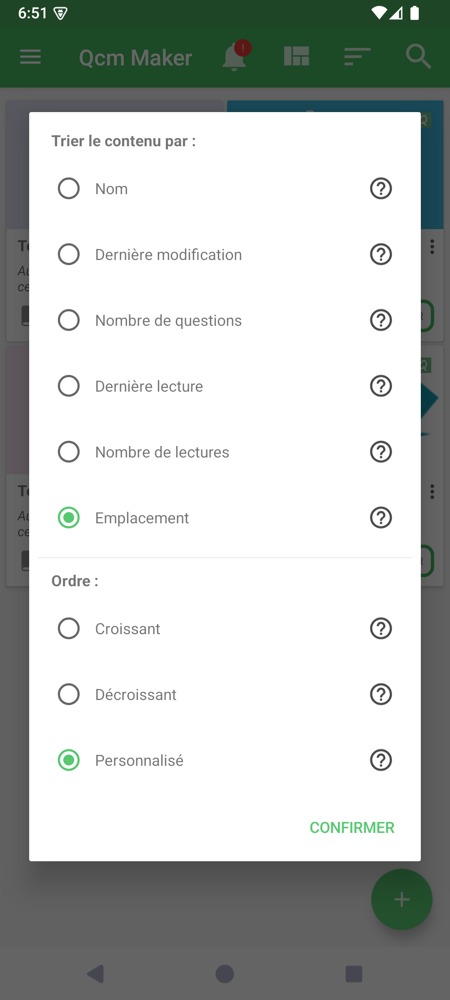
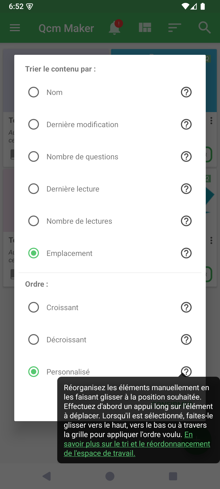
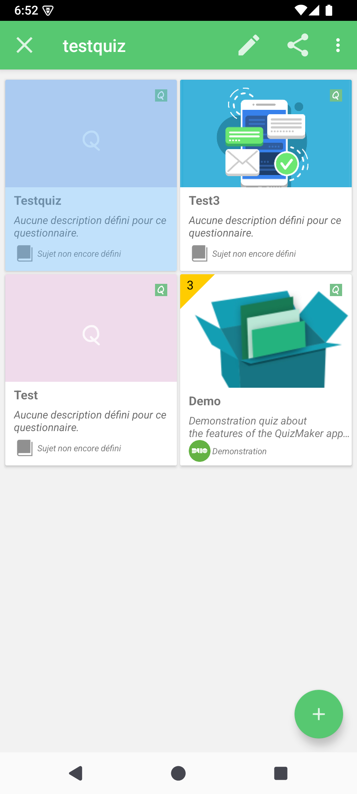

# Trier et réordonner l’espace de travail

Le tri de l’espace de travail contrôle l’ordre des cartes de quiz affichées sur l’accueil. Les ordres automatiques organisent la liste à partir d’une propriété, tandis que l’ordre personnalisé vous permet de choisir la position exacte de chaque quiz.

## Comment y accéder

Sur l’accueil, appuyez sur l’action **Trier** dans la barre supérieure.

Si l’action Trier est masquée, ouvrez Préférences → **Personnalisation de l’interface**, puis activez **Afficher l’action de tri**. Cette page permet également de choisir l’ordre par défaut.

## Choisir une propriété et un ordre

| Propriété | L’ordre croissant commence par | L’ordre décroissant commence par |
|-----------|--------------------------------|----------------------------------|
| Nom | A | Z |
| Dernière modification | La plus ancienne modification | La plus récente modification |
| Nombre de questions | Le moins de questions | Le plus de questions |
| Dernière lecture | La plus ancienne activité | La plus récente activité |
| Nombre de lectures | Le moins joué | Le plus joué |
| Emplacement | Les fichiers locaux | Les fichiers distants |

L’ordre **Personnalisé** est disponible avec chaque propriété. La propriété fournit l’ordre initial ou de repli ; vos positions manuelles deviennent ensuite prioritaires. Pour Emplacement + Personnalisé, les fichiers locaux constituent l’ordre initial.

## Réordonner les cartes manuellement

1. Dans le dialogue de tri, choisissez une propriété et **Personnalisé**, puis confirmez.
2. Effectuez un appui long sur une carte, puis relâchez lorsque cette carte devient le seul élément sélectionné.
3. Appuyez de nouveau sur la carte sélectionnée et faites-la glisser jusqu’à la position souhaitée.
4. Relâchez la carte. QcmMaker mémorise immédiatement les positions modifiées.

Dans une grille, vous pouvez déplacer la carte entre les lignes et les colonnes. Dans une liste, faites-la glisser vers le haut ou vers le bas. Le réordonnancement est disponible uniquement lorsqu’un seul quiz est sélectionné ; la sélection de plusieurs quiz désactive le geste.

## Ce que QcmMaker mémorise

QcmMaker restaure le tri sélectionné lorsque l’espace de travail est actualisé ou rouvert. Chaque combinaison d’une propriété avec l’ordre Personnalisé conserve sa propre séquence manuelle, identifiée à partir du quiz et pas uniquement de son chemin de fichier actuel.

Le passage à l’ordre Croissant ou Décroissant arrête le réordonnancement manuel et affiche l’ordre automatique correspondant. Revenir à la même combinaison Personnalisée restaure la séquence enregistrée.

© QmakerTech — Dernière mise à jour : 2026-08-21

