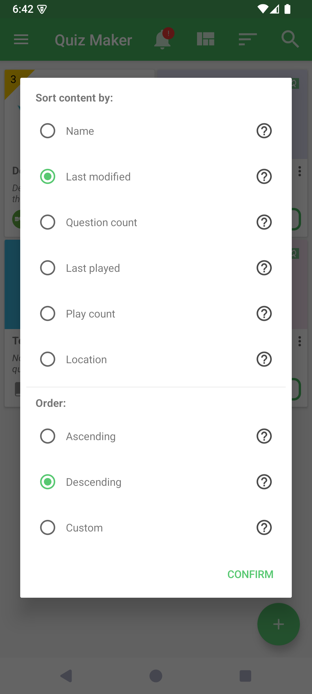
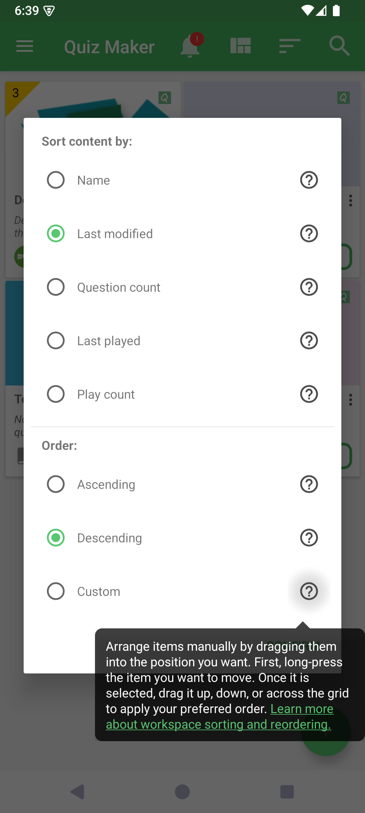
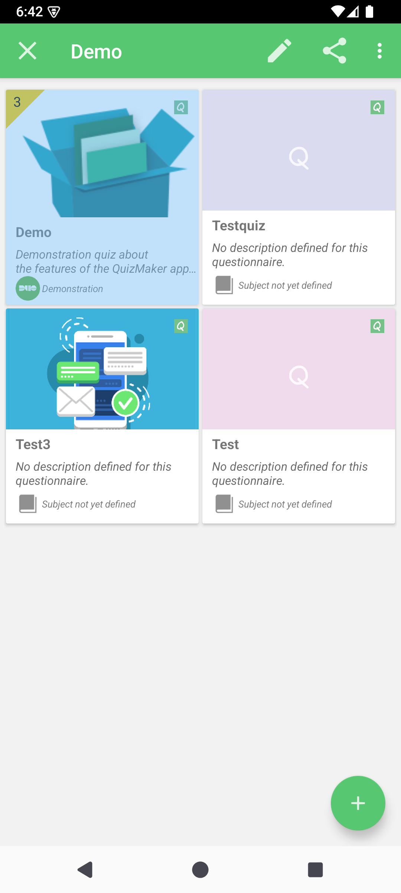

# Sort and Reorder the Workspace

Workspace sorting controls the sequence of quiz cards shown on Home. Automatic orders keep the list organized from a chosen property, while Custom order lets you decide the exact position of each quiz.

## How to access

On Home, tap the **Sort** action in the top bar.

If Sort is hidden, open Preferences → **Interface customization** and enable **Show sort action**. You can also choose the default order from that settings page.

## Choose a property and an order

| Property | Ascending starts with | Descending starts with |
|----------|-----------------------|------------------------|
| Name | A | Z |
| Last modified | Oldest edit | Most recent edit |
| Question count | Fewest questions | Most questions |
| Last played | Oldest play activity | Most recent play activity |
| Play count | Least played | Most played |
| Location | Local files | Remote files |

The **Custom** order is available with every property. The property supplies the initial or fallback sequence; your manual positions then take priority. For Location + Custom, local files are the initial order.

## Reorder quiz cards manually

1. In the Sort dialog, choose a property and **Custom**, then confirm.
2. Long-press a quiz card and release it when the card becomes the only selected item.
3. Press the selected card again and drag it to the position you want.
4. Release the card. QcmMaker saves the changed positions immediately.

In a grid you can drag across rows and columns. In a list, drag up or down. Reordering is available only when exactly one quiz is selected; selecting several quizzes disables the gesture.

## What QcmMaker remembers

QcmMaker restores the selected sort when the workspace refreshes or reopens. Each property combined with Custom keeps its own manual sequence, identified from the quiz itself rather than only from its current file path.

Switching to Ascending or Descending stops manual reordering and displays the corresponding automatic order. Returning to the same Custom combination restores its saved sequence.

© QmakerTech — Last updated: 2026-08-21

