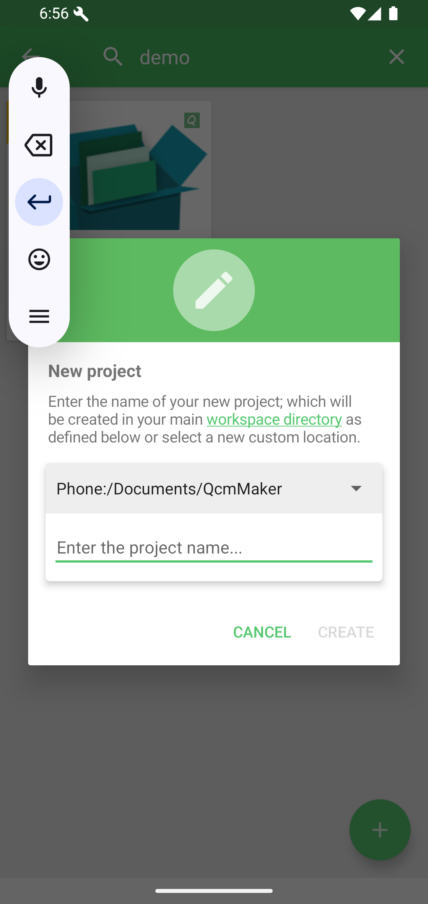
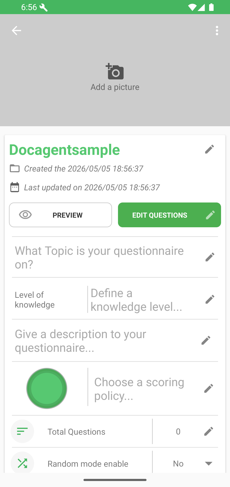

# Créer son premier quiz

> Les captures montrent l'interface en anglais.

**Objectif :** créer, décrire et tester une première question.

## 1. Créer le fichier

Depuis l'accueil, touchez le bouton flottant, puis **Create a new quiz project**. Saisissez un nom, conservez l'espace principal et touchez **CREATE**.

Le nom sert à retrouver le fichier dans l'espace de travail.

## 2. Décrire le quiz

Ignorez ou suivez la visite guidée, puis ajoutez un sujet et une courte description. Ils expliquent le but du quiz avant son lancement.

Consultez [Modifier les informations du quiz](../features/create-quiz/edit-information-fr.md) pour les autres réglages.

## 3. Ajouter une question

Touchez **EDIT QUESTIONS**, saisissez un énoncé, ajoutez au moins deux choix et cochez la bonne réponse. Touchez **Next** ou **Save** pour valider.

Le [guide de l'éditeur](../features/editor/README-fr.md) présente les autres types, les médias et les commentaires.

## 4. Enregistrer et tester

Choisissez **Save & play using** ou revenez aux informations du quiz et touchez **PLAY**. Répondez à la question et examinez la correction.

**Étape suivante :** [ajouter d'autres types](../features/editor/question-types/README-fr.md) ou [partager le fichier `.qcm`](../features/sharing/README-fr.md).
