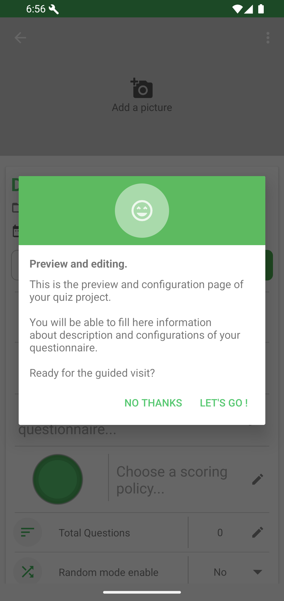

# Creating Your First Quiz

From Home, tap the floating action button and choose **Create a new quiz project**.

Enter a quiz name, keep the main workspace selected, then tap **CREATE**.

QcmMaker opens the project viewer. Tap **NO THANKS** to skip the guided tour or **LET'S GO !** to follow it.

On the project viewer, tap **EDIT QUESTIONS** to start adding questions.

