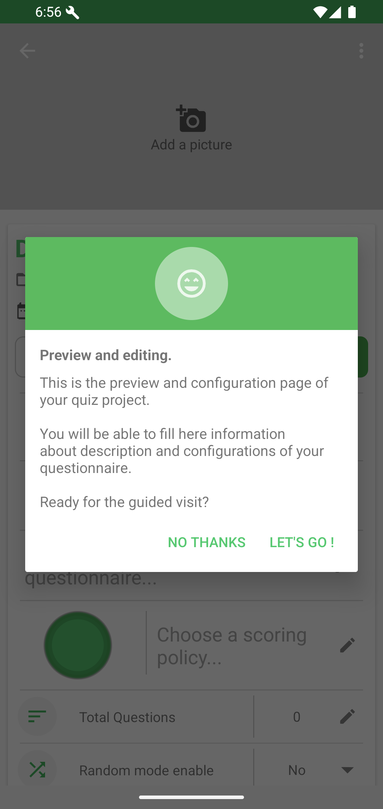

# Creating Your First Quiz

**Goal:** create, describe, and test a first question in one short walkthrough.

This walkthrough creates a real `.qcm` quiz file in your workspace. For detailed explanations or advanced options, follow the links at the end of each step.

From Home, tap the floating action button and choose **Create a new quiz project**.

Enter a quiz name, keep the main workspace selected, then tap **CREATE**.

Good to know: the name becomes the visible quiz file name in your workspace. A clear name helps you find the quiz later, especially after you have several files.

QcmMaker opens the project viewer. Tap **NO THANKS** to skip the guided tour or **LET'S GO !** to follow it.

## 2. Give the quiz a clear identity

On the project information screen, add a topic and a short description. These details help learners understand the purpose of the quiz before playing it. You can keep the other settings unchanged for this first attempt.

See [Edit quiz information](../features/create-quiz/edit-information.md) for every field and setting.

## 3. Add a first question

Tap **EDIT QUESTIONS**. Enter a prompt, add at least two answer choices, and check the correct answer. Tap **Next** or **Save** to validate it.

See [Editing questions](../features/editor/README.md) if you want another question type, media, or a correction explanation.

## 4. Save and test

Open the save action and choose **Save & play using**, or return to the project screen and tap **PLAY**. Answer the question and inspect its correction.

Testing before sharing helps you find missing answers, unclear wording, unsuitable timing, or an incorrect scoring configuration.

**Next:** [add more question types](../features/editor/question-types/README.md) or [share the completed `.qcm` file](../features/sharing/README.md).
