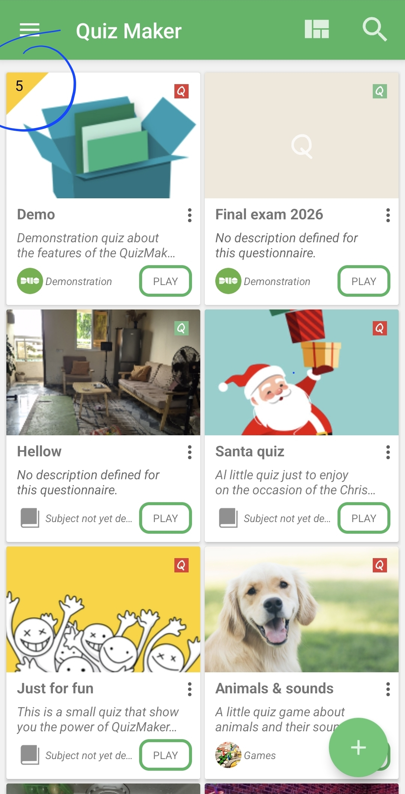

# Interface Overview

The Home screen is your quiz dashboard. It lists the `.qcm` files found in your workspace and gives quick access to play, edit, share, search, or organize them.

Good to know: the Home screen shows files QcmMaker can currently see. If a quiz is stored in another folder, it may not appear until you open that file or add its folder to the workspace.

Main actions:

| Area | What it does |
|------|--------------|
| Drawer button | Opens navigation, settings, bookmarks, subscription, and information pages. |
| Arrangement | Changes how quiz cards are displayed. |
| Search | Filters quizzes in the workspace. |
| Quiz card | Opens or plays a quiz. |
| Number badge on a quiz card | Shows how many copies or versions of the same quiz QcmMaker found. |
| PLAY | Starts the quiz. |
| Floating action button | Opens workspace actions: create, open, or add folder. |

## Similar Quiz Occurrences

Sometimes a quiz card shows a small number in the top corner. This number is not the number of questions in the quiz. It means QcmMaker found several files that appear to be the same quiz, usually because copies or older versions are stored in different folders.

Tap the number to open the list of found locations. See [Similar quiz files](similar-quiz-occurrences/README.md) for the dedicated explanation of that list and how to choose the right file.

To open a quiz file that is stored outside the visible workspace list, use the floating action button and follow [Opening a `.qcm` file from your device](open-qcm-file/README.md).

## Quiz Card Options

Use the options menu on a quiz card for quick actions such as details, properties, copy, share, delete, editor, and desktop shortcut.

When to use this: open the quiz card normally when you want to play or preview it. Use the card options when you want to manage the file itself, such as sharing it, copying it, checking its properties, or opening the editor.

## Selection Mode

Long press a quiz card to enter selection mode.

With one item selected, QcmMaker shows actions for that quiz. Tap more quiz cards to switch to multi-selection.

Use the close button or Android Back to leave selection mode.

What changes in selection mode: actions apply to the selected quiz files instead of just the card you tapped. This is useful for grouped actions, but it also means you should check which files are selected before deleting, sharing, or moving anything.

If the guided tour is active and you tap outside its target, QcmMaker asks whether to leave or continue it.

