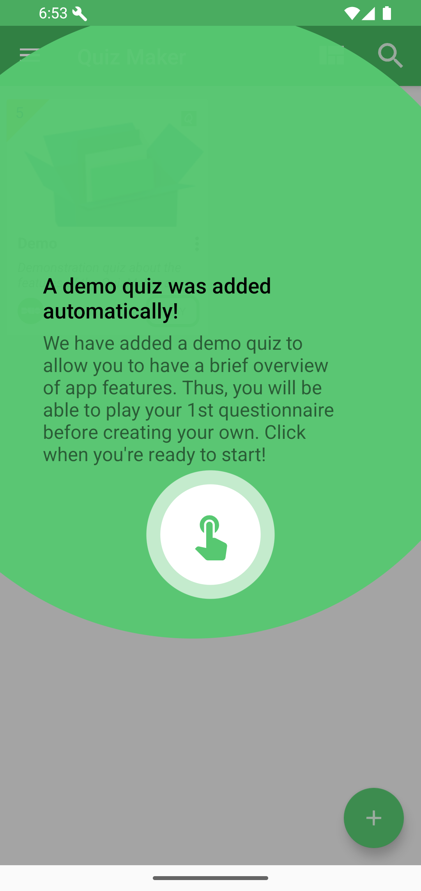
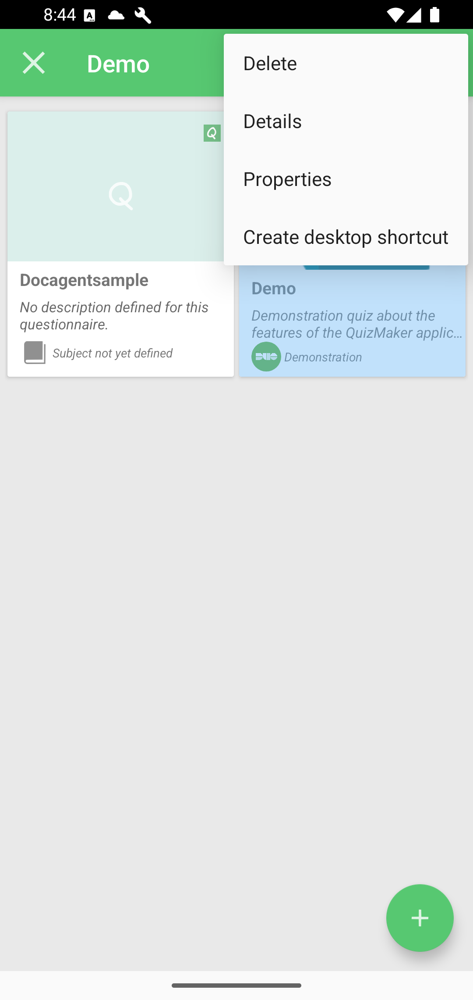
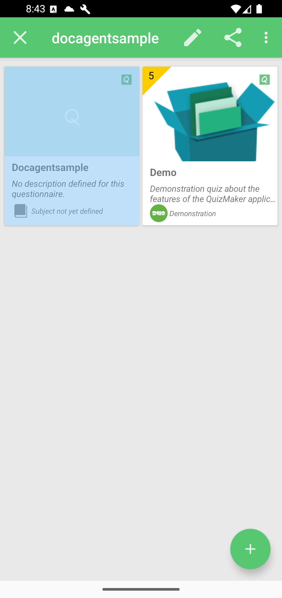
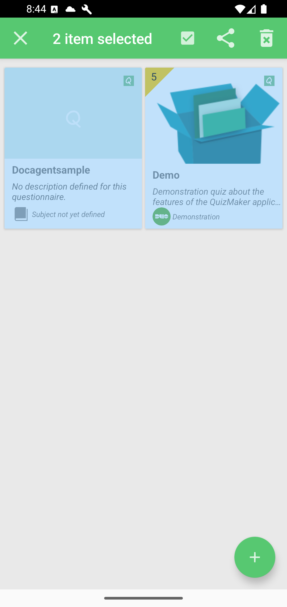
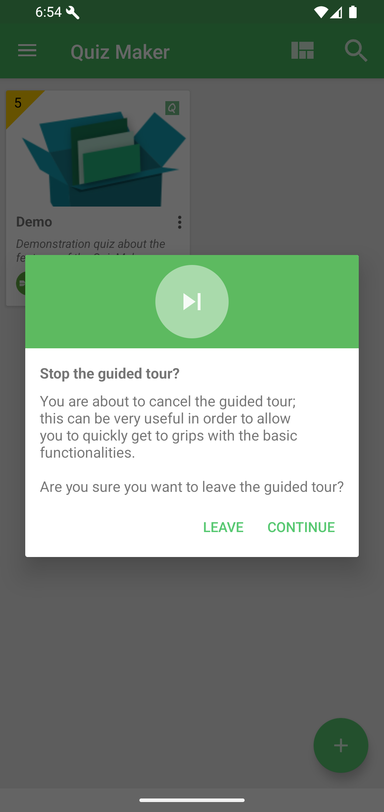

# Interface Overview

The Home screen lists quiz files in your workspace.

Main actions:

| Area | What it does |
|------|--------------|
| Drawer button | Opens navigation, settings, bookmarks, subscription, and information pages. |
| Arrangement | Changes how quiz cards are displayed. |
| Search | Filters quizzes in the workspace. |
| Quiz card | Opens or plays a quiz. |
| PLAY | Starts the quiz. |
| Floating action button | Opens workspace actions: create, open, or add folder. |

## Quiz Card Options

Use the options menu on a quiz card for quick actions such as details, properties, copy, share, delete, editor, and desktop shortcut.

## Selection Mode

Long press a quiz card to enter selection mode.

With one item selected, QcmMaker shows actions for that quiz. Tap more quiz cards to switch to multi-selection.

Use the close button or Android Back to leave selection mode.

If the guided tour is active and you tap outside its target, QcmMaker asks whether to leave or continue it.

