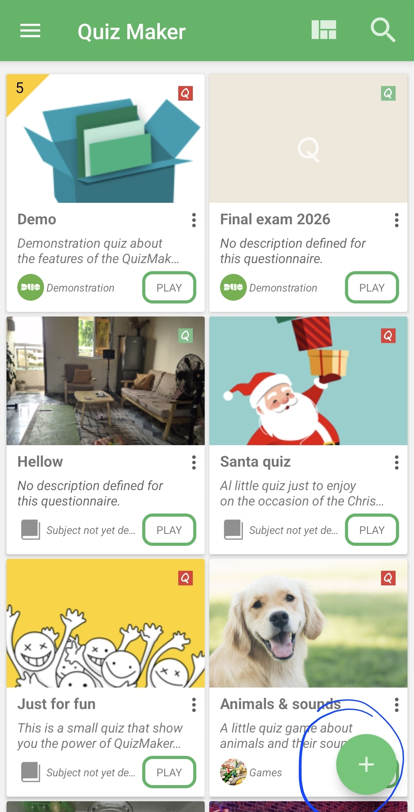
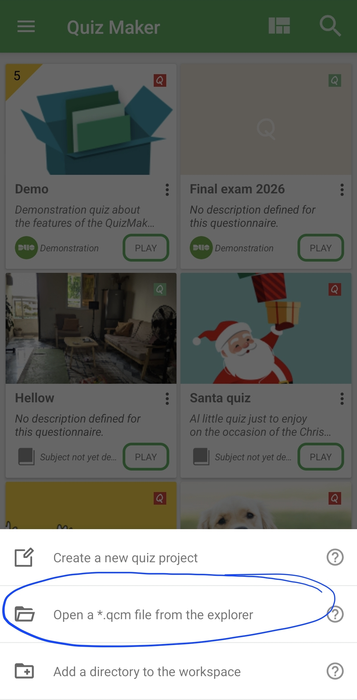
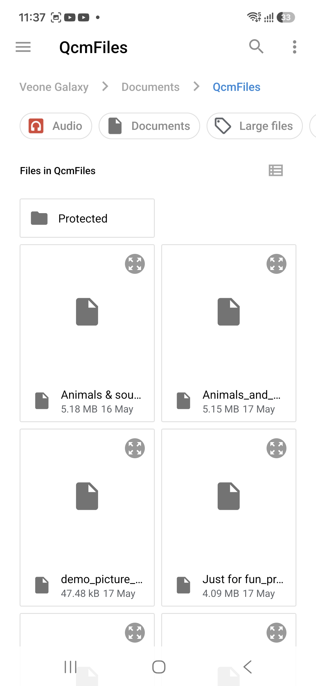

# Opening a `.qcm` File From Your Device

A `.qcm` file is a portable quiz file. You can receive one from another person, download one, copy
one from another device, or keep one outside your usual workspace folder. When the file is not
already visible on Home, open it from Android's file explorer.

From Home, tap the floating action button.

In the menu that opens, choose **Open a *.qcm file from the explorer**.

Android opens the system file explorer. Browse to the folder that contains your quiz file, then tap
the `.qcm` file you want to open.

After you select the file, QcmMaker opens it and adds it to your workspace list. This also gives
QcmMaker access to that selected file, so you can open it more easily next time from Home.

If you do not see the file, check that you are in the right folder and that the file really uses the `.qcm` extension.
