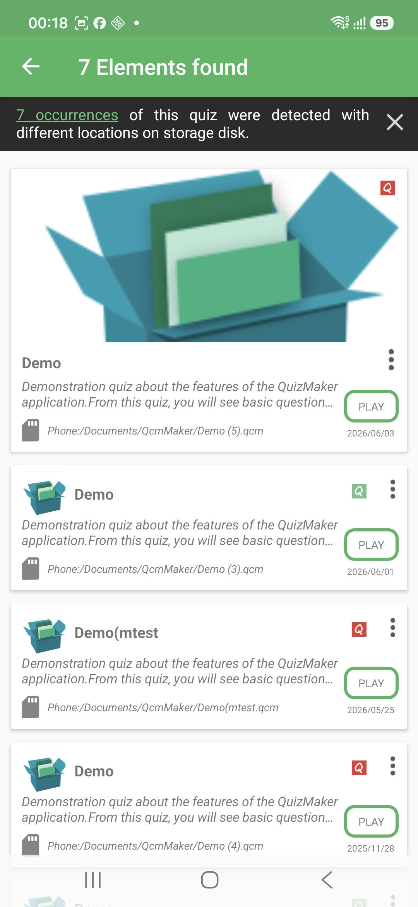
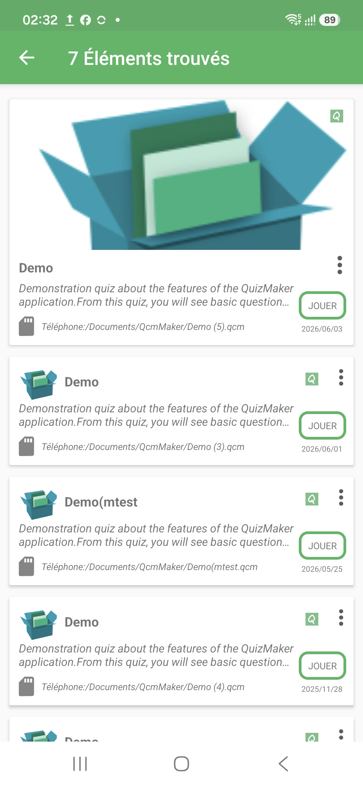

# Similar Quiz Files

QcmMaker can find more than one file for the same quiz. This usually happens when you add several folders to the workspace, keep backups, or save different versions of a quiz in different places.

When this happens, the Home screen shows one quiz card with a small number badge. The number is not the number of questions. It tells you how many matching quiz files QcmMaker found.

Tap that number to open the list of matching files.

## Matching Files List

The top banner confirms how many matching files were found. Use it as a quick check that you are looking at copies or versions of the same quiz, not unrelated quizzes with similar names.

Each row represents one `.qcm` file. Look at the file name, location, and date to decide which version you want to use. The most recent file is shown first when QcmMaker can determine it.

## After The Banner Hides

The banner can disappear automatically or after you close it. The file list stays available, so you can still choose an occurrence, play it, open it, inspect it, share it, or delete it using the available actions.

If you expected only one file, check your workspace folders for backups or older copies. If you expected another copy to appear, add the folder that contains it to the workspace or open the `.qcm` file manually.
