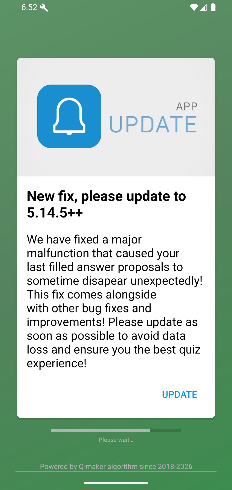
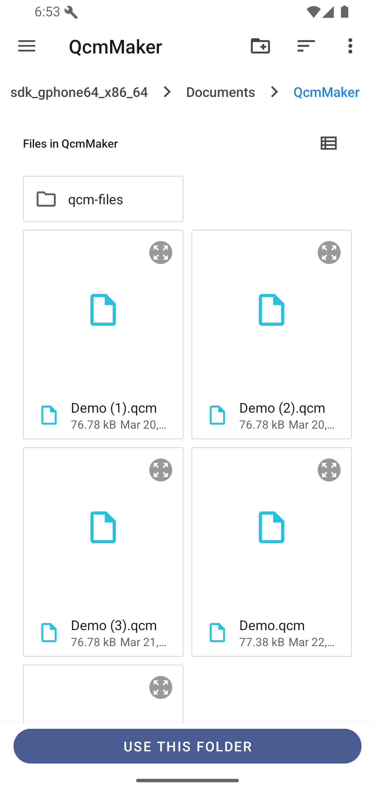
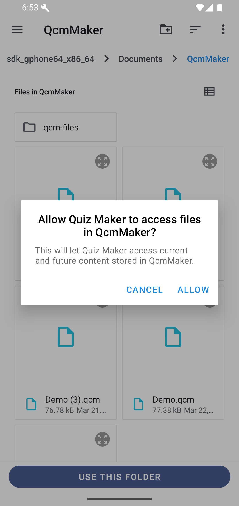

# Workspace Setup

On first launch, QcmMaker asks you to choose a workspace. This folder is the place where QcmMaker stores, detects, and lists your `.qcm` quiz files.

Good to know: the workspace is not a hidden account or cloud space. It is a folder on your device storage. Choosing a clear folder helps you find your quizzes later, back them up, or move them to another device.

Tap **I AM READY, LET'S GO**, choose the folder you want to use, then tap **USE THIS FOLDER**.

Android asks for final permission. Tap **ALLOW** so QcmMaker can access current and future quiz files in that folder.

What happens next: QcmMaker can list the `.qcm` files already present in this folder and save new quizzes there. It does not mean every file on your phone is added to the app.

If you add several folders to the workspace, QcmMaker may find several copies or versions of the same quiz. In that case, the Home card can show a small number badge so you can open the list of matching files and choose the version you want.

If a quiz does not appear on the Home screen later, first check whether the `.qcm` file is still inside a workspace folder. If it was moved elsewhere, open the file manually or add the folder that contains it.
